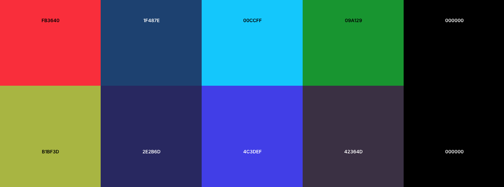
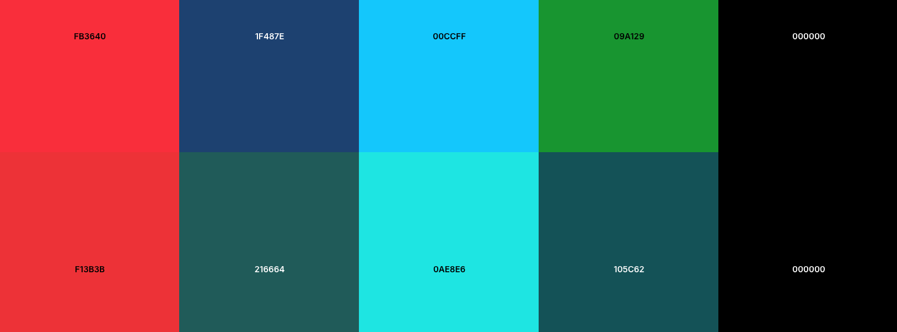
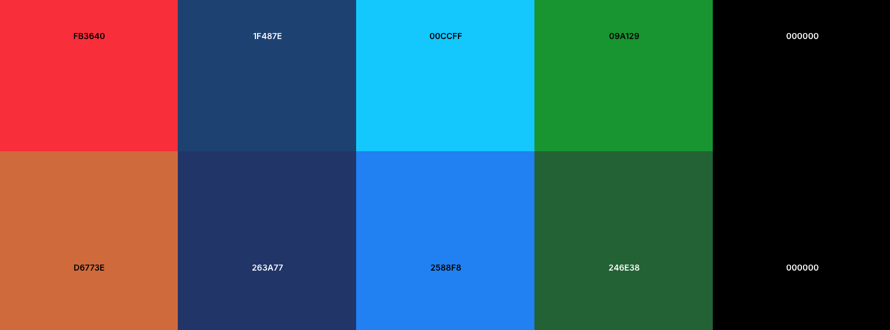
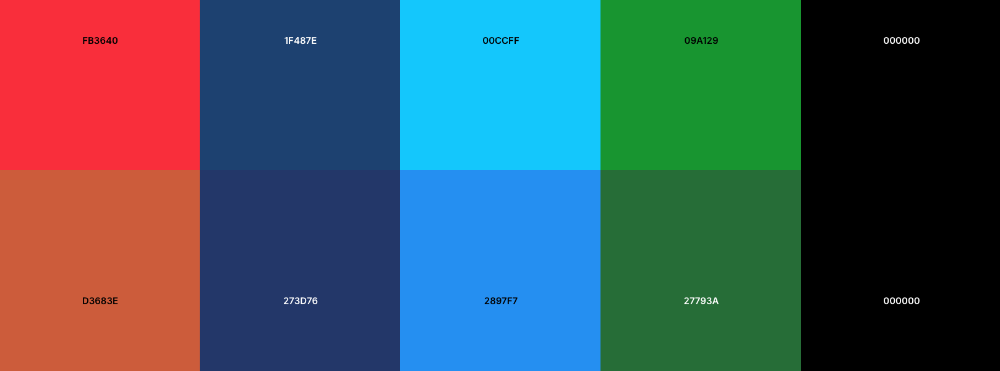
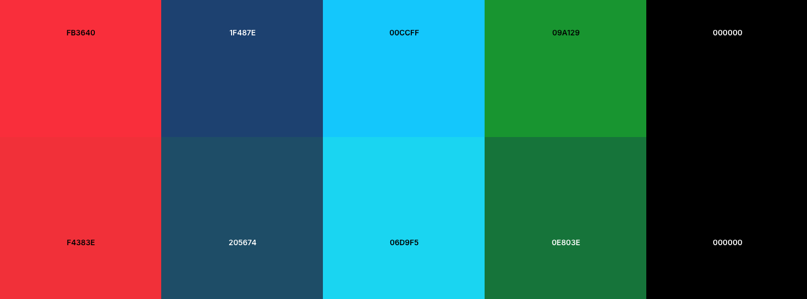

*Chat GPT was used in the creation of this document.*
# Cupid Code High-Level Design Document
Sprint Leader: Kayden Lancaster

Sprint Followers: Zac Cunningham, Greg Steele, Dallin Tew, Carter Johnson

## Contents
  - [Introduction](#1-introduction)
  - [Sysem Overview](#2-system-overview----kayden)
  - [Architecture](#3-architecture----carter)
  - [Major Components](#4-major-components----dallin)
  - [External Interfaces](#5-external-interfaces----dallin)
  - [User Interface Design](#6-user-interface-design----zac)
  - [Input and Output](#7-input-and-output----zac)
  - [Security](#8-security----carter)
  - [Risks and Mitigations](#9-risks-and-mitigation----greg)
  - [Data Design](#10-data-design)
  - [Diagrams](#11-diagrams----all)
## 1. Introduction
**Purpose**  
Provide a concise high‑level technical design for the current Cupid Code platform so the team can complete an MVP (Minimum Viable Product) that delivers the Must requirements (MoSCoW) for 2025–2026. This document aligns inherited code (frontend Vue app + Django backend) with the updated requirements specification and guides subsequent detailed design, implementation, and risk mitigation.

**Scope**  
Covers:  
- System context and current vs planned capabilities (AI assist, gigs, payments, notifications).  
- Architectural style (web client + Django REST backend) and core component boundaries.  
- Roles and data domains (Dater, Cupid, Manager/Admin, Couple/Shared).  
- High‑level data handling (profiles, gigs, feedback, authentication, future payments, AI session artifacts).  
- Integration points (future: Stripe, PayPal, weather, messaging, location).  
Excludes: low‑level class diagrams, detailed endpoint specs, test plans, deployment runbooks (to be documented separately). References: Requirements Specification (requirements.md) for authoritative functional, nonfunctional, business, and user requirements.

**Audience**  
- Engineering team members adding features (AI, payments, notifications).  
- Product/managerial stakeholders validating scope vs requirements.  
- Security/review stakeholders assessing data handling and role boundaries.  
- New contributors needing a structural overview before reading code.

**Goals Alignment (Selected Musts)**  
- Real‑time AI feedback (listen + chat).  
- Multi‑role web access (desktop + mobile browsers).  
- External notifications (email/SMS planned).  
- Secure data handling & age gating.  
- Future payment rails (Stripe/PayPal) for funding and Cupid payouts.  
- Maintain extensibility for couple features and auditability.

**Non‑Goals (Current Release)**  
- Native mobile apps.  
- Full subscription tiering or microtransactions (explicit Won’t).  
- Full multilingual & advanced analytics dashboards (later phases).  

## 2. System Overview -- Kayden
**System Description**  
Cupid Code is a role‑based web application that assists users (primarily socially anxious or inexperienced daters) with AI‑driven, context‑aware coaching and on‑demand human “Cupid” gig interventions. The platform delivers:  
- Dater experience: AI chat + (future) passive listening for live guidance; scheduling and gig request flows.  
- Cupid experience: Manage gigs, respond to interventions, (future) earnings and availability.  
- Manager/Admin: User oversight, future compliance/reporting, operational dashboards.  
- Couple extension (Should/Could): Shared calendar, joint preferences, gift/timeline concepts.  
Current stack:  
- Frontend: Vue 3 (Vite) SPA (router, components under src/, role‑specific views).  
- Backend: Django + Django REST style views (api app) with SQLite (to migrate to managed cloud DB).  
- Auth: Username/password (working), role persisted in backend models.  
- AI: Placeholder endpoints; microphone capture pipeline present; logic for real guidance still minimal.  
- Storage: Local DB for users, gigs, feedback scaffolding (see server/api/models.py).  
- Tests: Selenium UI scripts for login and role flows.  

**Legacy System Overview**  
Inherited (working or partial):  
- Authentication & role assignment.  
- Basic Vue SPA routing and layout.  
- Gig creation UI (no financial settlement).  
- Audio capture scaffolding + placeholders for AI responses.  
Partial / incomplete (to be delivered):  
- Funds pipeline (balances, deposits via Stripe/PayPal, payouts).  
- Real‑time notifications (web + external email/SMS).  
- AI reasoning + personalized memory (user preference persistence & adaptive coaching).  
- Cupid availability / scheduling logic validation.  
- Feedback loops (post‑gig rating, AI reflection).  
- Security hardening (encryption fixes, PII handling, audit trails).  

**Planned Enhancements (Near Term)**  
- Integrate payment providers (abstracted service layer).  
- AI session store referencing user profile + prior date context.  
- Notification subsystem (queued + provider adapters).  
- Role‑segregated data views and future couple privacy controls.  
- Deployment to Azure (containerized or managed app service).  

**Key Constraints / Assumptions**  
- Must remain web-first; performance acceptable for real‑time guidance within latency budgets (<1–2s AI round trip after backend integration).  
- Incremental migration from SQLite to Azure Postgres/MySQL once payment + audit features start (avoids migration pain later).  
- Privacy: Microphone streaming only opt‑in per session; no permanent raw audio retention (derived features only).  

**High-Level Data Domains**  
- Identity & Roles (User, DaterProfile, CupidProfile, Manager/Admin).  
- Scheduling & Gigs (gig requests, status, Cupid assignment, intervention notes).  
- AI Interaction (chat transcripts, advice events, memory embeddings—planned).  
- Financial (wallet, transactions, payouts—planned).  
- Feedback & Ratings (post‑gig + AI evaluation—planned).  
- Notifications (in-app + external dispatch queue—planned).  

**External / Future Integrations**  
- Payments: Stripe, PayPal (Must).  
- Weather API (Could) for contextual planning.  
- Location services (Could) for Cupid tracking.  
- Dating app API linking (Could).  
- Email/SMS provider (Twilio / SendGrid) for push-out notifications (Must for notifications objective).  

**Quality & NFR Priorities (Short Term)**  
- Security remediation (address encryption misuse, card storage via tokenization not raw DB).  
- Accessibility improvements (contrast, screen reader semantics in Vue components).  
- Reliability: Graceful degradation when AI or payment providers unavailable.  

**Architecture Diagram (Placeholder)**  
(Will depict: Browser SPA (Vue) → REST/JSON API (Django) → Data Layer (DB + future cache) → External Services (AI API, Stripe, PayPal, Email/SMS, Weather). Will be added in Section 11.)

**Success Criteria for This Phase**  
- End-to-end flow: Dater logs in → requests AI help → receives contextual response referencing stored preferences.  
- Cupid gig lifecycle visible (create → assign placeholder → mark complete).  
- Stubs for payment & notification services integrated behind clear service interfaces to enable parallel work streams.  

## 3. Architecture -- Carter
### Chosen Architecture
Cupid Code adopts a **three-tier architecture** with a separation of concerns between presentation, application logic, and data persistence:

1. **Frontend (Presentation Layer)**  
   - Built with **Vue.js**.  
   - Provides role-based portals for **Daters**, **Cupids (gig workers)**, and **Married Users**.  
   - Handles real-time interactions (chat, notifications, scheduling UI).  
   - Communicates with the backend exclusively through a REST API over HTTPS.  

2. **Backend (Application Layer)**  
   - Powered by **Django**.  
   - Hosts business logic for authentication, payments, AI orchestration, and scheduling.  
   - Exposes secure APIs to the frontend and integrates with external services (Stripe/PayPal, AI APIs, SMS/email notification providers).  
   - Includes background task management (Celery + Redis) for notifications, scheduled events, and AI feedback.  

3. **Database (Data Layer)**  
   - Relational storage using **PostgreSQL**.  
   - Stores user profiles, preferences, schedules, gig orders, transaction records, and AI interaction logs.  
   - Employs strict schema definitions and foreign keys for consistency.  
   - Sensitive data (e.g., payment info) is either securely encrypted or handled via external payment processors.

### Design Rationale
- **Separation of concerns:** Keeping UI, business logic, and storage distinct improves maintainability and scalability.  
- **Security and compliance:** Sensitive financial and personal data is minimized/encrypted in storage.
- **Scalability:** Each layer can be scaled independently (e.g., multiple frontend servers, load-balanced backend services, managed DB instances).  
- **Extensibility:** New features like subscription tiers, AI integrations, or couple-specific modules can be added without impacting the entire system.  
- **Cloud deployment:** Designed for deployment on **Azure** for backend, frontend, and database services.

### Major Components & Interactions
- **User Portals (Vue)** → **REST API (Django)** → **Postgres DB**  
- **AI Services**: Django integrates with external AI APIs for chat, voice recognition, and real-time coaching.  
- **Payment Services**: Stripe/PayPal APIs handle funds; Django manages session tokens and transaction status.  
- **Notification Services**: Workers push updates via email/SMS and in-app alerts.  
- **Manager/Admin Dashboard**: Real-time metrics and compliance reporting via Django views connected to Postgres.

## 4. Major Components -- Dallin
### Frontend (Vue 3 + Vite)

- **Responsibilities**  
The frontend is responsible for rendering the user interface and ensuring a smooth, responsive experience across devices. It manages client-side routing, maintains global application state (e.g., authentication, session data, preferences), and enforces accessibility standards such as ARIA roles and keyboard navigation. It communicates with the backend via APIs and, where necessary, establishes WebSocket connections for real-time features like chat or live notifications.  

- **Technologies/Versions**  
Vue 3 (Composition API) provides a modular approach to building reactive components, while Vite handles efficient bundling and hot-module reloading for development. Vue Router manages client-side navigation, and Socket.io or native WebSocket clients support real-time updates.  

- **Internal Interfaces**  
Common abstractions include an `apiClient` module for standardized HTTP requests, an `authStore` to track authentication state, a `notificationService` to manage system alerts, and reusable UI components to enforce consistency across the application.  

### Backend API (Django + DRF)

- **Responsibilities**  
The backend exposes a RESTful API that supports all client-facing features. It manages authentication and enforces role-based access for different user types (Dater, Cupid, Manager). It implements business logic such as matchmaking, chat storage, and media uploads. It also handles background jobs such as notification dispatch, analytics aggregation, and payment confirmation through asynchronous workers.  

- **Technologies/Versions**  
Django 5.x provides a secure and scalable foundation, while Django REST Framework (DRF) simplifies the creation of API endpoints. 

- **Internal Interfaces**  
The backend is structured around `serializers` for data validation and formatting, `services/*` modules to encapsulate domain logic, `signals` for event-driven triggers, and `tasks.py` for asynchronous job execution.  

### Database (SQLite → Postgres)

- **Responsibilities**  
The database persists all critical application data, including users, profiles, matches, chat messages, financial transactions, and notification logs. It provides transactional integrity, supports relational queries, and ensures long-term data durability.  

- **Technologies/Versions**  
SQLite is used during development for its simplicity and lightweight setup. 

- **Internal Interfaces**  
Django models serve as the primary abstraction for interacting with the database. Repository/service layers may be introduced to separate business logic from persistence logic.  

### AI Service

- **Responsibilities**  
The AI service supports advanced features such as natural language chat responses, moderation of inappropriate content, and optional voice transcription. It can also rank or filter suggestions based on user context, providing a more personalized experience.  

- **Technologies/Versions**  
Integration with external large language models (OpenAI, Anthropic, etc.) powers text-based AI features. For speech-to-text, services like Whisper or Pyttsx3 equivalents can be used.  

- **Internal Interfaces**  
Clients communicate with the AI service through REST or streaming endpoints such as `/ai/chat` and `/ai/transcribe`. A dedicated API wrapper ensures consistent request formatting and error handling.  

### Payments (Stripe / PayPal)

- **Responsibilities**  
This component manages the full lifecycle of user payments, including subscriptions, one-time transactions, and credits. It ensures that transactions are recorded securely, validates payment statuses via webhook callbacks, and generates receipts or invoices for users.  

- **Technologies/Versions**  
Stripe Checkout and PayPal Smart Buttons are used for payment processing. Both provide PCI-compliant hosted flows to reduce security risk.  

- **Internal Interfaces**  
Webhook processors validate payment events, a payment service module orchestrates subscriptions and credit logic, and a receipt generator prepares transactional records for users.  

### Notifications (Email / SMS / Push)

- **Responsibilities**  
Notifications provide timely communication to users outside the app, such as verification emails, password resets, match alerts, or payment confirmations. Channels include email, SMS, and push notifications.  

- **Technologies/Versions**  
Twilio handles SMS and voice, while providers such as SendGrid or Firebase may handle email and push delivery. A message queue (e.g., Celery) ensures reliable, asynchronous delivery.  

- **Internal Interfaces**  
Core modules include a `notification_queue` for queuing outbound messages, a template renderer for creating consistent messages, and delivery gateways for dispatching to providers.  

### Auth / Identity

- **Responsibilities**  
This component handles all user identity management. It supports user registration, login, session or token issuance, password recovery, and optional two-factor authentication. It also enforces rules like age verification to ensure compliance with platform requirements.  

- **Technologies/Versions**  
Django’s authentication system is extended with JWT (e.g., SimpleJWT) for API token management. OAuth integrations (Google, Apple) may be added for social logins.  

- **Internal Interfaces**  
The system includes a token generator for access/refresh tokens, session middleware for web clients, and validation services for age-gating and security checks.  

### Admin / Manager Dashboard

- **Responsibilities**  
The dashboard provides administrators and managers with tools to oversee platform activity. Features include analytics views for monitoring engagement, moderation panels for handling reports or flagged content, and user management capabilities.  

- **Technologies/Versions**  
Django Admin provides an out-of-the-box management interface. Alternatively, a custom Vue-based admin panel can be built for a richer user experience.  

- **Internal Interfaces**  
Modules include metrics aggregation services for analytics, and privilege enforcement mechanisms to ensure only authorized managers can access sensitive data.  

## 5. External Interfaces -- Dallin
### Third-Party APIs / Services

1. **AI Bot**  
    - **Description:** The AI logic is dependent on and provided by Prof. Falor. It powers the “intelligence” behind AI chat and listening features.  
    - **Used in:** All interactions involving a Cupid, including conversational chat, AI-assisted suggestions, and real-time responses.  
    - **Notes:** The AI bot acts as the core decision-making engine; API reliability and latency are critical for responsive interaction.

2. **Geolocation API**  
    - **Description:** Provides device location data, either via GPS, IP address, or browser geolocation.  
    - **Used in:** Matching users based on proximity and finding nearby gigs or events.  
    - **Notes:** Requires explicit user permission; must handle location errors or denials gracefully.

3. **Pyttsx3**  
    - **Description:** Python text-to-speech library for converting text into spoken audio.  
    - **Used in:** Accessibility features (for visually impaired users) and optionally for AI voice output during gigs.  
    - **Notes:** Runs locally and does not require internet access; can be used as a fallback if external TTS services fail.

4. **Twilio API**  
    - **Description:** Cloud communication platform providing SMS, email, and voice messaging services.  
    - **Used in:** Sending notifications, verification codes, and alerts to users.  
    - **Notes:** Includes retry and fallback mechanisms; provider quotas should be monitored to avoid delivery failures.

5. **Yelp Fusion API (via `yelpapi`)**  
    - **Description:** Access to business data, reviews, events, and ratings through the Yelp platform.  
    - **Used in:** Finding gigs, events, and venues for users based on location and preferences.  
    - **Notes:** Must handle API rate limits and cache results to improve performance and reduce API calls.

6. **Azure REST API**  
    - **Description:** Cloud-based services for hosting, storage, and connecting multiple devices.  
    - **Used in:** Supporting backend infrastructure, real-time device communication, and scalable storage for media or data.  
    - **Notes:** Provides high availability and scalability; secure authentication and endpoint validation are required.

## 6. User Interface Design -- Zac

### UI/UX Principles

- Cupid codes redesign aims to make users' experience frustration-free by simplifying the overall design.
- Part of the redesign includes making the UI a mobile-first responsive design.                              
- Navigation will adhere to the standard of 2 clicks to get anywhere from the home page.   
- Cupid code aims to be accessible to all, which is why the color palettes were selected with color blindness in mind.

### Rebranding and Color Schemes

As part of the Rebranding for Cupid Code, our team has decided to lean into who our users are and focus the color scheme and logos around them.
Our main users, the daters, are comprised of tech enthusiasts; for this reason, we have decided to give the app a more techy vibe and style the app around the terminal. 

- The rebranding will feature a new logo designed to resemble intricate code elements.
- Below is an example of what the new logo could look like.

- Buttons that have graphics will also follow the new rebranding and look like code.
- The color scheme we have selected is based on the look of a terminal.
  - Dark background
  - light green words
  - minimal other colors
- The colors we have selected in hex are (from right to left)
  - #FB3640
  - #1F487E
  - #00CCFF
  - #09A129   
  - #000000

### Accessibility

- This color scheme aligns with our tech-driven vibe, ensuring the users feel right at home.
- Accessibility is essential to our team, so we have compared our color scheme to the following color blindness types, and we have included an image of that comparison for each.

**Protanopia**

**Deuteranopia** 

**Tritanopia**

**Achromatopsia**

**Protanomaly**

**Deuteranomaly** 

**Tritanomaly**

**Achromatomaly**

- Most Color Blindnesses are compatible with our color scheme.
- To ensure all can see and use our app efficiently, we will be adding an Accessibility mode.
- The Accessibility mode will make the following changes.
  - The black background (#000000) will change to a white background (#FFFFFF)
  - The Green Text (#09A129) will be changed to Black (#000000)
- Accessibility mode will be easily accessible from the home screen.
- Below is the color Palette for the accessibility mode.
  

### Navigation Flow
As stated before, we aim to make the user's experience as simple as possible; therefore, we strive to follow the following navigation plan.
Our home page is designed after the layout of the Canvas Mobile app.
- All pages are accessible with just two clicks from the home page.
- Pages:
  0. Sign up page
    - This page will be simple in design
    - A new user will use a toggle to determine whether they are signing up as a cupid or a dater
    - If they are signing up as a cupid then they will have a  smaller sign up page as not as much information is needed from them
    - If they are signing up as a dater then a long sign up page will be present as more details information is needed
    - Examples of dater sign up info 
      - Nerd type 
      - Relationship goals 
      - Intrests 
      - Past dating history 
      - Dating strengths 
   - Both sign up pages will have a create acount page
  1. Login page 
    - Simple normal looking login page
    - Will be the same page for all users (Daters, Cupids, Managers)
    - Button to sign in with at bottom
**Dater**
  0. Home Page 
    - Top nav bar (This is on Every page)
      - Logo center 
      - Hamburger button
        - Accessible mode toggle 
        - Link to profile page
        - Link to payment page
        - Logout link
    - Main content card style 
      - Card to link to AI page 
      - Card to link to Plan a Date/ create a gig  page 
      - Card to link to Rate Cupids/Order Status page 
      - Card to link to Calendar 
      - Upcoming Dates Preview
        - 1-3 cards showing upcoming dates/events 
      - On smaller screen sizes there will be a bottom nav bar with buttons to take you to the different pages
        - On larger screens this nav bar will be at the top underneath the logo
        - Bottom nav bar (This is on every page)
          - link to Home page (disabled when on home page) 
          - Link to AI page 
          - Link to Payment page 
          - Link to Profile page 
          - Link to Notifications Page 
  1. AI Page
    - Top nav bar (discussed previously)
    - AI chat tab  
      - Chat history ( only avalible for current chat)
      - User will be able to ask AI questions and recieve responses in real time
      - AI voice button ( changes UI to AI listening tab) 
    - AI listening tab
      - User will be able to start and stop AI recording 
      - user should be able to see an AI response after stoping the recording
      - AI chat button ( changes UI to AI chat tab)
    - Bottom nav bar (discussed previously)  
  2. Plan a date/create gig page 
    - Top nav bar 
    - User will be able to manually plan a date/ create a gig
    - Will need to input the What, When, Where, How($$), to create a valid date/gig
    - Button to add gig/create date 
    - Bottom nav bar 
  3. Rate Cupid/ Order Status page 
    - Top nav bar  
    - Unclaimed section 
      - Cards for all unclaimed gigs 
    - Claimed section 
      - Cards for all claimed gigs 
    - Completed Gigs section 
      - Cards for all completed gigs 
        - Completed gigs cards will have a button to rate cupid 
    - Rate cupid popup 
      - Will have a way to describe interaction with cupid 
      - Will have a way to rate the cupid using hearts 
      - Send button 
      - Cancel button 
    - Bottom nav bar
  4. Calander page 
    - Top nav bar 
    - Upcoming dates section
      - Cards of upcoming dates ordered from closests to farthest
        - Date details will include  
          - When
          - Where 
          - What 
          - Budget 
    - Past dates section 
      - Cards of past dates ordered from closest to farthest
        - All card details are the same as the upcomming dates cards
    - Bottom nav bar
  5. Payment page 
    - Top nav bar 
    - Current acount balance 
    - User will be able to select from saved cards 
    - User will be able to input amount they wish to add to account 
    - Deposit button
    - Add card section 
      - User will be able to add and save a new card to their account
      - Save button 
    - Bottom nav bar 
  6. Profile Page 
    - Top nav bar 
    - User's information will be split up into sections which can be edited
    - Section topics will include the following
      - Personal Information section  
      - User information section 
      - Details about you section
    - Save button 
    - Bottom nav bar 
  7. Notifications page
    - Top nav bar 
    - Unopened notifications section
    - A user will see there unread notifications at the top in order from newest to oldest
    - Opened notifications
    - A user will see a list of opened notifications in order from newest to oldest

**Cupid**
  1. Home page 
    - Because a cupid has less needs, we are able to give them multiple ways to get anywhere they need from the home page
    - Top nav bar 
      - Hamburger side bar 
        - Link to profile page 
        - Link to find gigs page 
        - Link to complete gigs page 
        - Link to feeback page 
        - Logout button
    - Main section will have cards that link to all of the same pages
    - Availble gigs section
      - Here users should be able to see 2-3 availble gigs in card form to make accepting gigs faster and easier
    - On smaller screen sizes there will be a bottom nav bar with buttons to take you to the different pages
    - This nav bar will appear on every page
      - On larger screens this nav bar will be at the top underneath the logo
      - Nav bar buttons will link to the following pages
        - Home (if on home disabled) 
        - Find gigs page 
        - Completed gigs page 
        - Feedback page 
        - Profile page
  2. Find Gigs Page 
    - Top nav bar 
    - Active gig section 
      - Here a cupid wil be able to see the gigs they have accepted 
      - Active gigs should appear in card format with relevant information
      - Each active gig should have a completed button and a 
    - Available gigs section
      - Here a cupid will be able to see the gigs they can accept
      - Each available gig will be shown in card fomat with relevant information
      - Accept buttons should be on each card 
    - Bottom nav bar
  3. Completed gigs page
    - This page allows the cupid to reflect on their completed gigs
    - All completed gigs will be in card form with relevant information to the gig
    - Each card will have a Rate Dater button which create pop up to rate dater
    - Rate dater pop up 
      - A cupid will be able to describe interaction with dater
      - There will be a rating system like 1-5 stars 
      - send and cancel buttons 
    - Bottom nav bar 
  4. Feedback page
    - Top nav bar 
    - This page will have an overall star ratings at the top 
    - all feedback/ ratings from daters will be shown in card format 
    - Each feedback card will show relevant information
    - Bottom nav bar 
  5. Profile Page 
    - Top nav bar 
    - Profile picture 
    - Cupids will be able to find their account balance, and how many successful gigs vs the amount of gigs they have accepted
    - Cupids personal information will be able to be edited 
    - Save button 
    - Bottom Nav bar 

**Manager**
  1. Home page
    - Banner at top showing logo and Logout button 
    - 2 cards that link to both Cupids info page, and Daters info page
    - Will have graph to show revenue over time 
    - Will have a general stats section which will hold information like: 
      - Total dater 
      - Total cupids 
      - Active cupids 
      - Active daters 
    - Gigs stats section will hold information like: 
      - Total gigs 
      - Gigs per day 
      - Gigs completed 
      - Gigs dropped 
    - Will be a convert to PDF button to take stats and graph and produce a downloadable PDF of that information
    - On smaller screen sizes there will be a bottom nav bar with buttons to take you to the different pages
    - This nav bar will appear on every page
      - On larger screens this nav bar will be at the top underneath the logo
      - Nav bar buttons will link to the following pages
        - Home ( will be disabled when on home page) 
        - Cupids info 
        - Daters info 
  2. Cupids info page 
    - Manager will be able to see all cupids in card form 
    - Each cupid card will have relevant information like: 
      - Rating 
      - Name 
      - Completed gigs 
      - A button to suspend the cupid 
    - Bottom nav bar 
  3. Daters info page
    - Manager will be able to see all Daters in card form 
    - Each dater card will have relevant information like: 
      - Rating 
      - Name 
      - A button to suspend the dater
    - Bottom nav bar

### UI Diagrams

## 7. Input and Output -- Zac
- **Types of Input:** (User actions, external data, etc.)
- **Types of Output:** (UI updates, notifications, reports)
- **Expected Volume:** (If relevant)

## 8. Security -- Carter
### Security at Each Layer

1. **Frontend (Vue)**  
   - Enforces HTTPS-only connections.  
   - Implements role-based access (different portals for daters, Cupids, married users).  
   - Uses OAuth 2.0 / JWT tokens for secure session handling.  
   - Client-side input validation to prevent malformed requests.  

2. **Backend (Django)**  
   - Authentication: Django’s built-in auth with salted + hashed passwords (PBKDF2/Argon2).  
   - Authorization: Role-based access controls (RBAC) to isolate user classes.  
   - API Security:  
     - All endpoints protected with authentication/CSRF protection.  
     - Rate limiting to prevent brute-force attacks.  
   - Background tasks run in isolated workers with limited privileges.  

3. **Database (PostgreSQL)**  
   - Encryption at rest (AES-256) and in transit (TLS).  
   - Strict schema constraints to prevent injection.  
   - Role-based DB users (e.g., read-only vs. write access).  
   - Sensitive information (like payment methods) never stored; only tokens from payment processors are persisted.  

### Sensitive Data Handling
- **User credentials** → Encrypted with PBKDF2/Argon2.  
- **Payment data** → Delegated to Stripe/PayPal; only transaction IDs and metadata stored.  
- **Personal Information (addresses, calendar data)** → Encrypted at rest; decrypted only when necessary for app functions.  
- **AI interaction logs** → Stored with anonymization to protect user identities.  
- **Audit logs** → All account changes, logins, and payment events logged for security monitoring.  

### Compliance Considerations
- **Age restriction:** Enforce 18+ verification with DOB validation at sign-up.  
- **Data privacy:** Align with GDPR principles. Users can delete accounts and request data exports.  
- **Financial compliance:** PCI-DSS compliance via third-party payment processors (Stripe/PayPal).  
- **Accessibility compliance:** WCAG 2.1 AA standards for usability (screen readers, high contrast).  
- **Security monitoring:** Logging and anomaly detection for suspicious activity; intrusion detection via cloud services.  
- **Consent management:** Couples can configure privacy/consent settings for shared data (surprises, gifts, etc.).  

## 9. Risks and Mitigation -- Greg

#### Risk Table Key
- **L (Low):** Rare/Minor (unlikely or easily handled)
- **M (Medium):** Possible/Moderate (would disrupt but manageable)
- **H (High):** Likely/Critical (seriously affects project or business)
- **Status:** Open = active/unresolved; Monitoring = being tracked; Closed = fully mitigated/resolved
- **Exposure:** Combines likelihood and impact for overall risk attention
- **Trigger/Indicator:** Metric or event that flags a risk may materialize

| ID  | Category         | Risk Statement                                                  | Likelihood | Impact | Exposure | Preventative Mitigation                | Contingency / Fallback             | Trigger/Indicator                   | Status    |
|-----|------------------|-----------------------------------------------------------------|------------|--------|----------|-----------------|----------------------------------------|-------------------------------------|-------------------------------------|
| R1  | Payments/Webhooks| Webhook failures/job overlaps → Revenue loss, user impact       | Medium     | High   | High      | Sandbox-first, idempotency keys        | Circuit breaker, manual audit, retry| Failure rate >2%/day                | Monitoring |
| R2  | AI Latency/Cost  | AI slow/costly → Bad experience, unscalable costs               | Medium     | Medium | Medium   | Observability, rate limiting           | Disable costly features, fallback   | Latency p95 >1.2s for 3 days         | Monitoring |
| R3  | Notification     | Non-delivery → Missed connections, retention drop               | Low        | High   | Medium   | Retry logic, multiple providers        | Alert users, manual notification    | Notification failures >1%/day        | Monitoring |
| R4  | Auth/SSO         | SSO/auth errors → Users locked out, increased support            | Low        | High   | Low      | Feature flags, error logging           | Switch to local login, escalate     | Auth error spikes >100/hr            | Monitoring |
| R5  | Data Migration   | Migration loss → Data integrity compromised, app downtime        | Low        | High   | Medium         | Sandbox/backup, rollback plan          | Restore backup, freeze changes      | Audit fails, missing records         | Monitoring |
| R6  | Schedule         | ML/data delays → Missed launch/revenue                          | Medium     | Medium | Medium   |  Milestone review, cadence checks       | Shift resources, move deadlines     | Milestone slip, unresolved blockers  | Monitoring |
| R7  | Security  | Bank info unencrypted → Data breach → Legal, financial, and reputation damage | Medium        | High      | High        | Implement AES-256 encryption, limit access, audit regularly | Immediate full encryption, user & regulator notification | Audit reveals unencrypted bank info, or breach occurs | Open     |

## 10. Data Design
### 10.1 Scope & Goals
Current schema (SQLite) implements merged role+profile patterns (Dater, Cupid) and an early Gig workflow. Several security‑sensitive financial storage models (PaymentCard, BankAccount) exist that must be deprecated before production. Goal: Stabilize current entities, schedule refactors (AI session separation, payment tokenization, assignment abstraction), and remove unsafe PCI data.

### 10.2 Entity Inventory: Implemented vs Planned
| Entity (Code Name) | Implemented? | Purpose (Current) | Planned Change / Future Name |
|--------------------|-------------|-------------------|------------------------------|
| User               | Yes         | Auth + role + phone_number | Add UUID PK (optional), audit fields |
| Dater (OneToOne User) | Yes      | Extended dater attributes & metrics | Rename to DaterProfile; trim large free‑text fields; encrypt selected PII |
| Cupid (OneToOne User) | Yes      | Cupid state & performance stats | Rename to CupidProfile; add availability & payout token (no raw banking) |
| Gig                | Yes         | Match Dater to Cupid + status | Extract GigAssignment (separate Cupid link + timestamps) |
| Quest              | Yes         | Requested items / context for a Gig | Fold into Gig (JSON) or keep normalized; evaluate |
| Message            | Yes         | Mixed user + AI chat entries (from_ai flag) | Split into AISession + AIMessage (session metadata, tokens) |
| Date               | Yes         | Scheduled date event (planning) | Keep; may relate to future couple/shared features |
| Feedback           | Yes         | Star rating + message for a Gig (owner→target) | Add XOR validation (only one target type later) |
| PaymentCard        | Yes (Unsafe) | Stores raw card PAN + CVV (PCI scope) | REMOVE: Replace with PaymentMethodToken (Stripe) |
| BankAccount        | Yes (Unsafe) | Stores raw routing/account numbers | REMOVE: External payout provider token only |
| Subscription       | No          | Future recurring access | Add after payment rails established |
| Transaction        | No          | Ledger / wallet accounting | Add with payments (Stripe webhooks) |
| Payment (Intent)   | No          | Track provider intent/status | Add before enabling real payments |
| Notification       | No          | Queue of outbound messages | Add (email/SMS + in‑app) |
| AuditLog           | No          | Immutable security/business events | Add (append‑only) |
| FeatureFlag        | No          | Runtime configuration | Add (simple key/value) |
| KeyRotationEvent   | No          | Track encryption key usage | Add with encryption rollout |

### 10.3 Current Entity Details (from /code/server/api/models.py)
(Fields summarized; omit Django implicit id unless primary key overridden.)

User  
- Fields: id (int PK), username, email, password, role (dater|cupid|manager), phone_number (unique, length=10).  
- Gaps: No created_at/updated_at audit timestamps; no soft delete; no MFA.

Dater  
- PK: user (OneToOne).  
- Key Fields: budget, communication_preference, multiple narrative TextFields (description, strengths, weaknesses, interests, past, nerd_type, relationship_goals), ai_degree, cupid_cash_balance, location, rating_sum/rating_count, is_suspended, profile_picture.  
- Observations: Many large free‑text fields (potential PII/behavioral); no structured enums; separate rating_sum/count used for aggregation.

Cupid  
- PK: user (OneToOne).  
- Fields: accepting_gigs, gigs_completed/failed, status (enum int), cupid_cash_balance, location, gig_range, rating_sum/count, is_suspended.  
- Issue: save() mutates self.user via username lookup (fragile) — prefer direct FK reference already present.

Message  
- Fields: owner (FK User), text, from_ai (bool).  
- Limitation: No session correlation, no token counts, no ordering index, no retention label.

Quest  
- Fields: budget, items_requested, pickup_location.  
- Single OneToOne on Gig; potentially mergeable.

Gig  
- Fields: dater (FK Dater), cupid (FK Cupid nullable), status (UNCLAIMED|CLAIMED|COMPLETE), date_time_of_request (auto), date_time_of_claim, date_time_of_completion, quest (OneToOne), dropped_count, accepted_count.  
- Missing: Explicit monetary, title/description, cancellation reason, normalized assignment audit.

Date  
- Fields: dater, date_time, location, description, status (planned|occurring|past|canceled), budget.  
- Not referenced elsewhere yet.

Feedback  
- Fields: owner (nullable, SET_NULL), target (User), gig, message, star_rating, date_time.  
- Missing: Constraints on rating range (validation), no uniqueness (duplicate ratings possible).

PaymentCard (To Remove)  
- Raw card_number, cvv, expiration stored as TextField. HIGH RISK.

BankAccount (To Remove)  
- Raw routing_number, account_number stored in cleartext. HIGH RISK.

### 10.4 Required Refactors & Tickets
| Priority | Action | Rationale |
|----------|--------|-----------|
| Critical | Remove PaymentCard & BankAccount before prod; migrate to external tokenization (Stripe) | Eliminate PCI scope & breach risk |
| High | Introduce AISession & AIMessage; migrate existing Message rows | Enables retention limits & analytics |
| High | Add created_at/updated_at (auto timestamps) to core entities | Auditing & troubleshooting |
| High | Replace Gig.cupid nullable with GigAssignment (Gig FK + Cupid FK + timestamps) | Normalizes lifecycle events |
| Medium | Consolidate / structure large Dater narrative fields (enum + JSON) | Queryability & privacy |
| Medium | Add soft delete or active flags (User, Dater, Cupid) | Regulatory deletes |
| Medium | Add Feedback constraints (rating 1–5, unique (owner,gig) ) | Data integrity |
| Medium | Add indexes (Gig.status, Message.owner + id) | Query performance |
| Low | Merge Quest into Gig JSON field or formalize separate use cases | Reduce joins |
| Low | Add AuditLog table | Security visibility |
| Low | Introduce FeatureFlag table | Safe gradual rollout |

### 10.5 Interim vs Target Model Mapping
| Conceptual (Original Doc) | Current Model | Gap / Plan |
|---------------------------|---------------|------------|
| UserProfile               | (Absent)      | Either add minimal profile table or keep fields in role models |
| DaterProfile              | Dater         | Rename + field review & encryption |
| CupidProfile              | Cupid         | Rename + availability expansion |
| GigAssignment             | (Inline cupid FK on Gig) | Create new table; move timestamps |
| AISession/AIMessage       | Message       | Split & migrate |
| Payment/Transaction       | (Absent)      | Add with Stripe integration |
| Notification              | (Absent)      | Add queue table + outbox pattern |
| AuditLog                  | (Absent)      | Add append-only table |

### 10.6 Sensitive Data & Protection 
| Field / Data | Location Now | Issue | Action |
|--------------|--------------|-------|--------|
| password (hashed) | User.password | OK (Django default PBKDF2) | Consider Argon2 config |
| phone_number | User.phone_number | PII (no format validation) | Add normalization + E.164 future |
| card_number / cvv / expiration | PaymentCard | Plaintext storage | DROP model; no raw card data |
| routing_number / account_number | BankAccount | Plaintext storage | DROP model; external payout token |
| location (text) | Dater/Cupid | Potential PII granularity | Define granularity or geocode tokenization |
| description / strengths / weaknesses / past / interests | Dater | Sensitive narrative | Consider classification + optional encryption |
| Message.text | Message | Sensitive conversation | Apply retention limit & later anonymization |
| rating_sum / rating_count | Dater/Cupid | Low sensitivity | OK |
| gig timestamps | Gig | OK | Ensure timezone UTC |

Planned Protection Additions:
- Application-layer field encryption (select narrative or location fields if stored long term).
- Tokenization for payouts (provider-managed).
- Retention jobs for Message (purge or anonymize after X days).

### 10.7 Data Flows (Tagging Current vs Planned)
1. Dater requests Gig (Implemented) → Gig row (status=UNCLAIMED).  
2. Cupid claims Gig (Implemented) → status=CLAIMED; future: create GigAssignment row.  
3. AI Chat (Partial) → Message rows (from_ai bool) — future: create AISession then AIMessage rows.  
4. Feedback submitted (Implemented) → Feedback row (no validation on duplicates).  
5. Payments & Notifications (Planned) → No current persistence (remove earlier implication).  

### 10.8 Constraints & Integrity (Current vs Needed)
Current Enforced:
- OneToOne (User ↔ Dater / Cupid).
- Foreign keys cascade (Gig→Dater/Cupid, Feedback→Gig/User).
- Unique phone_number.

Needed / Planned:
- CHECK rating 1–5 (Feedback).
- UNIQUE (owner, gig) on Feedback.
- UNIQUE (GigAssignment.gig_id) when introduced.
- NOT NULL defaults for Gig.status (already via choices).
- DB index additions (see 10.9).

### 10.9 Index & Performance Plan
Immediate (add migrations):
- Gig: index_together (status, date_time_of_request).
- Message: (owner_id, id) for chronological user queries.
- Feedback: (gig_id).
Post-Refactor:
- AIMessage: (session_id, created_at).
- GigAssignment: (cupid_id, created_at).
- Partial indexes (Postgres) for active gigs once migrated.

### 10.10 Migration / Refactor Strategy
Phase A (Pre-security hardening):
- Create migrations to add timestamps (auto_now_add / auto_now) where missing.
- Add indexes above.

Phase B (Security Remediation):
- Create new PaymentMethodToken model (provider, user FK, last4, brand, exp_month/year, provider_token).  
- Migrate (export + securely delete) then DROP PaymentCard & BankAccount tables.  
- Commit architecture doc update referencing Stripe vaulting.

Phase C (AI Session Separation):
- Add AISession + AIMessage tables.
- Backfill: For each unique (owner) contiguous Message block create session.

Phase D (Gig Assignment):
- Create GigAssignment; migrate existing cupid/time fields.
- Remove cupid FK from Gig (or keep nullable for fast access, but ensure consistency).

### 10.11 Retention & Deletion (Adjusted)
| Data | Interim Policy | Target Policy |
|------|----------------|---------------|
| Message.text | Stored indefinitely | 90 day retention / anonymize older |
| PaymentCard/BankAccount | Remove ASAP | Not stored (provider tokens only) |
| Dater narrative fields | Indefinite | Review & redact after 1 year inactivity |
| Gig lifecycle timestamps | Indefinite | Keep (low sensitivity) |
| Feedback | Indefinite | 1 year (anonymize author if user deleted) |

### 10.12 Backup & Restore
Current: Local SQLite (manual copy only).  
Target (pre-payments): Migrate to managed Postgres + daily logical backup + WAL. (Original backup plan retained but not yet applicable.)

### 10.13 Open Decisions
| Topic | Question | Status |
|-------|----------|--------|
| Drop raw financial tables timeline | Before first external test user? | Decide date |
| Introduce UUID PKs | Worth migration or keep int? | Evaluate |
| Encrypt narrative fields | Scope vs performance | Assess after MVP |
| Merge Quest into Gig | Simplify vs future reuse | Pending |
| Session model necessity now | Defer until AI metrics needed? | Decide Sprint N |

### 10.14 Artifacts To Produce
- schema_snapshot.md (generated via inspectdb) — baseline.
- migration_plan_refactor.md (Phases A–D tasks).
- draft_models_future.py (proposed AISession, AIMessage, GigAssignment).
- risk_note_financial_data.md (documents removal of PaymentCard/BankAccount).

(Original conceptual entities retained above only where they map to planned refactors.)

## 11. Diagrams -- All
- **Architecture Diagram**
- **Component Diagram**
- **Sequence Diagram(s)**
- **Use Case Diagram(s)**

