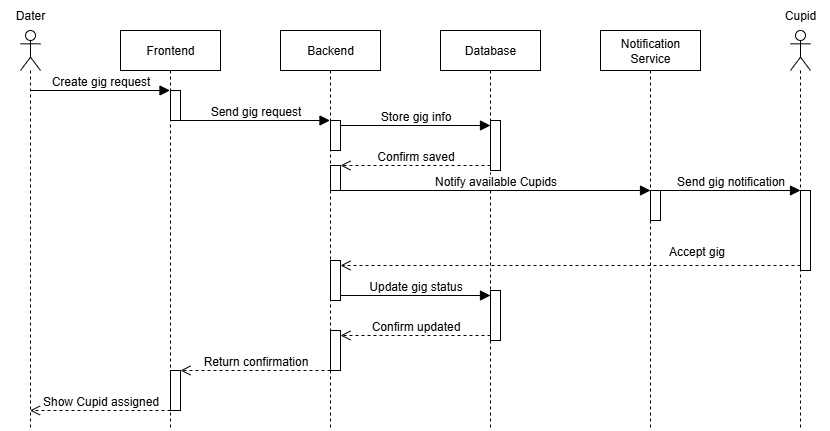

# High-Level Design Document Template

## 1. Introduction -- Kayden
- **Purpose:** Briefly state the purpose of this document.
- **Scope:** What is covered in this design? Reference the requirements document.
- **Audience:** Who should read this document?

## 2. System Overview -- Kayden
- **System Description:** High-level summary of the system and its goals.
- **Legacy System Overview:** (If applicable) What is inherited from previous development? What is new or changed?
- **Architecture Diagram:** Insert a simple block diagram showing major components.

## 3. Architecture -- Carter
- **Chosen Architecture:** (e.g., client-server, microservices, monolith)
- **Design Rationale:** Why was this architecture chosen?

## 4. Major Components -- Dallin
For each component:
- **Name:**
- **Responsibilities:**
- **Technologies Used:**
- **Internal Interfaces:** How does it communicate with other components?

## 5. External Interfaces -- Dallin
- **Third-Party APIs/Services:** List and describe each (e.g., Stripe, PayPal, notification services).
- **Protocols/Data Formats:** (e.g., REST, WebSocket, JSON)

## 6. User Interface Design -- Zac
- **Branding and Color Schemes:**
- **Navigation Flow:**
- **Accessibility Considerations:**
- **Wireframes/Mockups:** (Insert or link to images)

## 7. Input and Output -- Zac
- **Types of Input:** (User actions, external data, etc.)
- **Types of Output:** (UI updates, notifications, reports)
- **Expected Volume:** (If relevant)

## 8. Security -- Carter
- **Security at Each Layer:** (OS, application, network, data)
- **Sensitive Data Handling:**
- **Compliance Considerations:** (e.g., GDPR)

## 9. Risks and Mitigation -- Greg

### Explanation of Risk Mitigation Table
The table below summarizes the key risks identified for the AI-assisted dating help app, across critical categories such as Technology, Security, Data, and Schedule. Each risk is described with its causal factors, potential impact, and likelihood of occurrence. To support proactive management, specific preventative mitigations are outlined that aim to reduce the chance or severity of each risk. Contingency or fallback plans describe actions to be taken if a risk materializes despite these safeguards.

Triggers and early warning indicators provide measurable signals or thresholds that help detect when a risk is emerging or escalating, enabling rapid response. The residual risk denotes the remaining exposure after applying mitigations, while the status tracks the current risk handling state (e.g., Open, Monitoring).

This structured approach ensures clarity, accountability, and readiness to handle uncertainties, helping safeguard the project’s success and user trust in our app.

#### Risk Table Key
- **L (Low):** Rare/Minor (unlikely or easily handled)
- **M (Medium):** Possible/Moderate (would disrupt but manageable)
- **H (High):** Likely/Critical (seriously affects project or business)
- **Status:** Open = active/unresolved; Monitoring = being tracked; Closed = fully mitigated/resolved
- **Exposure:** Combines likelihood and impact for overall risk attention
- **Trigger/Indicator:** Metric or event that flags a risk may materialize

| ID  | Category         | Risk Statement                                                  | Likelihood | Impact | Exposure | Preventative Mitigation                | Contingency / Fallback             | Trigger/Indicator                   | Status    |
|-----|------------------|-----------------------------------------------------------------|------------|--------|----------|-----------------|----------------------------------------|-------------------------------------|-------------------------------------|
| R1  | Payments/Webhooks| Webhook failures/job overlaps → Revenue loss, user impact       | Medium     | High   | High      | Sandbox-first, idempotency keys        | Circuit breaker, manual audit, retry| Failure rate >2%/day                | Monitoring |
| R2  | AI Latency/Cost  | AI slow/costly → Bad experience, unscalable costs               | Medium     | Medium | Medium   | Observability, rate limiting           | Disable costly features, fallback   | Latency p95 >1.2s for 3 days         | Monitoring |
| R3  | Notification     | Non-delivery → Missed connections, retention drop               | Low        | High   | Medium   | Retry logic, multiple providers        | Alert users, manual notification    | Notification failures >1%/day        | Monitoring |
| R4  | Auth/SSO         | SSO/auth errors → Users locked out, increased support            | Low        | High   | Low      | Feature flags, error logging           | Switch to local login, escalate     | Auth error spikes >100/hr            | Monitoring |
| R5  | Data Migration   | Migration loss → Data integrity compromised, app downtime        | Low        | High   | Medium         | Sandbox/backup, rollback plan          | Restore backup, freeze changes      | Audit fails, missing records         | Monitoring |
| R6  | Schedule         | ML/data delays → Missed launch/revenue                          | Medium     | Medium | Medium   |  Milestone review, cadence checks       | Shift resources, move deadlines     | Milestone slip, unresolved blockers  | Monitoring |
| R7  | Security  | Bank info unencrypted → Data breach → Legal, financial, and reputation damage | Medium        | High      | High        | Implement AES-256 encryption, limit access, audit regularly | Immediate full encryption, user & regulator notification | Audit reveals unencrypted bank info, or breach occurs | Open     |

## 10. Data Design -- Greg
- **Data Stored:**
- **Data Structure:**
- **Privacy and Retention:**

## 11. Diagrams -- All
- **Architecture Diagram**
- **Component Diagram**
- **Sequence Diagram(s)**

#### **Gig Request**

- **Use Case Diagram(s)**

