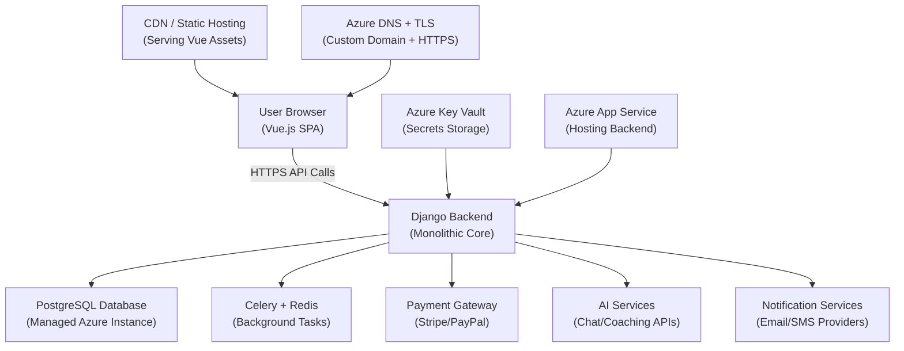

*Chat GPT was used in the creation of this document.*
# Cupid Code High-Level Design Document
Sprint Leader: Kayden Lancaster

Sprint Followers: Zac Cunningham, Greg Steele, Dallin Tew, Carter Johnson

## Contents
  - [Introduction](#1-introduction)
  - [Sysem Overview](#2-system-overview----kayden)
  - [Architecture](#3-architecture----carter)
  - [Major Components](#4-major-components----dallin)
  - [External Interfaces](#5-external-interfaces----dallin)
  - [User Interface Design](#6-user-interface-design----zac)
  - [Input and Output](#7-input-and-output----zac)
  - [Security](#8-security----carter)
  - [Risks and Mitigations](#9-risks-and-mitigation----greg)
  - [Data Design](#10-data-design----greg)
  - [Diagrams](#11-diagrams----all)
## 1. Introduction
**Purpose**  
Provide a concise high‑level technical design for the current Cupid Code platform so the team can complete an MVP that delivers the Must requirements (MoSCoW) for 2025–2026. This document aligns inherited code (frontend Vue app + Django backend) with the updated requirements specification and guides subsequent detailed design, implementation, and risk mitigation.

**Scope**  
Covers:  
- System context and current vs planned capabilities (AI assist, gigs, payments, notifications).  
- Architectural style (web client + Django REST backend) and core component boundaries.  
- Roles and data domains (Dater, Cupid, Manager/Admin, Couple/Shared).  
- High‑level data handling (profiles, gigs, feedback, authentication, future payments, AI session artifacts).  
- Integration points (future: Stripe, PayPal, weather, messaging, location).  
Excludes: low‑level class diagrams, detailed endpoint specs, test plans, deployment runbooks (to be documented separately). References: Requirements Specification (requirements.md) for authoritative functional, nonfunctional, business, and user requirements.

**Audience**  
- Engineering team members adding features (AI, payments, notifications).  
- Product/managerial stakeholders validating scope vs requirements.  
- Security/review stakeholders assessing data handling and role boundaries.  
- New contributors needing a structural overview before reading code.

**Goals Alignment (Selected Musts)**  
- Real‑time AI feedback (listen + chat).  
- Multi‑role web access (desktop + mobile browsers).  
- External notifications (email/SMS planned).  
- Secure data handling & age gating.  
- Future payment rails (Stripe/PayPal) for funding and Cupid payouts.  
- Maintain extensibility for couple features and auditability.

**Non‑Goals (Current Release)**  
- Native mobile apps.  
- Full subscription tiering or microtransactions (explicit Won’t).  
- Full multilingual & advanced analytics dashboards (later phases).  

## 2. System Overview -- Kayden
**System Description**  
Cupid Code is a role‑based web application that assists users (primarily socially anxious or inexperienced daters) with AI‑driven, context‑aware coaching and on‑demand human “Cupid” gig interventions. The platform delivers:  
- Dater experience: AI chat + (future) passive listening for live guidance; scheduling and gig request flows.  
- Cupid experience: Manage gigs, respond to interventions, (future) earnings and availability.  
- Manager/Admin: User oversight, future compliance/reporting, operational dashboards.  
- Couple extension (Should/Could): Shared calendar, joint preferences, gift/timeline concepts.  
Current stack:  
- Frontend: Vue 3 (Vite) SPA (router, components under src/, role‑specific views).  
- Backend: Django + Django REST style views (api app) with SQLite (to migrate to managed cloud DB).  
- Auth: Username/password (working), role persisted in backend models.  
- AI: Placeholder endpoints; microphone capture pipeline present; logic for real guidance still minimal.  
- Storage: Local DB for users, gigs, feedback scaffolding (see server/api/models.py).  
- Tests: Selenium UI scripts for login and role flows.  

**Legacy System Overview**  
Inherited (working or partial):  
- Authentication & role assignment.  
- Basic Vue SPA routing and layout.  
- Gig creation UI (no financial settlement).  
- Audio capture scaffolding + placeholders for AI responses.  
Partial / incomplete (to be delivered):  
- Funds pipeline (balances, deposits via Stripe/PayPal, payouts).  
- Real‑time notifications (web + external email/SMS).  
- AI reasoning + personalized memory (user preference persistence & adaptive coaching).  
- Cupid availability / scheduling logic validation.  
- Feedback loops (post‑gig rating, AI reflection).  
- Security hardening (encryption fixes, PII handling, audit trails).  

**Planned Enhancements (Near Term)**  
- Integrate payment providers (abstracted service layer).  
- AI session store referencing user profile + prior date context.  
- Notification subsystem (queued + provider adapters).  
- Role‑segregated data views and future couple privacy controls.  
- Deployment to Azure (containerized or managed app service).  

**Key Constraints / Assumptions**  
- Must remain web-first; performance acceptable for real‑time guidance within latency budgets (<1–2s AI round trip after backend integration).  
- Incremental migration from SQLite to Azure Postgres/MySQL once payment + audit features start (avoids migration pain later).  
- Privacy: Microphone streaming only opt‑in per session; no permanent raw audio retention (derived features only).  

**High-Level Data Domains**  
- Identity & Roles (User, DaterProfile, CupidProfile, Manager/Admin).  
- Scheduling & Gigs (gig requests, status, Cupid assignment, intervention notes).  
- AI Interaction (chat transcripts, advice events, memory embeddings—planned).  
- Financial (wallet, transactions, payouts—planned).  
- Feedback & Ratings (post‑gig + AI evaluation—planned).  
- Notifications (in-app + external dispatch queue—planned).  

**External / Future Integrations**  
- Payments: Stripe, PayPal (Must).  
- Weather API (Could) for contextual planning.  
- Location services (Could) for Cupid tracking.  
- Dating app API linking (Could).  
- Email/SMS provider (Twilio / SendGrid) for push-out notifications (Must for notifications objective).  

**Quality & NFR Priorities (Short Term)**  
- Security remediation (address encryption misuse, card storage via tokenization not raw DB).  
- Accessibility improvements (contrast, screen reader semantics in Vue components).  
- Reliability: Graceful degradation when AI or payment providers unavailable.  

**Architecture Diagram (Placeholder)**  
(Will depict: Browser SPA (Vue) → REST/JSON API (Django) → Data Layer (DB + future cache) → External Services (AI API, Stripe, PayPal, Email/SMS, Weather). Will be added in Section 11.)

**Success Criteria for This Phase**  
- End-to-end flow: Dater logs in → requests AI help → receives contextual response referencing stored preferences.  
- Cupid gig lifecycle visible (create → assign placeholder → mark complete).  
- Stubs for payment & notification services integrated behind clear service interfaces to enable parallel work streams.  

## 3. Architecture -- Carter
### Architecture Style
Cupid Code is designed using a **client–server monolithic architecture** centered on **Django**. While the backend currently functions as a monolith for simplicity and rapid development, it is organized into **modular services** (authentication, scheduling, payments, AI integration, notifications). This modular design provides a clear **pathway to evolve into a service-oriented or microservices architecture** in the future if scalability demands increase.  

This style was chosen because:
- It is well-suited to the **team size** and **tight project deadlines**.  
- It allows for **simpler deployment** and maintenance compared to a microservices setup.  
- It leverages the **existing Django codebase** and ecosystem, minimizing onboarding time for developers.  
- It balances the need for quick iteration with long-term maintainability and potential scaling.

### Deployment View
Cupid Code will be deployed in **three environments**: local development, staging/testing, and production. Each environment mirrors the core setup to ensure smooth promotion of code between stages.  

- **Frontend (Vue.js):**  
  Compiled into static assets and served via **Azure App Service** or a **CDN** for fast delivery.  
- **Backend (Django):**  
  Runs in an **Azure App Service container** with autoscaling enabled for higher loads. Handles API requests, business logic, and orchestration of external services.  
- **Database (PostgreSQL):**  
  Deployed as a **managed Azure Database for PostgreSQL** instance. Configured with automatic backups, encryption at rest, and role-based access controls.  
- **Secrets Management:**  
  Sensitive keys (API keys, DB credentials) stored in **Azure Key Vault**, never hardcoded.  
- **Networking & DNS:**  
  Deployed behind **Azure Application Gateway** with HTTPS termination. DNS configured via a custom domain with TLS certificates auto-renewed by **Azure Certificate Manager**.  

This setup ensures **fast iteration for developers**, **secure production hosting**, and **cloud-native scalability**.

### Major Components & Interactions
Cupid Code follows a **three-tier separation of concerns** with clear boundaries between presentation, logic, and storage:

1. **Frontend (Presentation Layer)**  
   - Vue.js single-page application (SPA).  
   - Role-based portals for Daters, Cupids, and Admins.  
   - Communicates with backend solely via HTTPS API calls.  

2. **Backend (Application Layer)**  
   - Django monolith structured into modular apps (auth, scheduling, payments, notifications, AI).  
   - Celery + Redis handle background jobs like reminders, notifications, and AI feedback.  
   - Integrates with third-party services: Stripe/PayPal (payments), AI APIs, email/SMS notification providers.  

3. **Database (Data Layer)**  
   - PostgreSQL stores user accounts, schedules, orders, and logs.  
   - Payment methods are never stored directly; only tokens from Stripe/PayPal are persisted.  
   - Strict schema with foreign keys to preserve consistency.  

### Design Rationale
- **Maintainability:** Monolith reduces deployment complexity while modularization ensures clean code boundaries.  
- **Scalability:** Although currently monolithic, service boundaries allow migration to microservices as traffic grows.  
- **Security:** Data separation, managed services, and secure key handling reduce attack surface.  
- **Extensibility:** Easy to add subscription tiers, new AI integrations, or enhanced scheduling features.  
- **Cloud-Native:** Uses Azure-managed services for scalability, security, and monitoring out of the box.  

### Component Diagram
The following diagram illustrates Cupid Code’s architecture and external integrations:

## 4. Major Components -- Dallin
For each component:
- **Name:**
- **Responsibilities:**
- **Technologies Used:**
- **Internal Interfaces:** How does it communicate with other components?

## 5. External Interfaces -- Dallin
- **Third-Party APIs/Services:** List and describe each (e.g., Stripe, PayPal, notification services).
- **Protocols/Data Formats:** (e.g., REST, WebSocket, JSON)

## 6. User Interface Design -- Zac

### UI/UX Principles

- Cupid codes redesign aims to make users' experience frustration-free by simplifying the overall design.
- Part of the redesign includes making the UI a mobile-first responsive design.                              
- Navigation will adhere to the standard of 2 clicks to get anywhere from the home page.   
- Cupid code aims to be accessible to all, which is why the color palettes were selected with color blindness in mind.

### Rebranding and Color Schemes

As part of the Rebranding for Cupid Code, our team has decided to lean into who our users are and focus the color scheme and logos around them.
Our main users, the daters, are comprised of tech enthusiasts; for this reason, we have decided to give the app a more techy vibe and style the app around the terminal. 

- The rebranding will feature a new logo designed to resemble intricate code elements.
- Below is an example of what the new logo could look like.

- Buttons that have graphics will also follow the new rebranding and look like code.
- The color scheme we have selected is based on the look of a terminal.
  - Dark background
  - light green words
  - minimal other colors
- The colors we have selected in hex are (from right to left)
  - #FB3640
  - #1F487E
  - #00CCFF
  - #09A129   
  - #000000

### Accessibility

- This color scheme aligns with our tech-driven vibe, ensuring the users feel right at home.
- Accessibility is essential to our team, so we have compared our color scheme to the following color blindness types, and we have included an image of that comparison for each.

**Protanopia**

**Deuteranopia** 

**Tritanopia**

**Achromatopsia**

**Protanomaly**

**Deuteranomaly** 

**Tritanomaly**

**Achromatomaly**

- Most Color Blindnesses are compatible with our color scheme.
- To ensure all can see and use our app efficiently, we will be adding an Accessibility mode.
- The Accessibility mode will make the following changes.
  - The black background (#000000) will change to a white background (#FFFFFF)
  - The Green Text (#09A129) will be changed to Black (#000000)
- Accessibility mode will be easily accessible from the home screen.
- Below is the color Palette for the accessibility mode.
  

### Navigation Flow
**Dater**

As stated before, we aim to make the user's experience as simple as possible; therefore, we strive to follow the following navigation plan.
Our home page is designed after the layout of the Canvas Mobile app.
- All pages are accessible with just two clicks from the home page.
- Pages:
  0. sign up page 
    - toggle for type of account (Cupid, or Dater) 
    - simple page with input boxes for: 
      - username 
      - password 
      - first name 
      - last name 
      - email 
      - phone number 
      - address 
      - physical discription
    - file upload button for a Profile picture
    - dedicated card space for a preview of prfile picture 
    - create account button 
  1. login page 
    - input boxes for:
      - email
      - password 
    - button to sign in with
  2. Home Page 
    - top nav bar (This is on Every page)
      - Logo center 
      - hamburger button
        - Accessible mode toggle 
        - link to profile page
        - link to payment page
        - logout link
    - main content card style 
      - Card to link to AI page 
      - Card to link to Plan a Date/ create a gig  page 
      - Card to link to Rate Cupids/Order Status page 
      - Card to link to Calendar 
      - Upcoming Dates Preview
        - 1-3 cards showing upcoming dates/events 
    - bottom nav bar (This is on every page)
      - link to Home page (disabled when on home page) 
      - Link to AI page 
      - Link to Payment page 
      - Link to Profile page 
      - Link to Notifications Page 
  3. AI Page
    - top nav bar (discussed previously)
    - AI chat tab  
      - chat history ( only avalible for current chat)
      - input message box
      - AI voice button ( changes UI to AI listening tab) 
    - AI listening tab
      - start listening button
      - stop listening button 
      - real time AI response box ( only will load after stop listening) 
      - AI chat button ( changes UI to AI chat tab
    - bottom nav bar (discussed previously)  
  4. Plan a date/create gig page 
    - top nav bar 
    - input boxes for: 
      - choose the day 
      - where you are going 
      - what you will be doing 
      - max budget for gig
    - button to add gig/create date 
    - bottom nav bar 
  5. Rate Cupid/ Order Status page 
    - top nav bar  
    - Unclaimed section 
      - Cards for all unclaimed gigs 
    - Claimed section 
      = Cards for all claimed gigs 
    - Completed Gigs section 
      - Cards for all completed gigs 
        - completed gigs cards will have a button to rate cupid 
    - rate cupid popup 
      - description input box
      - hearts radios 
      - send button 
      - cancel button 
    - bottom nav bar
  6. calander page 
    - top nav bar 
    -upcoming dates section
      - cards of upcoming dates ordered from closests to farthest
        - date details 
          - when
          - where 
          - what 
          - budget 
    - past dates section 
      - cards of past dates ordered from closest to farthest.
        - all card details are the same as the upcomming dates cards.
    - bottom nav bar
  7. Payment page 
    

**Cupid**

**Manager**

- **Navigation Flow:**
- **Wireframes/Mockups:** (Insert or link to images)

## 7. Input and Output -- Zac
- **Types of Input:** (User actions, external data, etc.)
- **Types of Output:** (UI updates, notifications, reports)
- **Expected Volume:** (If relevant)

## 8. Security -- Carter
### Overview — Defense in Depth
Cupid Code adopts a **defense-in-depth** approach: multiple independent controls are applied across the stack (client, server, data, and infrastructure).  Security is treated as a property of the entire system (architecture, code, build pipeline, and operations) rather than a single checkbox.  Controls are layered so that failure of one layer does not immediately expose sensitive data or critical functions.

---

### Threat Model — Summary & Key Mitigations
This section summarizes the highest-priority threats for Cupid Code and concrete mitigations.  The focus reflects your app’s features (real-time AI listening, payments, gig-worker access, shared couple data).

#### High-level threats
- **Unauthorized access / authN / authZ bypass**  
  *Mitigations:* strong password hashing (Argon2 preferred; PBKDF2 as fallback), email/phone verification, MFA for sensitive roles, short-lived access tokens + refresh tokens, OAuth2/OpenID Connect for external SSO, RBAC with least-privilege enforcement, require step-up auth for destructive operations (refunds, bans, data exports). Log and alert suspicious login patterns (IP/geolocation anomalies, impossible travel).

- **Injection (SQL, command, template)**  
  *Mitigations:* use Django ORM and parameterized queries only; avoid raw SQL. Validate and sanitize all inputs server-side. Static analysis and dependency scanning to catch vulnerable libraries. Apply a deny-by-default input validation policy for endpoints that accept free text.

- **Cross-Site Scripting (XSS)**  
  *Mitigations:* rely on Vue template auto-escaping; enforce CSP headers, sanitize any user HTML before rendering (if rich text is allowed), use HttpOnly cookies for session tokens when appropriate, and encode untrusted data placed into attributes or script contexts.

- **Cross-Site Request Forgery (CSRF)**  
  *Mitigations:* enable Django CSRF middleware for all form/API interactions that use cookies; require CSRF tokens on state-changing endpoints. For token-based API auth (Bearer/JWT), prefer header-based auth instead of cookies to avoid CSRF vectors.

- **Secret leakage (keys, tokens)**  
  *Mitigations:* never commit secrets to source control. Store secrets in Azure Key Vault (or equivalent KMS) and access them via managed identities. Enforce automated secret scanning for PRs and CI. Apply least-privilege to service accounts and rotate keys regularly.

- **Sensitive data exposure (PII, addresses, payment info)**  
  *Mitigations:* do not store raw payment card data — use Stripe/PayPal tokenization; encrypt PII at rest (field-level/envelope encryption for addresses); minimize retention; anonymize or redact logs; implement strict access controls and audit trails for PII access.

- **Denial of Service (DoS)**  
  *Mitigations:* rate limiting at API gateway, use Azure DDoS protection, autoscaling rules for legitimate traffic spikes, and circuit breakers for heavy third-party calls (AI, payment providers).

- **Privilege escalation / insider misuse**  
  *Mitigations:* RBAC, least privilege, separation of duties, require 2FA for admin actions, restrict DB and Key Vault access to ephemeral credentials and approved service principals, and log all privileged actions for review.

---

### Layered Controls (by layer)
#### Frontend (Vue)
- Enforce HTTPS everywhere (HSTS).  
- CSP headers; subresource integrity for critical third-party scripts.  
- Input validation on UI (but do not rely on it — always validate server side).  
- Use secure storage patterns: avoid persistent storage of sensitive tokens in localStorage; prefer short-lived tokens in memory, or HttpOnly cookies with proper SameSite settings for session cookies.  
- Obfuscate (never "securely hide") sensitive UI elements for couples (e.g., “surprise” flags) until consent reveals them.

#### Backend (Django)
- Use Django’s security middleware: CSRF, X-Frame-Options, XSS protections.  
- Centralized auth using Django + OAuth2/OIDC for SSO options (Google, GitHub) with verified email.  
- Granular RBAC enforcement at both view and object level (row-level checks where necessary).  
- Use parameterized queries exclusively; restrict any raw SQL to reviewed, tested code.  
- All background workers run with limited permissions; service accounts scoped to required resources.

#### Data Layer (Postgres, blob storage)
- Encryption at rest (DB-managed or Azure-managed AES-256).  
- Encrypted backups and snapshots.  
- Field-level encryption for PII such as addresses; use envelope encryption keys stored in Key Vault.  
- Tokenize payment instruments: store only processor tokens (Stripe PaymentMethod IDs) and transaction metadata.

#### Infrastructure / Cloud
- Secrets in Azure Key Vault; access with managed identities and RBAC.  
- TLS 1.3 across all endpoints; strict cipher suites.  
- Azure-native logging and monitoring (integrate with SIEM / Azure Sentinel).  
- Network-level controls: private subnets for DB, limited inbound rules, and API gateway rate limiting.

---

### Data Protection: specifics & best practices
- **At-rest encryption:** enforce Azure-managed encryption (AES-256) for Postgres, Blob storage, and backups. Use database-level Transparent Data Encryption (TDE) where supported.  
- **In-transit encryption:** require TLS 1.2+ (prefer TLS 1.3) for all communications (client↔API, API↔DB, API↔third-party). Certificate management handled by Azure Certificates/Key Vault or Let’s Encrypt via automation.  
- **Secrets & Key Rotation:** store all secrets/keys in Azure Key Vault. Enforce automated rotation policies for keys and credentials (e.g., 90-day rotation or as required by policy). Use short-lived service tokens where possible. Monitor Key Vault access logs.  
- **Addresses & Calendar data:** treat addresses as sensitive PII. Use field-level encryption (envelope encryption) for these fields; decrypt only in server memory and only when needed by a business flow (e.g., displaying to the user or sharing with an assigned Cupid, with user consent). For couple-shared data, honor per-partner consent flags before decryption.  
- **Payment/Card handling:** do not store PANs or CVV. Use Stripe Elements / Payment Intents to collect card data directly and receive a token/PaymentMethod id that can be used server-side. Keep PCI scope minimal by delegating card capture and storage to the payment processor. Log only non-sensitive transaction metadata.  
- **Token scopes and lifetime:** use OAuth2 scopes for granular API tokens (e.g., `read:profile`, `write:gigs`, `admin:billing`). Keep access tokens short-lived (minutes to hours) and use refresh tokens with rotation and revocation. Implement token revocation lists and immediate session invalidation after password changes or account deletion.

---

### Role-Based Access Control (RBAC) — model & enforcement
Define clear roles and least-privilege permissions. Enforce both coarse-grained (API-level) and fine-grained (resource/object-level) rules.

#### Roles & typical permissions
- **Dater (end-user)**  
  - Create/update own profile and preferences.  
  - Initiate payments (via Stripe/PayPal token flow), schedule dates, enable/disable in-date listening.  
  - View own transaction history, AI interaction logs (anonymized), and delete own account.

- **Cupid (gig worker)**  
  - View assigned gigs/orders and non-sensitive contextual info needed to fulfill tasks (approximate address, time window) — only after user's explicit consent where required.  
  - Update gig status, send messages to assigned dater, request reimbursements.  
  - No access to user's full financial history or private couple notes unless explicitly authorized.

- **Manager / Admin**  
  - System telemetry, safety/moderation tools (flagging, bans), dispute resolution (refunds), and compliance reporting.  
  - Sensitive actions (e.g., refunds, account takeovers, data exports) require two-person approval or step-up authentication.  
  - Admin accesses are logged, time-limited sessions with enforced MFA.

#### Enforcement patterns
- Use object-level permissions (Django Guardian-style or similar) for resources that must be shared selectively (couple timelines, surprise gifts).  
- All privileged endpoints require an `admin` scope and step-up MFA.  
- Periodic automated audits of role assignments; revoke stale privileges.  
- Implement consent flags for couples: features like “hide surprise gift” are enforced in the authorization layer — decryption and display logic check consent before revealing.

---

### Compliance & Governance
- **Age gating:** require DOB at registration and validate via email/phone verification. Deny or lock accounts under 18. Keep dob validation logs for audit.  
- **Data subject rights:** support export (machine-readable format) and permanent deletion of user data. Provide an admin workflow to comply with verified deletion requests and a method to redact backups per policy.  
- **Audit logs:** immutable, tamper-evident logs of authentication events, role changes, payment events, admin actions, and data accesses. Centralize logs in a SIEM and retain according to regulatory requirements (e.g., 1 year for routine logs, longer for financial events). Log access must itself be audited.  
- **PII minimization:** collect only required attributes. Where possible, store derived or hashed values instead of raw PII (e.g., hashed addresses for deduplication). Anonymize AI logs used for model improvement; retain raw transcripts only when explicitly approved by the user.  
- **Payments / PCI:** remain out of PCI-scope by relying on Stripe/PayPal for card storage and processing. Ensure server interactions with payment APIs follow recommended best practices (server-side verification of webhooks, idempotency keys).  
- **Legal & privacy policy:** publish a clear privacy policy describing data use, retention, and sharing. Provide opt-outs for marketing and telemetry. Maintain a data processing addendum if working with processors in GDPR jurisdictions.  
- **Testing & audits:** plan regular security scans (SAST/DAST), quarterly dependency vulnerability scans, and at least annual penetration testing. Consider a bug-bounty or coordinated vulnerability disclosure program as the product grows.

---

### Operational Security Practices & Incident Response
- **Secure SDLC:** require code reviews, SAST in CI, dependency vulnerability checks (dependabot/renovate), and secret scanning for pull requests.  
- **CI/CD:** separate pipelines and credentials for dev/staging/prod. Use ephemeral deploy tokens and require approvals for production deploys.  
- **Access management:** enforce MFA for all developer and admin accounts; use role-based access to Azure resources; periodic access reviews.  
- **Monitoring & alerting:** integrate application logs and Azure activity logs into a SIEM (Azure Sentinel recommended). Create runbooks for critical alerts.  
- **Incident response:** maintain an incident response playbook (containment, forensics, user notification timelines), contacts for legal/regulatory obligations, and pre-defined communication templates for breach notifications. Test the IR playbook with tabletop exercises.

## 9. Risks and Mitigation -- Greg
- **Key Risks:**
- **Mitigation Strategies:**

## 10. Data Design -- Greg
- **Data Stored:**
- **Data Structure:**
- **Privacy and Retention:**

## 11. Diagrams -- All
- **Architecture Diagram**
- **Component Diagram**
- **Sequence Diagram(s)**
- **Use Case Diagram(s)**

