*Artificial Intelligence (GitHub Copilot, ChatGPT) was used in the creation of this document*
# Low-Level Design

Sprint Leader: Kayden Lancaster
Team: Zac Cunningham, Greg Steele, Dallin Tew, Carter Johnson

### Contents
- [Introduction](#1-introduction)
- [System Architecture](#2-system-architecture-detailed-view)
- [Subsystem & Class Design](#3-subsystems--class-design)
- [Database Design](#4-database-design)
- [Performance Considerations](#5-performance-considerations)
- [Security Design](#6-security-design)
- [User Interface & Experience](#7-user-interface--experience)
- [Technology Stack](#8-technology-stack)
- [Deployment Plan](#9-deployment-plan)
- [Testing & Monitoring](#10-testing--monitoring)

## 1. Introduction

### Purpose
This Low‑Level Design (LLD) turns the Cupid Code high‑level vision into implementable specifications for an MVP that satisfies 2025–2026 Must requirements. It defines concrete data models and migrations, REST APIs and error contracts, service boundaries, background jobs, and security controls so engineers can build, test, and deploy with consistency.

### Scope
Covers:
- Frontend (Vue 3 + Vite SPA, router, components) and API client contracts.
- Backend (Django + DRF) endpoints, serializers, services, and signals.
- Data layer (SQLite dev → Azure PostgreSQL prod), schemas, indexes, migrations.
- Async jobs (Celery + Redis) for notifications, AI tasks, and long‑running work.
- Integrations (Stripe/PayPal tokenized payments, email/SMS providers).
- Config/ops (env config, secrets, observability, deployment assumptions on Azure).

Out of scope: microservices decomposition, native mobile apps, full analytics dashboards.

### Audience
- Engineers implementing features and infrastructure.
- Test engineers writing unit/integration/E2E tests.
- Tech leads and security reviewers validating decisions and controls.

### Assumptions and Constraints
- No raw card/bank data stored; payment methods use processor tokens (Stripe/PayPal).
- PII minimized; sensitive fields encrypted at rest; logs redacted.
- API versioning under /api/v1; additive changes favored.
- All timestamps UTC, ISO‑8601 over the wire.
- RBAC enforced at view and object level.
- Performance targets met via pagination, indexing, and async offloading.
- Cloud secrets via Azure Key Vault; CI/CD separates dev/staging/prod.

## 2. System Architecture (Detailed View)

> **Purpose:** this section expands the high-level architecture into a concrete, implementation-focused low-level design (LLD). It includes the finalized architecture diagram, detailed component interactions, repository and runtime structure, API/DB shapes, operational considerations, alternatives considered (and why they were rejected), and justification for the chosen solution.

---

### Finalized Architecture Diagram

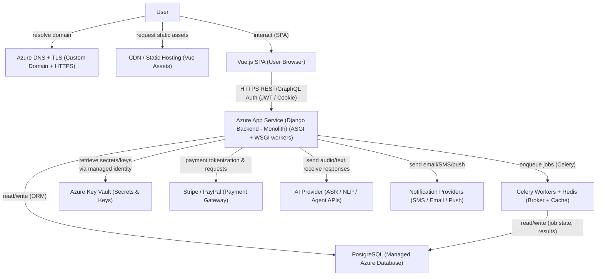

---

### Component interactions (detailed sequences)

Below are two canonical interaction paths showing call patterns, responsibilities, and failure handling considerations.

#### User sign-in (browser → API → DB)
1. **Browser (Vue SPA)** posts credentials to `POST /api/v1/auth/login`.  
2. **Django Backend**:
   - Validates input server-side (throttles attempts, checks CAPTCHA after threshold).
   - Queries Postgres for user record via Django ORM (parameterized).
   - Verifies password using Argon2 (or PBKDF2 fallback) and checks `is_active`, `age >= 18`.
   - On success: create a short-lived access token (JWT) and a refresh token (rotating, stored hashed in DB). Optionally also set an HttpOnly secure cookie for SPA flows that require cookie-based CSRF protection.
   - Emit an audit log entry (`audit_logs` table) for the login event and forward to the logging pipeline.
3. **DB**: returns user metadata (id, role, consent flags).  
4. **Backend** responds with `200 OK` + `access_token` (or cookie) and minimal user context.

**Failure handling:**  
- Lock account or require step-up MFA on suspicious login patterns (impossible travel, IP changes).  
- Rate limit enforced at API gateway (Azure Application Gateway / API Management) and in Django (per-IP and per-account).  
- Provide machine-readable error codes for client UX to show contextual messages (e.g., `ERR_AUTH_LOCKED`, `ERR_RATE_LIMITED`).

---

#### Real-time AI listening + coaching (browser → WebSocket/HTTP streaming → Backend → Celery → AI provider → Backend → DB → user)
1. **Browser** opens a WebSocket (or WebRTC/secure WebSocket) to `/ws/ai-session/:session_id` with bearer token or secure cookie.  
2. **Django (Channels / ASGI wrapper)** accepts the auth on upgrade and creates an `audio_session` record in DB (status: active).  
3. **Browser** streams short audio chunks to the WebSocket; chunks buffered and published as messages into a Redis channel or forwarded to a Celery worker via a secure internal endpoint.  
4. **Celery Worker** assembles audio frames into small batches and forwards encrypted streams over TLS to the AI provider (ASR/LLM pipeline). Worker uses a dedicated service identity and secrets from Key Vault.  
5. **AI Provider** returns transcriptions and suggested coaching messages (structured JSON). Worker enriches with timestamps & confidence scores and persists to `ai_interactions` table (JSONB) and triggers follow-up actions (e.g., suggested push notification to the dater).  
6. **Backend** pushes the coaching suggestions to the browser via the WebSocket channel, optionally also scheduling delayed notifications via Celery.  
7. **DB** stores audit and interaction logs (anonymized where possible). Sensitive data is stored encrypted (see Data section).

**Failure handling & cost controls:**  
- Chunk buffering plus local fallback (on connection failure, continue client-side to collect and retry).  
- Implement circuit-breaker between worker and AI provider to avoid runaway costs and retries.  
- Apply sampling for persistent storage of transcripts (e.g., store only when user opts in for post-date feedback) to limit storage cost and privacy exposure.

---

### Concrete component descriptions & runtime placement

> **Where things run** — summarized mapping of code → runtime → Azure service.

- **Vue SPA**  
  - **Build:** Node 18+, build pipeline (Vite/webpack) in CI producing optimized static assets.  
  - **Runtime:** served from CDN backed by Azure Blob Storage / Static Website or Azure Front Door.  
  - **Responsibilities:** UI/UX, local validation, audio capture (MediaDevices / WebRTC), offline caching and local state (Pinia/Vuex), push subscription registration, optimistic updates for gig statuses.

- **Django Backend (Monolith)**  
  - **Structure:** Django project with well-scoped apps: `accounts`, `profiles`, `couples`, `gigs`, `payments`, `ai`, `notifications`, `analytics`, `audit`.  
  - **Runtime:** ASGI server (Daphne/uvicorn) for long-lived connections (Channels) + Gunicorn WSGI workers for synchronous workloads. Containerized using Docker; hosted in Azure App Service (or optionally AKS for future scaling).  
  - **Concurrency:** Use ASGI for WebSocket endpoints (Channels + Redis channel layer). WSGI for standard REST workloads. Keep CPU-bound work in background workers.

- **Background processing**  
  - **Celery** with **Redis** as broker and result backend (or RabbitMQ if stronger delivery semantics are required).  
  - **Tasks:** notification sending, scheduled reminders, AI orchestration, payment reconciliations, periodic audits, CSV imports (bulk ETL).  
  - Workers run in separate containers with limited privileges (no direct access to production secrets beyond scoped service identities).

- **Database**  
  - **PostgreSQL (managed)** on Azure with TLS enforced, encryption at rest (AES-256), automated backups and point-in-time recovery.  
  - Use `pgbouncer` when under heavy concurrency to reduce DB connection churn. Optionally add read replicas for analytics and reporting workloads to isolate them from transactional load.

- **Secrets & Keys**  
  - **Azure Key Vault** for API keys, JWT signing keys, envelope encryption keys. Backend uses Managed Identity to fetch secrets at runtime; CI uses ephemeral deploy secrets from pipeline-integrated vault.

- **Third-party integrations**  
  - **Payments:** Stripe (PaymentIntents, webhooks); do not store PAN/CVV. Store `stripe_customer_id`, `payment_method_id` tokens and transaction metadata. Use idempotency keys on create flows.  
  - **AI provider(s):** external LLM + ASR providers (audio + text). All calls authenticated with Key Vault keys; worker proxies audio to provider to keep PII out of direct client→provider paths.  
  - **Notifications:** Twilio / SendGrid or equivalent; webhook verification and retry logic for delivery.

---

### API design (examples & conventions)

- **Versioning:** `/api/v1/...` — increment major versions for breaking changes.  
- **Auth:** Bearer JWT short lived + refresh token (rotating). Admin actions require `admin` scope and step-up MFA.  
- **Response envelope:**
  ```json
  {
    "status": "ok|error",
    "data": {...},
    "error": {"code": "...", "message":"..."}
  }
  ```
- **Key endpoints (examples):**
  - `POST /api/v1/auth/login` — credentials → returns `access_token`, `refresh_token`.  
  - `POST /api/v1/auth/refresh` — rotates refresh token.  
  - `GET /api/v1/profile` — returns profile (obeys privacy flags).  
  - `POST /api/v1/gigs` — create gig (validates budget, tokenizes payment intent).  
  - `POST /api/v1/ai/sessions` — start audio coaching session (returns session id, WebSocket URL).  
  - `POST /webhooks/stripe` — verified webhook handler (idempotent).
- **Real-time:** `/ws/ai-session/:id` for audio + coaching stream (ASGI Channels).  
- **Error handling:** idempotency keys for payment endpoints; 4xx for client errors with machine-readable codes; 5xx for server errors with correlation id logged. Include `retry-after` headers where rate-limiting is applied.

---

### Data model (high level schema & notes)

Primary tables (suggested, abbreviated). Use UUID PKs and timestamps (`timestamptz`) for auditability.

- **users**  
  - `id UUID pk`, `email text unique`, `password_hash text`, `role enum(dater,cupid,manager)`, `dob date`, `is_active bool`, `created_at timestamptz`  
  - Indexes: `email (unique)`, `created_at`, partial index on `is_active`.

- **profiles**  
  - `user_id FK`, `display_name`, `bio text`, `interests jsonb`, `search_vector tsvector` (for full-text).

- **couples**  
  - `id UUID`, `partner_a UUID`, `partner_b UUID`, `consent_flags jsonb`, `timeline jsonb`.

- **gigs**  
  - `id UUID`, `dater_id FK`, `cupid_id FK`, `status enum`, `budget_cents int`, `address_encrypted bytea`, `scheduled_at timestamptz`.

- **transactions**  
  - `id UUID`, `user_id FK`, `amount_cents int`, `currency text`, `processor_id text`, `status enum`, `metadata jsonb`.

- **ai_interactions**  
  - `id UUID`, `user_id FK`, `session_id UUID`, `transcript jsonb`, `response jsonb`, `confidence float`, `created_at`.

- **notifications**  
  - `id`, `user_id`, `type`, `payload jsonb`, `sent_at`, `status`.

- **audit_logs**  
  - `id`, `actor_id`, `action text`, `target_type`, `target_id`, `details jsonb`, `created_at`.

**Notes & practices:**  
- Use `JSONB` for flexible metadata and to avoid frequent schema migrations for small AI metadata changes.  
- Encrypt `address_encrypted` with envelope encryption keys from Key Vault; store the key id or key version metadata.  
- Use Postgres `row-level security (RLS)` for selective privacy enforcement (useful for couple-specific data).  
- Add `pg_trgm` / `tsvector` indexes for profile searching and `GIN` indexes for JSONB queries.

---

### Operational & infra details (CI/CD, runbooks, scaling)

- **CI/CD:** GitHub Actions or Azure DevOps pipelines:
  - Steps: lint → unit tests → integration tests → build frontend → publish artifacts → stage deploy → smoke tests → manual approval → prod deploy.  
  - Use environment-specific secrets from pipeline vault integration (do not commit secrets).

- **Containers / Runtime:** build Docker images for backend and workers; push to Azure Container Registry. Use Azure App Service for initial deployment; migrate to AKS if Kubernetes orchestration becomes necessary.

- **Scaling:** horizontal scaling for backend containers; Redis & DB sized per concurrency; autoscale rules on CPU/queue depth.

- **Connection pooling:** recommended `pgbouncer` between app and Postgres to manage many short DB connections (Azure Postgres has connection limits).

- **Backups & DR:** daily automated DB backups, point-in-time recovery enabled, weekly snapshot exports to cold storage. Define RTO & RPO in runbook.

- **Monitoring:** Azure Monitor + Application Insights for metrics/traces; centralized logs (JSON) forwarded to SIEM (Azure Sentinel advisable).

- **Secrets rotation & key management:** use vault rotation policies and secret versioning; CI uses short-lived tokens.

---

### Alternatives considered (and why rejected)

#### Monolith (Django) vs Microservices
**Monolith (chosen):**  
- **Pros:** faster feature development and iteration (single repo, unified test environment); simpler deployment pipeline and fewer operational components; lower cognitive overhead for a small team.  
- **Cons:** risk of a single large deploy causing cross-cutting regressions; scaling particular hot paths requires coarse-grained scaling.  
- **Mitigation:** modular app boundaries, clear contracts, and ability to extract services later.

**Microservices (not chosen now):**  
- **Pros:** each domain scales independently; language/tech heterogeneity allowed; failure isolation per service.  
- **Cons:** higher operational burden (service discovery, distributed tracing, CI/CD complexity), cross-service transactions become harder, increased latency and cost. Requires larger ops maturity.  
- **Decision:** postpone microservices until traffic or organizational needs justify the operational cost. Maintain clean modular code to enable extraction later.

---

#### SQLite vs PostgreSQL
**SQLite (rejected for production):**  
- **Pros:** extremely simple, zero-config, great for local dev and tests.  
- **Cons:** not suitable for concurrent writes at scale, lacks advanced security, replication, read replicas, and enterprise features (RLS, JSONB performance, extensions).  
- **Decision:** use SQLite for local dev and tests but **Postgres** for staging/production.

**PostgreSQL (chosen):**  
- **Pros:** robust concurrency, advanced indexing (GIN/pg_trgm), JSONB support, RLS, managed instances on Azure, point-in-time recovery, encryption, and proven performance for expected patterns (transactions, analytics).  
- **Cons:** slightly more operational complexity than SQLite, but handled by managed services.

---

### Decision rationale (summary & justification)

**Why a Django monolith + Postgres is the best fit now**

1. **Team size & velocity:** team is small and focused on quickly turning the partially-complete prototype (Cupid Code) into a working MVP. A Django monolith lets developers iterate quickly—one repo, one deployment, and Django’s “batteries included” approach reduces the number of decisions and boilerplate required to ship features like authentication, admin tooling, migrations, and ORM models.

2. **Complex features with shared state:** the product mixes tight transactional flows (payments, transactions, gig assignment) with real-time interactions (AI listening, WebSockets). In a monolith, coordinating these flows and keeping transactional consistency is simpler than across networked microservices. Postgres gives strong transactional guarantees, JSONB flexibility for AI metadata, and features like RLS that map directly to the privacy model (couple consent flags). Managed Postgres also reduces ops burden (backups, patching, encryption at rest).

Together, this combination minimizes operational overhead while providing a clear, supported path to split components into services later if traffic patterns and organizational capacity demand it. The modular Django app layout and carefully-documented API contracts ensure the architecture is *evolutionary* rather than *entrenched*.

---

### Operational concerns & next sprint actions (practical LLD checklist)
- Finalize `settings/` per environment (`settings.dev`, `settings.staging`, `settings.prod`) and integrate Key Vault for secrets retrieval at startup.  
- Implement `Django Channels` + ASGI config for WebSocket endpoints and ensure worker containers run Daphne/uvicorn.  
- Add `pgbouncer` config for production to manage DB connections.  
- Implement `envelope encryption` for address fields with Key Vault-managed keys (KMS).  
- Create idempotent webhook handlers for Stripe and add idempotency key usage in payment flows.  
- Add rate-limiting middleware (Azure API Management + Django rate limit) and circuit-breakers for AI provider calls.  
- Add `row-level security` policy for couple data to enforce privacy constraints at the DB level.  
- Add CI SAST (bandit/pylint), secret scanning, and dependency checking. Schedule a pen-test before public alpha.

---

### Sequence Diagram (component interaction example)

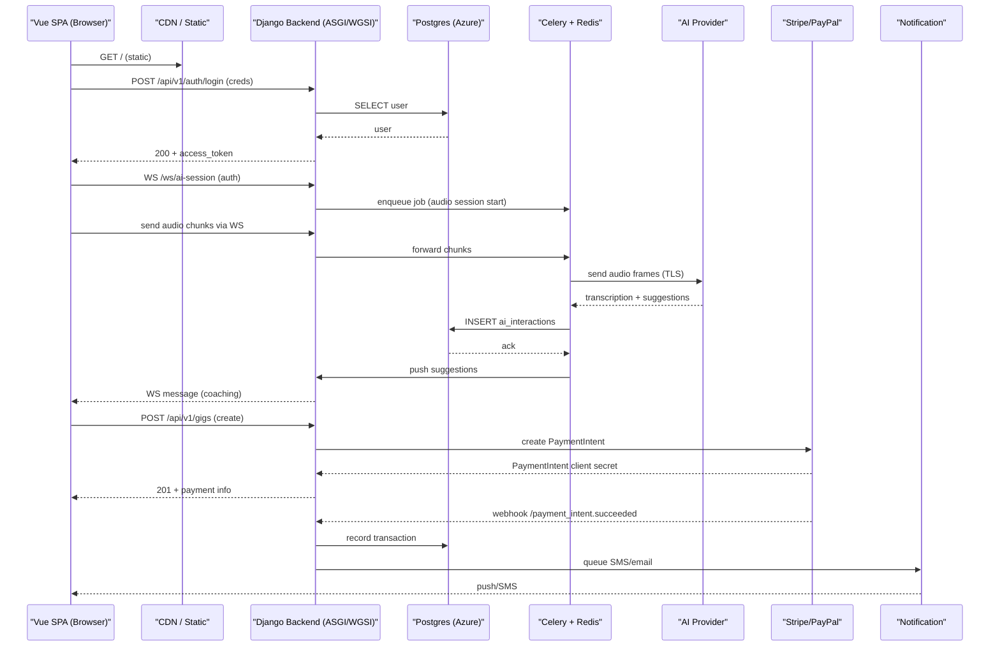
---

## 3. Subsystems & Class Design

### 3.1 Auth/Identity

**Responsibilities**

The authentication system manages user registration through the create_user() endpoint, which creates User instances with role-based profiles (Dater, Cupid, Manager) and automatically logs users in upon successful creation. User login is handled by sign_in(), which authenticates credentials using Django's built-in functions and returns serialized user data based on role. The system enforces authorization through helper functions like authenticated_dater() and authenticated_cupid() that validate user permissions before accessing protected resources. Session management relies on Django's session framework with CSRF protection, while logout functionality clears sessions through the logout_view(). The custom User model extends AbstractUser to include role designation and phone numbers, enabling role-based access control throughout the application where users can only access resources appropriate to their assigned role.

**Class breakdown**

*Backend Classes*

- **User (Django Model)**
  - Extends AbstractUser with custom role field and phone number
  - Defines role choices: DATER, CUPID, MANAGER
  - Serves as the base authentication model for all user types

- **Dater (Django Model)**
  - OneToOne relationship with User
  - Stores dater-specific profile data (budget, preferences, dating history)
  - Manages communication preferences and AI interaction settings
  - Tracks ratings, balance, and suspension status

- **Cupid (Django Model)**
  - OneToOne relationship with User
  - Manages gig worker profile data and availability status
  - Tracks completed/failed gigs, ratings, and earnings
  - Controls gig acceptance settings and location range

- **UserSerializer (DRF Serializer)**
  - Handles User model serialization/deserialization
  - Validates user registration data
  - Converts User instances to JSON for API responses

- **DaterSerializer (DRF Serializer)**
  - Serializes Dater profile data
  - Validates dater-specific form inputs
  - Handles profile updates and data formatting

- **CupidSerializer (DRF Serializer)**
  - Manages Cupid profile serialization
  - Validates cupid registration and profile data
  - Formats cupid data for API responses

*Frontend Classes/Components*

- **Login (Vue Component)**
  - Handles user login form and validation
  - Makes authentication requests to backend
  - Routes users to appropriate dashboards based on role

- **SignUp (Vue Component)**
  - Manages user registration process
  - Handles role selection and form validation
  - Submits registration data and auto-logs in users

- **NavSuite (Vue Component)**
  - Provides navigation and logout functionality
  - Manages user session state in the UI
  - Handles drawer navigation and profile routing

**UML case diagrams**

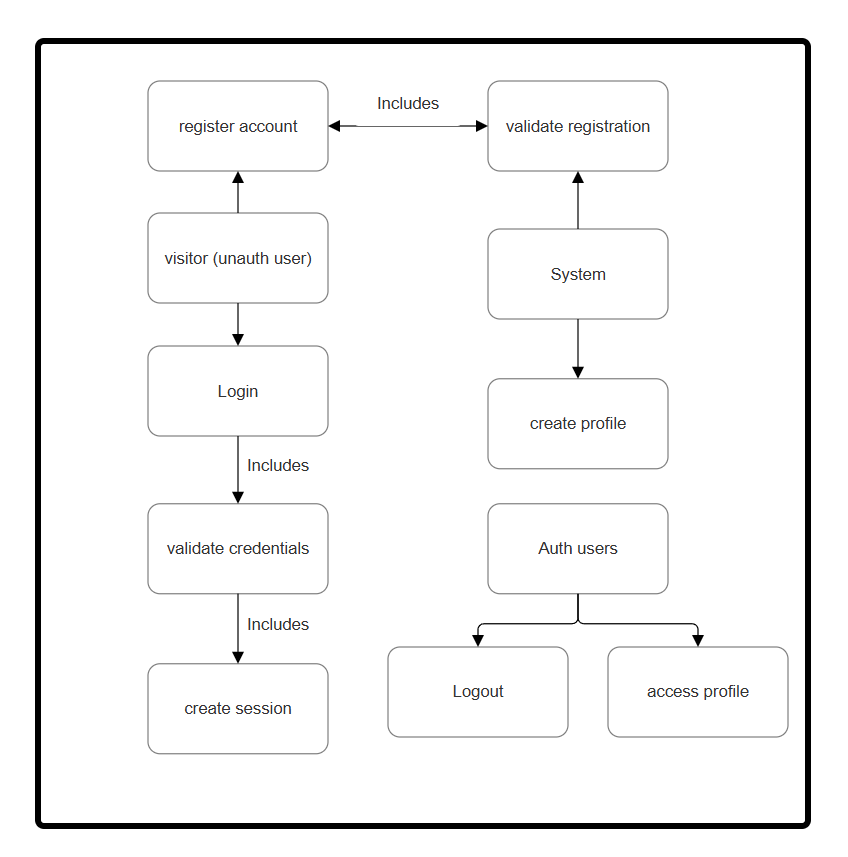

**Design choices/alternatives**

Auth/identity was produced by the previous team that worked on that project, as such we must keep it regardless, as to save time.

**Edge cases**

The authentication system handles duplicate user prevention via Django unique constraints, automatic role assignment in model save methods, suspension status checks with redirects, and permission validation preventing cross-user access through authenticated_dater() functions. Frontend components manage authentication failures with error displays, role-based routing, and form validation preventing incomplete submissions. The system handles profile creation rollbacks, distinguishes "user not found" vs "incorrect password" errors, and includes CSRF protection with session management. Key gaps include missing rate limiting, email verification, session timeout handling, and password strength validation.

### 3.2 Gig Scheduling
**Responsibilities**

The Gig Scheduling subsystem is responsible for finding and managing local events relevant to users. It retrieves event data from external sources using the Yelpapi API and determines which gigs to surface based on user location from the Geolocation API. It stores, updates, and filters event listings and handles any logic for scheduling, refreshing, or organizing gigs in the app. Its role is limited to acquiring, processing, and providing event data tied to user location.

**Class breakdown**

*Backend Classes*

- **Gig (Django Model)**
  - Manages gig lifecycle with status tracking (UNCLAIMED, CLAIMED, COMPLETE)
  - Links dater (requester) and cupid (assignee) with timestamps for each stage
  - Tracks dropped_count and accepted_count for analytics
  - Enforces foreign key relationships to Dater, Cupid, and Quest

- **Quest (Django Model)**
  - Stores gig details including budget, items_requested, and pickup_location
  - OneToOne relationship with Gig for detailed task specifications
  - Provides structured data for cupids to understand gig requirements

- **GigSerializer (DRF Serializer)**
  - Handles gig data serialization/deserialization for API responses
  - Validates gig creation and status update data
  - Formats gig data with related user information for frontend display

- **QuestSerializer (DRF Serializer)**
  - Manages quest data validation and formatting
  - Handles budget validation and location data processing
  - Converts quest specifications to JSON for API consumption

*Frontend Components*

- **DaterGigs (Vue Component)**
  - Displays dater's gigs categorized by status (claimed, unclaimed, complete)
  - Provides gig cancellation and cupid rating functionality
  - Manages rating popup with heart-based star system

- **GigDetails (Vue Component)**
  - Shows available gigs for cupids to accept
  - Filters gigs by cupid's location and range preferences
  - Provides accept/reject functionality for gig assignments

- **GigComplete (Vue Component)**
  - Displays completed gigs for cupid review
  - Enables dater rating and feedback submission
  - Shows gig history and completion statistics

- **Calendar (Vue Component)**
  - Manages date scheduling and gig timeline visualization
  - Integrates with gig creation for planning purposes
  - Displays upcoming gigs and date events

**UML case diagrams**

[To be added]

**Design choices/alternatives**

The gig system uses a separate Quest model rather than embedding gig details directly in the Gig model to maintain clear separation between gig lifecycle management and task specifications, enabling future quest reusability and detailed validation. Status tracking uses IntegerChoices enum rather than string fields to improve query performance and data consistency while preventing invalid status values. The system employs explicit foreign key relationships to Dater and Cupid rather than generic foreign keys to maintain referential integrity and enable efficient joins. Location-based filtering is implemented in Python rather than database spatial queries to avoid complex PostGIS setup for MVP, though this limits scalability for large geographic areas. Gig assignment uses a nullable cupid field on Gig rather than a separate GigAssignment table for simplicity, though the database design document recommends future normalization to track assignment history and handle concurrent claims more robustly.

**Edge cases**

The gig system handles location-based filtering to prevent cupids from seeing gigs outside their range, validates budget constraints during quest creation, and manages concurrent gig acceptance attempts through status checking. It prevents cross-user gig manipulation through authenticated_dater/cupid helper functions and handles orphaned gigs when cupids drop assignments. The system tracks completion statistics for performance analytics and validates gig ownership before allowing cancellation or modification. Missing capabilities include gig expiration handling, payment escrow during active gigs, and automated reassignment when cupids repeatedly drop gigs.

### 3.3 Messaging/AI
  Responsibilities
    The Messaging/AI subsystem handles all chatbot interactions and AI-driven communication features. It manages conversations between users and the in-app AI, generates responses, and provides real-time suggestions during dates based on live input. It can listen to user dialogue, evaluate communication proficiency, and recommend topics to keep the conversation active. Its role is limited to processing user messages, producing AI output, and supporting interaction through analysis and suggestion.

  Class breakdown
    Backend Classes

      Message (Django Model)
      Stores individual chat messages with owner reference and from_ai flag
      Links messages to users and distinguishes between user and AI responses
      Provides text storage for conversation history and context

      MessageSerializer (DRF Serializer)
      Handles message data validation and formatting for API responses
      Manages conversation serialization for frontend display
      Validates message text and user ownership

    Frontend Components

      AiChat (Vue Component)
      Provides text-based chat interface with AI
      Displays conversation history with visual distinction between user and AI messages
      Handles message sending and real-time conversation updates
      Manages chat state and auto-scrolling for new messages

      AiListen (Vue Component)
      Manages voice recording and speech-to-text functionality
      Provides emergency gig creation through popup interface
      Handles audio capture and transmission to backend STT endpoint
      Displays AI responses and listening status feedback

    Helper Functions

      speech_to_text() (API View)
      Processes audio data for speech recognition
      Converts voice input to text for AI processing
      Handles audio format validation and response generation

  UML case diagrams
  Design choices/alternatives
    The messaging system uses a simple Message model with from_ai boolean flag rather than separate UserMessage and AIMessage tables to minimize complexity for MVP, though this approach limits advanced features like message threading and conversation branching. Speech-to-text processing is handled synchronously in the API view rather than asynchronously to provide immediate feedback during live conversations, accepting potential latency issues for better user experience. The system stores all conversation history without automatic expiration to maintain context for AI responses, though the database design document proposes AISession separation for better retention management. Browser-based audio recording is used instead of native mobile recording to maintain web-first architecture, limiting audio quality but ensuring cross-platform compatibility. AI responses are generated on-demand rather than cached to provide personalized context, trading performance for response relevance but increasing API costs and latency.
  Edge cases
    The messaging system handles conversation persistence across sessions, manages concurrent message sending, and validates user ownership of conversations. It processes speech-to-text with error handling for poor audio quality and manages real-time AI response generation. The system handles emergency scenarios through immediate gig creation during listening sessions and maintains conversation context for coherent AI responses. Missing features include message encryption, conversation archiving, AI response caching, and advanced speech recognition error recovery.


Payments
  Responsibilities
    The Payments subsystem manages all monetary transactions through the Stripe API. It handles the purchase of Cupid Cash, and ensures that payment requests, confirmations, and balances are processed correctly. It records transactions, verifies successful payments, and updates user currency balances. Its role is limited to processing purchases, interacting with Stripe, and maintaining accurate Cupid Cash allocations for use in funding gigs.

  Class breakdown
    Backend Classes

      PaymentMethodToken (Django Model)
      Stores tokenized payment method references from Stripe/PayPal
      Links users to secure external payment tokens without storing sensitive data
      Tracks payment method metadata (brand, last4, expiration) for display
      Manages multiple payment methods per user with primary selection
      Provides secure payment method validation and verification status

      PaymentIntent (Django Model)
      Manages payment processing lifecycle from creation to completion
      Stores Stripe/PayPal payment intent IDs and processing status
      Tracks payment amounts, currency, and associated gig/transaction
      Handles payment confirmation, failure, and refund processing
      Provides audit trail for all payment attempts and outcomes

      Transaction (Django Model)
      Maintains comprehensive financial ledger for all user transactions
      Records debits, credits, transfers, and balance adjustments
      Links transactions to payment intents, gigs, and external references
      Provides immutable transaction history for accounting and auditing
      Supports transaction categorization and reporting requirements

      WalletBalance (Django Model)
      Tracks user account balances and available funds
      Manages separate balances for daters and cupids with role validation
      Handles balance updates with atomic operations and concurrency control
      Provides balance history and low-balance notification triggers
      Supports multiple currencies and conversion tracking

      EscrowHold (Django Model)
      Manages funds held in escrow during active gigs
      Links held amounts to specific gigs and payment sources
      Handles automatic release on gig completion or manual intervention
      Tracks hold duration and provides escrow status reporting
      Manages dispute resolution and partial release scenarios

      PaymentMethodTokenSerializer (DRF Serializer)
      Handles secure payment method display and validation
      Manages tokenization requests to payment providers
      Validates payment method updates and primary selection
      Formats payment method data for secure frontend display
      Handles payment method verification and status updates

      PaymentIntentSerializer (DRF Serializer)
      Manages payment processing request validation and formatting
      Handles payment confirmation and status update serialization
      Validates payment amounts and gig associations
      Formats payment intent data for frontend tracking
      Manages error handling and retry logic for failed payments

      TransactionSerializer (DRF Serializer)
      Handles transaction history serialization and filtering
      Manages transaction search and reporting data formatting
      Validates transaction creation and status updates
      Provides transaction categorization and summary data
      Handles pagination for large transaction histories

    Frontend Components

      CupidCash (Vue Component)
      Manages dater balance display and Cupid Cash purchasing
      Provides payment card selection and amount input interface
      Handles deposit transactions and balance updates
      Integrates with payment processing for fund additions

    Helper Functions

      dater_transfer() / cupid_transfer() (API Views)
      Handle balance transfers and payment processing
      Manage transaction validation and balance updates
      Process payment confirmations and error handling

      get_dater_balance() / get_cupid_balance() (API Views)
      Retrieve current user balance information
      Validate user permissions for balance access
      Format balance data for frontend display

      save_card() / save_bank_account() (API Views) - DEPRECATED
      Store payment method information - high security risk
      To be replaced with tokenized payment method storage
      Currently handle raw payment data validation

  UML case diagrams
  Design choices/alternatives
    The payment system currently stores raw payment card data directly in the database for rapid MVP development, though this creates significant PCI compliance risks that require immediate migration to Stripe/PayPal tokenization before production deployment. Balance tracking uses simple decimal fields on user profiles rather than a separate transaction ledger to minimize complexity, though this approach limits audit capabilities and transaction history. Payment processing is handled synchronously in API views rather than using background jobs to provide immediate user feedback, accepting potential timeout risks for better user experience. The system uses separate dater and cupid balance fields rather than a unified wallet system to maintain clear separation between user types and prevent accidental cross-role transactions. Payment provider selection prioritizes Stripe over PayPal due to superior developer experience and webhook reliability, though both remain viable options for user choice and payment method diversity.
  Edge cases
    The payment system handles balance validation to prevent overdrafts, validates payment card formats, and manages transaction atomicity to prevent double-charging. It enforces user permissions ensuring users can only access their own payment information and balances. The system handles payment processing failures with appropriate error responses and maintains transaction logs for audit purposes. Critical security gaps include raw payment data storage requiring immediate tokenization, missing PCI compliance controls, lack of payment method verification, and no fraud detection mechanisms.


Notifications
  Responsibilities
    Sends alerts to users through the Twilio API. It delivers updates about gigs and confirms transactions such as purchases of Cupid Cash. It handles message formatting, delivery, and routing to the correct user based on phone or contact data. Its role is limited to generating and sending outbound notifications triggered by events in other subsystems.

  Class breakdown
    Backend Classes

      Notification 
      Would store notification queue with delivery status tracking
      Would manage recipient information and delivery preferences
      Would track delivery attempts and failure handling

    Helper Functions

      notify() (API View)
      Processes notification requests and formats messages
      Handles routing to appropriate delivery channels (SMS/email)
      Manages notification validation and delivery confirmation

      Twilio Integration Functions
      get_twilio_authenticated_sender_email() - Retrieves sender email configuration
      get_twilio_authenticated_sender_phone_number() - Gets SMS sender number
      get_twilio_authenticated_reserve_phone_number() - Manages backup phone numbers
      Handle Twilio API authentication and message delivery

    Frontend Components

      Notification Display (Integrated in NavSuite)
      Shows in-app notifications and alerts to users
      Manages notification state and user acknowledgment
      Provides notification history and status updates

  UML case diagrams
  Design choices/alternatives
    The notification system uses Twilio as the primary provider for SMS and email delivery rather than implementing multiple providers to reduce integration complexity for MVP, though this creates vendor lock-in risks. Notifications are sent synchronously from API views rather than using a background queue system to ensure immediate delivery feedback, accepting potential performance impacts for simpler error handling. The system lacks persistent notification storage, instead relying on immediate delivery or failure, which limits retry capabilities and notification history but reduces database complexity. Template management is handled through simple string formatting rather than a sophisticated template engine to minimize dependencies and maintain rapid development pace. In-app notifications are integrated directly into the NavSuite component rather than using a dedicated notification service to leverage existing UI patterns and reduce frontend complexity, though this limits notification customization and advanced features like notification categories or priority levels.
  Edge cases
    The notification system handles delivery failures with retry mechanisms, validates recipient contact information, and manages notification preferences per user. It processes notification templates and formatting for different delivery channels and handles rate limiting to prevent spam. The system validates notification content and manages delivery timing for optimal user experience. Current gaps include missing notification persistence, no delivery confirmation tracking, limited template management, and no unsubscribe handling for external notifications.


Admin/Manager Dashboard
  Responsibilities
    Provides management access to app-wide data and user oversight. It displays key metrics such as total users, active users, revenue over time, and gig statistics including completion and drop rates. It allows managers to view and manage Cupid and Dater accounts, including suspending users when needed. It generates PDFs of statistical data and graphs for reporting purposes. The dashboard also controls navigation to different administrative pages and adapts its layout for different screen sizes. Its role is limited to data presentation, user oversight, reporting, and interface access for management actions.

  
  Class breakdown
    Backend Classes

      ManagerSerializer (DRF Serializer)
      Handles manager account data serialization for admin interfaces
      Validates manager-specific permissions and data access
      Formats manager profile information for dashboard display

    API Views (Manager Functions)

      get_daters() / get_cupids() - Retrieve user lists for management interface
      get_dater_count() / get_cupid_count() - Provide user count statistics
      get_active_daters() / get_active_cupids() - Track active user metrics
      get_gig_rate() / get_gig_count() - Calculate gig performance statistics
      get_gig_drop_rate() / get_gig_complete_rate() - Analyze gig completion metrics
      suspend() / unsuspend() - Manage user account status and access control
      delete_user() - Handle account deletion with proper data cleanup

    Frontend Components

      ManagerHome (Vue Component)
      Displays dashboard overview with key metrics and navigation
      Shows revenue graphs, user statistics, and gig performance data
      Provides navigation to detailed management pages
      Integrates PDF generation functionality for reporting

      Daters (Vue Component)
      Lists all dater accounts with management controls
      Provides suspension/unsuspension functionality for dater accounts
      Displays dater ratings, status, and account details
      Handles bulk operations on dater accounts

      Cupid (Vue Component - for Cupid Management)
      Manages cupid account oversight and controls
      Shows cupid performance metrics, ratings, and gig completion rates
      Provides cupid suspension and account management tools
      Displays cupid availability and service statistics

    Utility Functions

      to_pdf() (Frontend Utility)
      Generates PDF reports from dashboard statistics and graphs
      Handles chart and data export formatting
      Manages download functionality for management reports

  UML case diagrams
  Design choices/alternatives
    The admin dashboard uses Django's IsAdminUser permission class rather than custom role checking to leverage built-in Django admin patterns and ensure consistent security enforcement. Statistics are calculated on-demand in API views rather than pre-computed and cached to ensure real-time accuracy for administrative decisions, accepting performance costs for data freshness. The dashboard uses separate Vue components for different user management pages rather than a single unified interface to maintain clear separation of concerns and enable independent development of Dater and Cupid management features. PDF generation is handled client-side using jsPDF rather than server-side rendering to reduce backend complexity and enable immediate download without additional API calls. User lists are loaded without pagination for the MVP to simplify implementation, though this approach limits scalability as user counts grow and will require pagination implementation for production use.
  Edge cases
    The admin dashboard handles role-based access with IsAdminUser permission enforcement, validates admin actions before execution, and manages concurrent administrative operations. It processes large user lists with pagination and filtering and handles data export with proper formatting. The system tracks administrative actions for audit purposes and validates user management operations. Missing features include detailed audit logging, advanced analytics filtering, bulk user operations, automated report scheduling, and sophisticated user search capabilities.


UI (Frontend Vue)
  Responsibilities
    The UI subsystem handles all user-facing screens and interactions using Vue. It renders pages for authentication, gigs, messaging, payments, notifications, and the manager dashboard. It manages user input, state display, navigation, and component layouts across different screen sizes. It communicates with backend APIs to show real-time data and trigger actions like logging in, purchasing Cupid Cash, or viewing gigs. Its role is limited to presentation, interaction handling, and API integration on the client side.
    
  Class breakdown
    Core Components

      App (Vue Component)
      Root application component managing global state and routing
      Handles application initialization and top-level navigation
      Provides authentication state management across the application

      Router (Vue Router Configuration)
      Manages client-side routing with hash-based navigation
      Defines route mappings for all user roles and page types
      Handles route guards and role-based access control

    Common Components

      NavSuite (Vue Component)
      Provides consistent navigation interface across all pages
      Handles drawer navigation, logout functionality, and profile routing
      Manages responsive navigation for different screen sizes

      Login (Vue Component)
      Handles user authentication with email/password validation
      Manages error display and role-based routing after login
      Integrates with backend authentication endpoints

      SignUp (Vue Component)
      Manages user registration with role selection (Dater/Cupid)
      Handles different form fields based on selected user role
      Provides file upload for profile pictures and form validation

      Welcome (Vue Component)
      Landing page with application introduction and feature overview
      Provides navigation to registration and login pages
      Displays application branding and value proposition

      PinkButton (Vue Component)
      Reusable button component with consistent styling
      Handles click events and provides accessible button interface
      Ensures design consistency across the application

      Heart (Vue Component)
      Rating component using heart icons for feedback systems
      Manages interactive rating selection and display
      Used in cupid/dater rating interfaces

      Popup (Vue Component)
      Modal dialog component for overlays and confirmations
      Handles popup state management and content display
      Provides consistent modal interface across the application

    Dater-Specific Components

      DaterHome (Vue Component)
      Dashboard overview for dater users with feature navigation
      Displays key action cards for AI chat, listening, calendar, and balance
      Provides quick access to all dater functionality

      AiChat (Vue Component)
      Text-based chat interface with AI conversation management
      Handles message display, sending, and conversation history
      Manages real-time chat updates and message formatting

      AiListen (Vue Component)
      Voice recording interface with speech-to-text functionality
      Manages audio capture, processing, and AI response display
      Handles emergency gig creation through integrated popup

      DaterProfile (Vue Component)
      Profile management with editable user information and preferences
      Handles form validation, data updates, and password changes
      Manages profile picture upload and personal information editing

      DaterGigs (Vue Component)
      Displays dater's gigs categorized by status with management controls
      Provides gig cancellation and cupid rating functionality
      Handles rating submission with heart-based interface

      Calendar (Vue Component)
      Date and event management with scheduling capabilities
      Integrates with gig system for timeline visualization
      Handles date creation, editing, and budget planning

      CupidCash (Vue Component)
      Balance management and payment processing interface
      Handles Cupid Cash purchasing and payment method selection
      Manages transaction processing and balance display

      DaterFeedback (Vue Component)
      Displays received feedback and ratings from cupids
      Shows feedback history and rating summaries
      Provides feedback management and review functionality

    Cupid-Specific Components

      CupidHome (Vue Component)
      Dashboard for cupid users with gig-focused navigation
      Displays available gig previews and quick action access
      Provides navigation to gig management and profile pages

      CupidDetails (Vue Component)
      Cupid profile management with availability and preference settings
      Handles cupid-specific information editing and gig range configuration
      Manages cupid status and acceptance preferences

      GigDetails (Vue Component)
      Available gig browser with location-based filtering
      Displays gig details and provides acceptance/rejection functionality
      Handles gig assignment and status updates

      GigComplete (Vue Component)
      Completed gig history with rating and feedback capabilities
      Shows gig completion statistics and performance metrics
      Handles dater rating submission and review management

      CupidFeedback (Vue Component)
      Displays feedback received from daters with rating summaries
      Shows performance history and improvement suggestions
      Manages feedback review and response capabilities

    Manager-Specific Components

      ManagerHome (Vue Component)
      Administrative dashboard with system metrics and navigation
      Displays user statistics, gig analytics, and revenue graphs
      Provides PDF export functionality and management tool access

      Daters (Vue Component)
      User management interface for dater account oversight
      Handles user suspension, account details, and bulk operations
      Provides search and filtering capabilities for user management

      Cupid (Vue Component - Manager View)
      Cupid account management with performance tracking
      Shows cupid metrics, ratings, and service statistics
      Handles cupid account administration and oversight

    Utility Components

      GigData (Vue Component)
      Reusable component for displaying gig information consistently
      Handles gig detail formatting and status visualization
      Used across dater and cupid interfaces for consistency

    Shared Services

      makeRequest (JavaScript Utility)
      Centralized API communication with CSRF protection and session management
      Handles HTTP requests, error processing, and response formatting
      Provides consistent interface for backend communication

      logoutRequest (JavaScript Utility)
      Specialized logout handling with session cleanup
      Manages logout API calls and state clearing
      Ensures proper session termination across the application

  UML case diagrams

  Design choices/alternatives
    The frontend uses Vue 3 with Composition API rather than Options API to provide better TypeScript support and improved component reusability, though this requires more modern JavaScript knowledge from developers. Hash-based routing is used instead of history mode to avoid server configuration requirements for SPA deployment, accepting less clean URLs for simpler deployment. The system employs role-specific Vue component directories (DaterVues, CupidVues, ManagerVues) rather than feature-based organization to maintain clear role separation and enable independent development of user type interfaces. Session-based authentication with cookies is used instead of token-based authentication to leverage Django's CSRF protection and simplify logout handling, though this limits mobile app compatibility. The application uses a centralized makeRequest utility rather than a full state management library like Vuex to minimize complexity for MVP, accepting manual state synchronization challenges for faster development and smaller bundle size.

  Edge cases
    The UI system handles responsive design across device sizes, manages role-based component rendering, and validates form inputs before submission. It processes navigation state and handles route protection based on authentication status. The system manages component state synchronization, handles API communication errors gracefully, and maintains consistent styling across all interfaces. Current limitations include missing loading states, limited error boundary handling, no offline capability, basic accessibility support, and minimal client-side caching for API responses.

## 4. Database Design

### 4.1 Current State
The current state uses SQLite for the database containers and Django models populate them. 

**Our current implemented entities are:**
- User
- Dater
- Cupid
- Gig
- Quest
- Message
- Date
- Feedback
- PaymentCard (will be depreciated)
- BankAccount (will be de preciated)

**What we need for an MVP (2025):**
- Timestamps on moddles
- Flattened gig Assignments
- Messages lack session content
- unsafe financial storage. Needs to be switched to Stripe third party.

### 4.2 Target Model (MVP)
**Keep/rename**
- User: 
  - built-in auth
  - role 
  - phone_number
  - add created_at
  - updated_at
  - consider soft_delete flag
- DaterProfile (rename Dater):
  - budget
  - communication_preference
  - location
  - rating_sum/count
  - profile_picture
  - review large narrative fields
- CupidProfile (rename Cupid): 
  - accepting_gigs
  - status
  - gig_range
  - rating_sum/count
  - add availability windows later
- Gig: 
  - dater_id
  - status
  - budget
  - time window
  - location
  - details JSON
  - counters
  - remove inline cupid FK after assignment split
- Date:
    - dater_id
    - date_time
    - location
    - description
    - status
    - budget
- Feedback: 
  - owner_id (nullable)
  - target_user_id
  - gig_id
  - message
  - stars (1–5)
  - created_at
  - unique (owner_id, gig_id)

**Add**
- GigAssignment:
  - gig_id (unique)
  - cupid_id
  - claimed_at
  - completed_at
  - canceled_at
  - cancellation_reason
- AISession: 
  - owner_id
  - started_at
  - ended_at
  - context JSON
  - retention_label
- AIMessage: 
  - session_id
  - role (user|ai|system)
  - text, tokens_in/out
  - created_at
  - index (session_id, created_at)
- PaymentMethodToken:
  - user_id
  - provider (stripe|paypal)
  - provider_token
  - brand
  - last4
  - exp_month
  - exp_year
  - unique (user_id, provider, provider_token)
- PaymentIntent: 
  - user_id
  - provider
  - intent_id
  - amount
  - currency
  - status
  - created_at
  - updated_at
  - metadata JSON
- Transaction: 
  - user_id
  - amount
  - currency
  - type (debit|credit)
  - source (payment|payout|adjustment)
  - external_id
  - created_at
- Notification: 
  - user_id
  - channel (email|sms|inapp)
  - template_key
  - payload JSON
  - status
  - created_at
  - sent_at
  - error
- AuditLog:
  - actor_user_id
  - action
  - object_type
  - object_id
  - metadata JSON
  - created_at (append-only)

**Remove**
- PaymentCard, BankAccount (unsafe; replace with Stripe)

### 4.3 Normalization & Constraints
- 3NF across core tables; relationships via FKs; avoid M2M for MVP
- Constraints:
  - Feedback: CHECK stars IN [1..5], UNIQUE (owner_id, gig_id)
  - GigAssignment: UNIQUE (gig_id), FKs to Gig and CupidProfile
  - AIMessage: FK to AISession, ON DELETE CASCADE
  - Notification/AuditLog: append-only (status updates allowed on Notification)
- Global rules: all timestamps UTC; prefer hard deletes with cascades unless policy requires soft delete

### 4.4 Sensitive Data Handling
- No PAN/CVV or bank numbers in DB; use Stripe/PayPal tokens (PaymentMethodToken)
- Encryption at rest (Azure Postgres) + optional field-level encryption for addresses and selected narratives
- Redact PII from logs; store only non-sensitive payment metadata
- Access control: decrypt sensitive fields only in authorized flows (e.g., assigned Cupid with consent)

### 4.5 Index & Query Plan
- User: UNIQUE (username), UNIQUE (phone_number)
- Gig: (status, date_time_of_request), (dater_id, status)
- GigAssignment: (cupid_id, claimed_at)
- AISession: (owner_id, started_at)
- AIMessage: (session_id, created_at)
- Feedback: (gig_id); UNIQUE (owner_id, gig_id)
- Notification: (status, created_at), (user_id, created_at)
- PaymentIntent/Transaction: (user_id, created_at), (external_id)

### 4.6 Migration Plan (SQLite → Azure Postgres)
- Step 1: 
  - Add migrations for new tables (GigAssignment, AISession, AIMessage, PaymentMethodToken, PaymentIntent, Transaction, Notification, AuditLog)
  - created_at/updated_at
- Step 2: 
  - Backfill data under feature flags:
    - GigAssignment from Gig.cupid + timestamps.
    - AISession/AIMessage by grouping Message rows per owner chronologically
- Step 3: 
  - Remove PaymentCard/BankAccount code paths
  - integrate Stripe/PayPal
  - export and securely purge
  - DROP tables
- Step 4: 
  - Provision Azure Postgres
  - set server/.env DATABASE_URL
  - run Django migrations against Postgres
- Step 5: 
  - Validate with smoke/E2E tests
  - compare record counts and invariants
  - promote cutover
- Rollback: 
  - restore Postgres snapshot
  - revert feature flags

### 4.7 ER Diagram (to be updated)
- Core: 
  - User 1–1 DaterProfile/CupidProfile
  - DaterProfile 1–* Gig
  - Gig 1–1 GigAssignment
  - Gig 1–* Feedback
  - User 1–* AISession 1–* AIMessage
  - User 1–* Notification
  - User 1–* Transaction
  - append-only AuditLog

### 4.8 Open Questions
- Merge Quest into Gig.details JSON or keep normalized?
- Field-level encryption scope: addresses only or selected narratives as well?
- Keep nullable Gig.cupid for denormalized reads after introducing GigAssignment?

### 4.9 Model Pseudocode (Github Copilot using ChatGPT 5)

Note: Pseudocode shaped like Python/Django models for clarity. Names map 1:1 to Section 4.2.

```python
# PSEUDOCODE — NEW TABLES

class GigAssignment:
    # FKs
    gig_id: FK -> Gig (unique)            # one assignment per gig
    cupid_id: FK -> CupidProfile

    # Lifecycle
    claimed_at: datetime?                 # set once on claim
    completed_at: datetime?               # set on completion
    canceled_at: datetime?                # set on cancel
    cancellation_reason: str?             # enum-like: USER_CANCELED|CUPID_NO_SHOW|OTHER

    # Derived status
    def status(self) -> str:
        if self.completed_at: return "COMPLETED"
        if self.canceled_at: return "CANCELED"
        if self.claimed_at: return "CLAIMED"
        return "UNCLAIMED"

    # Commands (validate invariants; idempotent)
    def claim(self, now):
        assert self.claimed_at is None and self.completed_at is None and self.canceled_at is None
        self.claimed_at = now

    def complete(self, now):
        assert self.claimed_at is not None and self.completed_at is None and self.canceled_at is None
        self.completed_at = now

    def cancel(self, now, reason):
        assert self.completed_at is None and self.canceled_at is None
        self.canceled_at = now
        self.cancellation_reason = reason

    class Meta:
        unique_together = [(gig_id,)]
        index_together = [(cupid_id, claimed_at)]
```

```python
class AISession:
    owner_id: FK -> User
    started_at: datetime = now()
    ended_at: datetime?
    context: JSON                         # e.g., profile snapshot, gig/date refs
    retention_label: str = "SHORT"        # SHORT|STANDARD|LONG (policy-driven)

    def end(self, now):
        if not self.ended_at:
            self.ended_at = now

    class Meta:
        index_together = [(owner_id, started_at)]
```

```python
class AIMessage:
    session_id: FK -> AISession (on delete cascade)
    role: str                             # "user" | "ai" | "system"
    text: str
    tokens_in: int = 0
    tokens_out: int = 0
    created_at: datetime = now()

    class Meta:
        index_together = [(session_id, created_at)]
```

```python
class PaymentMethodToken:
    user_id: FK -> User
    provider: str                         # "stripe" | "paypal"
    provider_token: str                   # e.g., pm_xxx or vaulted ID
    brand: str?                           # visa/mastercard
    last4: str?                           # masked digits
    exp_month: int?
    exp_year: int?

    class Meta:
        unique_together = [(user_id, provider, provider_token)]
        index_together = [(user_id, provider)]
```

```python
class PaymentIntent:
    user_id: FK -> User
    provider: str                         # "stripe" | "paypal"
    intent_id: str                        # provider reference
    amount: int                           # minor units (cents)
    currency: str = "USD"
    status: str = "REQUIRES_ACTION"       # REQUIRES_ACTION|PROCESSING|SUCCEEDED|FAILED|CANCELED
    metadata: JSON = {}

    created_at: datetime = now()
    updated_at: datetime = now()

    def mark_succeeded(self, now):
        self.status = "SUCCEEDED"; self.updated_at = now

    def mark_failed(self, now, err=None):
        self.status = "FAILED"; self.updated_at = now
        self.metadata["error"] = err

    class Meta:
        unique_together = [(provider, intent_id)]
        index_together = [(user_id, created_at)]
```

```python
class Transaction:
    user_id: FK -> User
    amount: int                           # positive integer in minor units
    currency: str = "USD"
    type: str                             # "debit" | "credit"
    source: str                           # "payment" | "payout" | "adjustment"
    external_id: str?                     # e.g., provider charge/payout id
    created_at: datetime = now()

    def validate_sign(self):
        # Convention: debit reduces balance; credit increases
        assert self.amount > 0

    class Meta:
        index_together = [(user_id, created_at)]
        unique_together = [(source, external_id)]  # when present
```

```python
class Notification:
    user_id: FK -> User
    channel: str                          # "email" | "sms" | "inapp"
    template_key: str                     # e.g., "gig_claimed", "payment_succeeded"
    payload: JSON                         # rendered variables
    status: str = "QUEUED"                # QUEUED|SENT|FAILED
    created_at: datetime = now()
    sent_at: datetime?
    error: str?

    def mark_sent(self, now):
        self.status = "SENT"; self.sent_at = now

    def mark_failed(self, now, err):
        self.status = "FAILED"; self.sent_at = now; self.error = err

    class Meta:
        index_together = [(status, created_at), (user_id, created_at)]
```

```python
class AuditLog:
    actor_user_id: FK -> User?            # null for system
    action: str                           # e.g., "USER.SUSPEND", "PAYMENT.REFUND"
    object_type: str                      # "User" | "Gig" | "PaymentIntent" ...
    object_id: str                        # string for portability
    metadata: JSON                        # context snapshot
    created_at: datetime = now()

    def save(self):
        # Append-only: disallow updates/deletes by policy
        super().save()

    class Meta:
        index_together = [(object_type, object_id), (created_at,)]
```

```python
# PSEUDOCODE — EXISTING TABLE UPDATES (SELECTED)

class User (extend):
    created_at: datetime = now()
    updated_at: datetime = now()
    # optional: soft_deleted: bool = False
    # Index: UNIQUE(phone_number)

class DaterProfile (rename from Dater):
    # fields unchanged; add timestamps
    created_at: datetime = now()
    updated_at: datetime = now()

class CupidProfile (rename from Cupid):
    created_at: datetime = now()
    updated_at: datetime = now()

class Feedback (update):
    owner_id: FK -> User (nullable)       # who left the feedback
    target_user_id: FK -> User
    gig_id: FK -> Gig
    message: str
    stars: int                            # 1..5
    created_at: datetime = now()

    def clean(self):
        assert 1 <= self.stars <= 5

    class Meta:
        unique_together = [(owner_id, gig_id)]
        index_together = [(gig_id,)]
```

```python
# PSEUDOCODE — SERVICE/WORKER SKETCHES

def backfill_gig_assignments():
    # For each Gig with cupid set: create GigAssignment row with claimed/completed times
    for gig in select Gig where gig.cupid_id is not null:
        create_if_absent(GigAssignment, gig_id=gig.id, cupid_id=gig.cupid_id,
                         claimed_at=gig.date_time_of_claim,
                         completed_at=gig.date_time_of_completion)

def migrate_messages_to_ai_sessions():
    # Group Messages by owner into chronological sessions
    for owner_id in distinct(Message.owner_id):
        msgs = fetch_messages(owner_id).order_by("id")
        session = None
        for m in msgs:
            if session is None or should_start_new_session(session, m):
                session = AISession(owner_id=owner_id, started_at=m.created_at, context={})
                session.save()
            AIMessage(session_id=session.id, role=("ai" if m.from_ai else "user"),
                      text=m.text, created_at=m.created_at).save()
```

Implementation notes:
- All timestamps UTC; DB defaults enforce UTC.
- Monetary values stored in minor units (int).
- No PAN/CVV/bank numbers in DB; only provider tokens.
- Prefer hard deletes except where audit/compliance requires retention.

## 5. Performance Considerations

Potential bottlenecks (AI latency, payments, notifications, DB joins).

Mitigation strategies (caching, indexing, async jobs, autoscaling).

Scaling plan (load increases: DB vertical/horizontal scaling, queueing).

## 6. Security Design

> **Purpose:** expand the high level security section into a concrete low-level design (LLD). The LLD defines the threat model, concrete mitigations (passwords, payments, PII, TLS), an authentication token design (JWT + refresh), alternatives considered, detection & logging, key operational practices, a security threat table, and a diagram showing how data is protected *in transit* and *at rest*.

---

### Threat model (summary)
We define the threat model by listing the most relevant attack classes for Cupid Code and where they can appear in our stack:

- **Auth bypass / credential compromise / session hijack** — attackers obtain or guess credentials, steal tokens, or abuse OAuth flows.
- **Injection (SQL / command / template)** — crafted user input executed at the DB or in shell/templating contexts.
- **Cross-Site Scripting (XSS)** — malicious script injected into pages viewed by users, enabling token theft or UI manipulation.
- **Cross-Site Request Forgery (CSRF)** — cross-origin requests that use user cookies to perform state-changing actions.
- **Sensitive data leakage** — exposure of PII, addresses, payment data, transcripts, or keys via code, logs, backups, or misconfigured storage.
- **Secrets leakage / key compromise** — app secrets (API keys, DB passwords, encryption keys) leaked from source or CI/CD.
- **Denial of Service (DoS) / resource exhaustion** — large numbers of requests or heavy third-party calls (AI) causing outage or runaway costs.
- **Privilege escalation / insider misuse** — misuse of admin privileges or compromised operator accounts.
- **Supply-chain / dependency vulnerabilities** — vulnerabilities in third-party libraries, containers, or CI tooling.

---

### Security threat table (concise, actionable)

| Threat | Example attack | Impact | Primary mitigations | Detection |
|---|---:|---|---|---|
| Auth bypass | Credential stuffing, stolen tokens | Account takeover, fundraiser abuse | Argon2id password hashing; MFA for admins; short access tokens + refresh rotation; device/IP heuristics; login throttling | Auth logs, failed login rate alerts, impossible travel detection |
| SQL injection | User input placed into raw SQL | Data exfiltration/modification | Django ORM only; static analysis, input validation, DB least privilege | WAF alerts, DB audit logs |
| XSS | Rich text comment contains `<script>` | Token theft, CSRF bypass | Vue auto-escaping; CSP; sanitize rich text server-side | CSP violation reports, WAF |
| CSRF | Forged POST from malicious site | Unauthorized state changes | CSRF tokens; use Authorization headers for APIs; SameSite cookies | CSRF token mismatches logged |
| Sensitive data leak | Logs containing addresses/transcripts | Privacy breach, regulatory fines | Field-level/envelope encryption; redact logs; limit PII retention | SIEM, data access audit |
| Secrets leakage | Secret in repo, CI leak | Third-party abuse, data compromise | Azure Key Vault; secret scanning; ephemeral CI creds | Git scanning alerts, Key Vault access logs |
| DoS / runaway AI cost | Flood of audio sessions | Service outage, bill spikes | Rate limiting, circuit breakers, quota/chargeback | API gateway metrics, cost alerts |
| Privilege misuse | Admin exports data | Severe privacy/financial risks | RBAC, 2-person approval, MFA, audit logs | Admin action audit trail + alerts |
| Dependency exploit | Vulnerable package in backend | RCE or data leak | SAST/DAST, dependency scanning, pinning | Dependency alerts, pentest |

---

### Concrete mitigations — low level details

#### Passwords — Argon2
- **Algorithm:** **Argon2id** (resistant to side-channel and GPU attacks).  
- **Storage:** store `hash = Argon2id(password, salt, params)` and keep the `salt` per account. Do **not** store raw passwords.  
- **Recommended starting parameters:** *benchmark on your production-like hardware and tune; example starting point*:
  - `time_cost = 3` (iterations),
  - `memory_cost = 64 MiB` (65536 KiB),
  - `parallelism = 4`.
- **Other controls:**
  - Use per-user random salts (>= 16 bytes).
  - Optionally apply a server-wide **pepper** (extra secret) read from Key Vault — stored separately from DB, rotated rarely.
  - Enforce strong password rules + rate limiting + fuzzy matching against breached password lists (e.g., HaveIBeenPwned).
  - Password reset flow: one-time token with short TTL, single-use, store hashed reset tokens, log reset events.
  - On algorithm or parameter updates, rehash on next successful login (rehash on verify).

#### Authentication tokens — chosen pattern: **JWT access tokens + rotating refresh tokens**
**Why JWT + refresh?**  
- JWTs are stateless, compact, and convenient for APIs and SPAs. Combined with very short-lifetime access tokens + a secure refresh mechanism you get excellent UX and security.
- We mitigate JWT downsides by: *short access TTL, refresh token rotation, server side refresh token revocation, and storing refresh tokens hashed*.

**Implementation details**
- **Access token (JWT):**
  - Lifetime: **5–15 minutes** (conservative starting point; tune for UX).
  - Signed with asymmetric key (ES256 or RS256) stored in **Key Vault**. Include `kid` header for key rotation.
  - Include claims: `sub`, `iat`, `exp`, `scope`, `jti` (unique id), limited set of claims (no PII).
  - Validate signature, `exp`, `iss`, `aud`.
- **Refresh token:**
  - Long-lived but **rotating** (on each use, issue a new refresh token and invalidate the previous).
  - Store refresh tokens hashed in DB (e.g., bcrypt/Argon2 hash of refresh token) + `jti`/session id, user id, device fingerprint, expiry, and `revoked` flag.
  - On refresh: verify hashed token, issue new JWT + rotated refresh token; mark old refresh token used/invalidated.
  - Support immediate revocation (logout, password change, account deletion).
- **Storage in SPA:**
  - **Access token**: keep in memory (avoid `localStorage`).  
  - **Refresh token**: store in **HttpOnly, Secure, SameSite=strict/lax cookie** (to prevent XSS access). If you store refresh in cookie, ensure CSRF protections (CSRF tokens for cookie flows).
  - **Alternative:** keep both tokens in memory and rely on a refresh endpoint that requires reauthentication — tradeoffs exist.
- **Revocation / blacklisting:** store `jti` of revoked tokens or maintain a revocation list keyed by `session id`. Access tokens are short so blacklist size is manageable.
- **Token scopes:** use OAuth2-like scopes (`read:profile`, `write:gigs`, `admin:billing`) and validate scopes on every endpoint.

> **Note:** For endpoints used by third parties (webhooks, server-to-server), use client credentials with short-lived certs or OAuth2 client tokens — never reuse user tokens.

#### Payments — Stripe (no raw cards)
- **Card capture:** use **Stripe Elements** or Payment Intents flow; card data is collected by Stripe client SDK and never touches our servers.  
- **Server side:** store only `stripe_customer_id`, `payment_method_id`, and `payment_intent_id`. No PAN/CVV stored.  
- **Webhooks:** validate signatures (use Stripe webhook signing secret), verify event type and idempotency to avoid double processing. Use idempotency keys on payment creation.  
- **PCI scope:** by delegating capture and storage to Stripe we reduce PCI obligations; still follow Stripe recommended server hardening. Log only non-sensitive metadata.  
- **Refunds / disputes:** require admin authorization workflows (two-person approval or step-up MFA) and record audit events.

#### PII & Field-level encryption (addresses, calendar entries)
- **Pattern:** **Envelope encryption** (DEK wrapped by KEK).
  - For each sensitive field (e.g., `address`, `calendar_note`), generate a random Data Encryption Key (DEK) and encrypt the plaintext with an authenticated algorithm (AES-256-GCM) producing ciphertext + associated tag and IV.
  - Encrypt (wrap) each DEK with a Key Encryption Key (KEK) stored in **Azure Key Vault** using the Key Vault wrap/unwrap API.
  - Store in DB: `ciphertext`, `wrapped_dek_id` (key id / key version), `iv`, `aad` (if used), and metadata (consent flags).
- **Decryption:** performed in server memory only when explicit business permission exists (e.g., user viewing their own address; when sharing with a Cupid, verify consent). Do not log decrypted values.
- **Key management:**
  - KEKs in Key Vault rotated per policy (e.g., 90 days). When rotating, re-wrap DEKs or use key versioning with a rewrap process.
  - Use Key Vault access policies and Managed Identity (no static credentials).
- **Search & indexing:** avoid storing plaintext. For required searches use hashed or tokenized indexes (e.g., salted HMAC for dedupe), or store a derived search token hashed with a separate key. Document privacy tradeoffs.
- **Retention and deletion:** support complete deletion by removing both ciphertext rows and wrapped DEK metadata; when requested, sanitize backups as feasible.

#### TLS everywhere
- **Enforce TLS 1.3** for all external and internal connections where supported: client ↔ App, App ↔ DB, App ↔ Key Vault, App ↔ third parties (Stripe, AI).
- **Server configuration:** prefer ciphers supporting forward secrecy — ECDHE with AES-GCM or ChaCha20-Poly1305.
- **HSTS:** set `Strict-Transport-Security` with `includeSubDomains` and `preload` (after careful testing).
- **Certificate management:** use Azure-managed certificates or Key Vault to store certs, automate renewal, use OCSP stapling when applicable.
- **Internal encryption:** where TLS offload occurs (Application Gateway), maintain TLS from gateway → backend or use private networking to reduce exposure. For DB and Key Vault always TLS.

---

### Alternatives considered (JWT vs Session tokens) — short analysis

#### Cookie-based server sessions (stateful) — pros & cons
- **Pros:**
  - Server holds session state; immediate revocation is trivial (remove session).
  - Simpler CSRF mitigations when combined with SameSite cookies and CSRF tokens.
- **Cons:**
  - Harder to scale across microservices unless session store is centralized (Redis).
  - SPA + cross-origin setups are more complex; cookies need careful SameSite handling.
  - Increased server state and storage overhead for many concurrent sessions.

#### JWT + refresh tokens (chosen)
- **Pros:**
  - Stateless access tokens simplify horizontal scaling and microservice auth verification (no central session lookup required for token validation).
  - Works well with APIs and bearer auth in headers.
  - Short-lived JWTs reduce the attack window when stolen.
  - Refresh token rotation + server validation combines benefits of stateful revocation with JWT convenience.
- **Cons:**
  - Token revocation is more complex (requires refresh token storage and revocation lists).
  - Careful design required to mitigate theft (XSS, long-lived tokens).

**Decision / Justification:** **JWT + rotating refresh tokens** are chosen for Cupid Code because:
- We operate an SPA that calls an API; JWTs are natural for Authorization headers and microservices in the future.
- We require scale and low-latency auth checks (JWT signature validation is local).
- We implement refresh token rotation + hashed storage + short access TTL to address primary JWT weaknesses (revocation and long attack windows).
- To minimize XSS risk, refresh tokens will be stored in **HttpOnly Secure cookies** while access tokens remain memory-only; CSRF protections applied for cookie flows.

---

### Detection, logging, monitoring & alerting (low level)
- **Audit logs:** write immutable logs for auth events, admin actions, payments, PII access, and key unwraps. Store logs in append-only store with integrity measures (write-once blob or SIEM ingest).
- **Application logs:** structured JSON logs with correlation IDs (not containing PII). Redact or hash PII before logging.
- **Monitoring:** Application Insights / Azure Monitor for traces, metrics, latency, exception rates.
- **SIEM:** forward logs to Azure Sentinel (or equivalent). Create correlation rules:
  - Multiple failed logins per account → alert.
  - Unusual refresh token usage (rotation anomalies) → alert.
  - High rate of AI calls from single user → cost/dos alert.
- **Alerting:** integrate with PagerDuty / Slack for high severity incidents. Define runbooks.

---

### Operational security & SDLC (practical controls)
- **Secure SDLC:** require code reviews, SAST (bandit/semgrep), DAST scans on staging, dependency scanning (Dependabot/renovate), and secret scanning in CI.
- **CI/CD:** separate pipelines for dev/staging/prod. Use ephemeral deploy tokens and require approvals for production deploys. CI reads secrets from Key Vault using managed identity.
- **Access management:** enforce Azure AD SSO for developers and admins; require MFA; regularly audit access lists and roles.
- **Pen testing:** annual pentest and ad hoc tests before major releases. Consider a bug bounty for mature product.
- **Incident response:** maintain playbook for containment, forensics, user notification (timelines per law), regulatory reporting, and a post-mortem process.

---

### Security threat mitigations checklist (next actions)
- Enforce Argon2id with tuned parameters and pepper in Key Vault.
- Implement JWT + rotating refresh token flows and refresh token storage hashed.
- Move secrets to Azure Key Vault; remove any `.env` secrets from repo history.
- Implement envelope encryption for address/calendar fields with DEKs wrapped in Key Vault KEKs.
- Configure TLS 1.3 everywhere and enable HSTS and OCSP stapling.
- Add CSP, subresource integrity, and X-Content-Type-Options headers in frontend.
- Protect webhook endpoints (verify provider signatures) and implement idempotency keys.
- Implement RLS for couple data where reasonable and apply row-level permissions.
- Add SAST/DAST in CI; schedule pentest; enable dependency scanning.

---

### Data protection diagram (in transit, at rest)

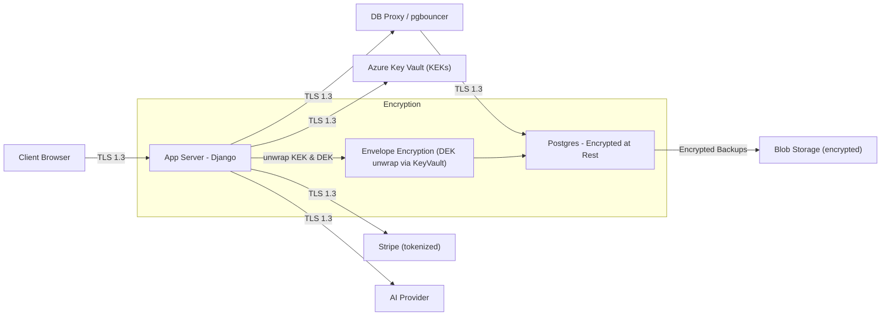

**Notes on the diagram**
- **TLS 1.3** is enforced on every arrow.  
- **Key Vault** contains KEKs and signing keys. App requests unwrap/wrap operations via Key Vault-managed identity — keys never leave the vault in plaintext.  
- **Envelope encryption**: App uses Key Vault to unwrap a KEK, which is used to decrypt a DEK (or to unwrap a stored wrapped DEK). DEK decrypts field ciphertext in memory only.  
- **Stripe / AI** calls are TLS authenticated using keys in Key Vault; Stripe handles card data tokenization.

---

### Justification (short summary)
- **Argon2id** is modern, GPU-resistant, and appropriate for protecting passwords given current threat models. Tunable memory/time parameters allow balancing security and performance.  
- **Stripe tokenization** keeps our PCI scope minimal and lets us avoid storing PANs/CVVs — a strong privacy and compliance decision.  
- **Field-level envelope encryption** for addresses and calendar items protects PII even if DB backups are compromised and enables fine-grained consent logic for couples.  
- **TLS 1.3 everywhere** ensures strong transport protection and forward secrecy; combined with Key Vault and HSM-backed keys this reduces exposure to typical network-level attacks.  
- **JWT + rotating refresh** is chosen for SPA/API friendliness and scalability while we mitigate JWT downfalls via short TTLs and server-side refresh token controls.

---

### Additional references & next steps
- **Benchmark Argon2** on your CI/bench environment; pick `memory`/`time` params and document them in `SECURITY.md`.  
- **Implement encryption helper library** (Python) encapsulating envelope encryption patterns, key wrap/unwrap, and consent checks to centralize complexity.  
- **Add monitoring rules** for abnormal token refresh patterns and for Key Vault access spikes.  
- **Schedule** a DAST scan and an external pentest before public alpha.  
- **Operationalize:** include the security checklist items into sprint tasks (Argon2 rollout, Key Vault migration, envelope encryption for addresses, token flow implementation, CSP/HSTS, webhook hardening, RLS policies).

---

## 7. User Interface & Experience

### 7.1 Accessibility

Cupid Code’s interface is designed to ensure that every user—regardless of visual, motor, or cognitive differences—can comfortably interact with the app. Accessibility is a core part of the redesign 
and is integrated across all roles (Dater, Cupid, and Manager).

#### Color Scheme & Contrast

Cupid Code’s visual identity draws from a terminal-inspired palette that balances bold contrast with simplicity. The selected colors are:

- **Imperial Red:** #FB3640
- **Polynesian Blue:** #1F487E
- **Vivid Sky Blue:** #00CCFF
- **Pigment Green:** #09A129
- **Black (Background):** #000000

This color scheme was tested against the most common forms of color blindness—**Protanopia**, **Deuteranopia**, **Tritanopia**, and **Achromatopsia**—to ensure clear differentiation between 
interface elements.  

##### Accessibility Mode

To further improve usability, Cupid Code includes an **Accessibility Mode** toggle that adjusts colors and contrast for users with visual sensitivities.  

When enabled, Accessibility Mode makes the following changes:
- Background color changes from **#00000** (Black) → *>#FFFFF>** (White)
- Text color changes from **#09A129** (Pigment Green) → *>#00000>** (Black)
- All interactive buttons and icons retain their accent colors for brand recognition and clarity.

The **Accessibility Mode toggle** will be visible on every page through:
1. The **Top Navigation Bar** (icon toggle next to the hamburger menu).  
2. The **Profile Settings Page** (persistent user preference stored in their account).  

When toggled, the interface updates instantly without requiring a page reload, ensuring users can switch modes seamlessly. The chosen setting is saved in the user’s profile so that 
it remains active across future sessions.

### 7.2 Navigation Flow

Cupid Code uses a predictable, mobile-first navigation model that minimizes friction and guarantees that core tasks are within two taps from the Home screen for every role.

#### 7.2.1 Two-Click Rule
- From each role’s **Home** screen (Dater, Cupid, Manager), all primary tasks (AI help, Plan/Find Gigs, Payments, Profile, Notifications; and for Manager: Cupid Info, Dater Info) are reachable in **≤ 2 taps**.
- Success toasts and notifications provide **deep links** back to the relevant record (e.g., a specific gig, payment receipt, or rating modal) without breaking the two-click expectation when returning to Home.

#### 7.2.2 Constant Navigation Bars
- **Top Bar (all pages):** Centered logo; left **hamburger menu**; optional quick actions (Profile, Payment) when appropriate to the role.
- **Bottom Navigation (mobile-first):** Persistent 4–5 items max; active route is clearly indicated (icon + label + underline).  
  - **Dater:** Home, AI, Payment, Profile, Notifications  
  - **Cupid:** Home, Find Gigs, Completed, Profile, Notifications  
  - **Manager:** Home (Dashboard), Cupid Info, Dater Info, Notifications
- The **current page’s** nav item is visually disabled or marked active to avoid redundant taps.

#### 7.2.3 Hamburger (Role-Aware Shortcuts)
- Opens a left drawer with role-specific shortcuts and secondary actions (e.g., Accessibility Mode toggle, Logout).
  - **Dater:** Profile, Payment, Calendar, Accessibility Mode, Logout
  - **Cupid:** Profile, Find Gigs, Completed Gigs, Feedback, Accessibility Mode, Logout
  - **Manager:** Dashboard, Cupid Info, Dater Info, Accessibility Mode, Logout
- The **Accessibility Mode toggle** is duplicated here for universal availability.

#### 7.2.4 Responsive Behavior (Screen Size Changes)
- **Mobile (default)**: Bottom nav is pinned; scrolling content lives beneath it; Top Bar remains fixed.
- **Tablet / Desktop**: Bottom nav moves to a **top secondary nav** (beneath the Top Bar) to leverage horizontal space; multi-column card grids are enabled where applicable.

### 7.3 Page Wireframes & Descriptions

# $`\textcolor{red}{\textbf{WARNING: PROTOTYPE SCREENS ONLY}}`$

The images referenced in this section are **non-functional prototypes** created in **Figma** to illustrate layout, flow, and component placement. They are not connected to live data or services, and **buttons/inputs do not work**. Final implementation details (spacing, copy, and micro-interactions) may change during development.

#### 7.3.1 Common Screens (Create Account, Login, Notifications)

---

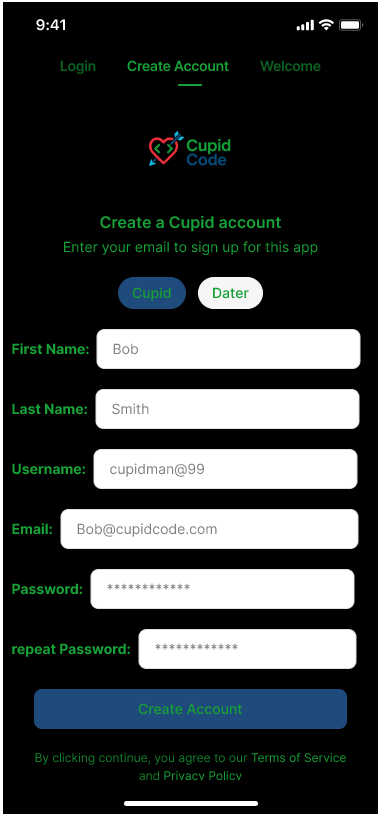

**Page Name:** Cupid Create Account

**Purpose:**  
Enable a new Cupid to register an account using only the most essential information required to create their profile and begin using the app. Following customer feedback, the **Create Account** process was simplified to reduce initial friction — Cupids now provide only basic details (name, email, username, and password). After registration, the system automatically sends a **notification prompting the user to complete their full profile** at a later time, allowing faster onboarding.

**Elements on this page:**  
- **Inputs**
  - First Name (text)
  - Last Name (text)
  - Username (text; uniqueness check on submit)
  - Email (email keypad; format validation)
  - Password (masked; strength meter)
  - Confirm Password (masked; match validation)
- **Selectors / Toggles**
  - Role Selector: **Cupid** / Dater (preselected as **Cupid** on this screen)
- **Buttons**
  - **Create Account** (primary)
  - **Back to Login** (secondary text link)
- **Validation / Messaging**
  - Inline error messages below fields on blur and on submit
  - Toast on success (“Account created ”)

**Expected User Actions:**  
- Enter required fields →  tap **Create Account**.  
- On success: account record created; user is directed to **Cupid Home** 
- If validation fails: inline errors displayed with clear remediation (e.g., “Username already in use,” “Passwords don’t match,”).

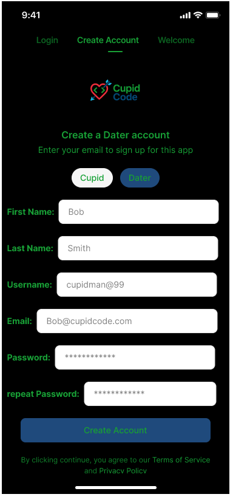

**Page Name:** Dater Create Account

**Purpose:**  
Allow a new Dater to register a basic account with minimal required information to begin exploring the app. Following the same simplification applied to the Cupid registration process, the **Dater Create Account** page now collects only core credentials (name, email, username, and password). After successful registration, the system automatically sends a **notification reminding the user to complete their full dating profile**, which includes details such as interests, relationship goals, and preferences. This staged onboarding ensures a faster initial signup experience while still enabling richer personalization later.

**Elements on this page:**  
- **Inputs**
  - First Name (text)
  - Last Name (text)
  - Username (text; uniqueness check on submit)
  - Email (email keypad; format validation)
  - Password (masked; strength meter)
  - Confirm Password (masked; match validation)
- **Selectors / Toggles**
  - Role Selector: **Dater** / Cupid (preselected as **Dater** on this screen)
- **Buttons**
  - **Create Account** (primary)
  - **Back to Login** (secondary text link)
- **Validation / Messaging**
  - Inline error messages displayed below fields on blur and submit
  - Toast on success (“Account created”)
  - Optional post-registration notification prompting completion of full profile

**Expected User Actions:**  
- Enter required fields → tap **Create Account**.  
- On success: account record is created, and the user is directed to the **Dater Home** screen.  
- If validation fails: inline errors are displayed with clear remediation (e.g., “Username already in use,” “Passwords don’t match,” “Invalid email format”).

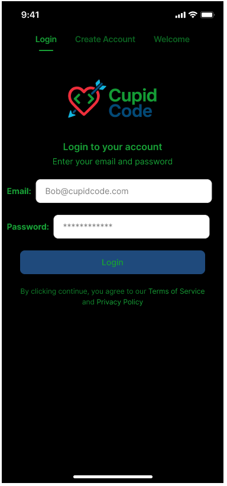

**Page Name:** Universal Login Page

**Purpose:**  
Provide a unified, simple login experience for all user roles — **Manager**, **Cupid**, and **Dater** — while maintaining the same consistent design language and accessibility standards. The shared login page minimizes redundancy and allows for a single authentication flow. After successful login, users are automatically redirected to their respective Home screen based on account role.

**Elements on this page:**  
- **Inputs**
  - Email (email keypad; format validation)
  - Password (masked; hidden characters with visibility toggle option in final build)
- **Buttons**
  - **Login** (primary; triggers authentication process)
- **Navigation Links**
  - **Create Account** tab (switches view to registration options for Cupid or Dater)
  - **Welcome** tab (optional introduction or marketing overview)
- **Informational Text**
  - Terms of Service and Privacy Policy disclaimer displayed beneath login button
  - Inline validation messaging if credentials are incorrect (e.g., “Invalid email or password”)
- **Branding**
  - Centered **Cupid Code** logo reinforcing consistent brand identity
  - Dark terminal-style background with bright accent colors matching the rebranding palette

**Expected User Actions:**  
- Enter registered **Email** and **Password** → tap **Login**.  
- On success: user is authenticated and redirected to the appropriate Home screen based on their role:  
  - Dater → **Dater Home**  
  - Cupid → **Cupid Home**  
  - Manager → **Manager Dashboard**  
- On failure: inline message appears beneath the password field prompting the user to retry or reset their password (future feature).  
- User may switch tabs at the top to **Create Account** if they don’t yet have an account, or to **Welcome** to learn more about the app.

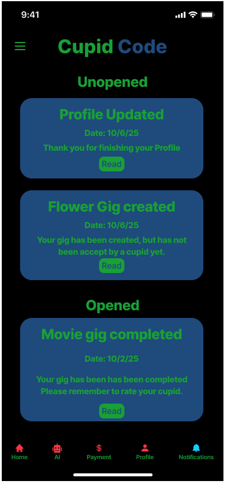

**Page Name:** Notifications Page (Dater View)

**Purpose:**  
Provide users with an organized list of updates and alerts related to their activity within Cupid Code. The **Notifications Page** helps users stay informed about completed gigs, new gig creations, profile updates, and reminders. This page maintains the same layout for all user roles (Dater, Cupid, Manager) but adapts the **bottom navigation bar** to match the role’s available features. Notifications ensure real-time awareness without requiring users to check multiple pages manually.

**Elements on this page:**  
- **Sections**
  - **Unopened:** Displays new or unread notifications at the top, visually emphasized with bright text and color contrast for quick recognition.  
  - **Opened:** Displays previously viewed notifications, shown in a slightly dimmed or muted color style to distinguish them from unread items.
- **Notification Cards**
  - Title (short summary of event, e.g., *“Profile Updated”*, *“Flower Gig Created”*, *“Movie Gig Completed”*)  
  - Date (timestamp of when the event occurred)  
  - Description (brief message about the update)  
  - **Read** button — marks the notification as opened and, when tapped, directs the user to the relevant page (e.g., profile, gig details, or rating page).  
  - Rounded corner design, consistent with terminal-style color palette (blue cards with green text).  
- **Navigation**
  - **Top Bar:** Centered Cupid Code logo with a hamburger menu on the left. The menu includes quick access to settings, accessibility mode toggle, and logout.  
  - **Bottom Navigation Bar (Role-Based):**
    - **Dater:** Home, AI, Payment, Profile, Notifications (active).  
    - **Cupid:** Home, Find Gigs, Completed Gigs, Profile, Notifications (active).  
    - **Manager:** Home (Dashboard), Cupid Info, Dater Info, Notifications (active).

**Expected User Actions:**  
- Scroll to browse unread and read notifications.  
- Tap the **Read** button to open the related page and automatically change the notification’s state to *opened*.  
- Once viewed, the notification visually transitions to the “Opened” section.  
- Use the **bottom navigation bar** to quickly access other app areas.  
- Access the **hamburger menu** to toggle accessibility mode or log out.  

#### 7.3.2 Dater Screens 

---

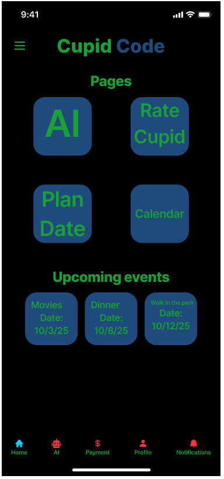

**Page Name:** Dater Home Page

**Purpose:**  
Serve as the **central hub** for Dater users, allowing quick access to all major app functions while presenting upcoming event information in a clear, visually structured layout. The Dater Home Page embodies Cupid Code’s **two-click navigation rule**, ensuring users can reach any feature—AI chat, date planning, rating cupids, or calendar—in two taps or fewer. It also provides an at-a-glance view of **upcoming events**, reinforcing the app’s focus on organization and simplicity.

**Elements on this page:**  
- **Top Bar**
  - Cupid Code logo centered at the top.  
  - Hamburger menu on the left for quick access.
- **Main Sections**
  - **Pages Section**
    - Four large interactive cards representing key actions:
      - **AI:** Opens the AI Chat/Voice Assistant page for help and suggestions.
      - **Rate Cupid:** Opens the page for rating past Cupid interactions or reviewing completed gigs.
      - **Plan Date:** Opens the date creation or gig request page.
      - **Calendar:** Opens the calendar view to see all scheduled and past events.
  - **Upcoming Events Section**
    - Displays 1–3 upcoming date cards (e.g., *Movies*, *Dinner*, *Walk in the Park*).  
    - Each card includes event title and date, formatted for quick readability.  
- **Navigation**
  - **Bottom Navigation Bar:** Persistent and role-specific (Dater View).  
    - **Home:** Active (disabled while on this page).  
    - **AI:** Opens AI Chat/Voice Assistant page.  
    - **Payment:** Opens Payment page for managing funds.  
    - **Profile:** Opens Dater Profile page for editing details.  
    - **Notifications:** Opens Notifications page (shared across roles).

**Expected User Actions:**  
- Tap one of the **Page cards** (AI, Rate Cupid, Plan Date, or Calendar) to navigate directly to the corresponding feature.  
- Scroll down to view **Upcoming Events**; tap an event card for more details or follow-up actions (e.g., rating, editing).  
- Use the **Bottom Nav Bar** or **Hamburger Menu** for quick navigation to other app sections.  
- The Dater can return to this Home Page from any other screen in **two taps or fewer**, maintaining the user experience standard defined in the High-Level Design.

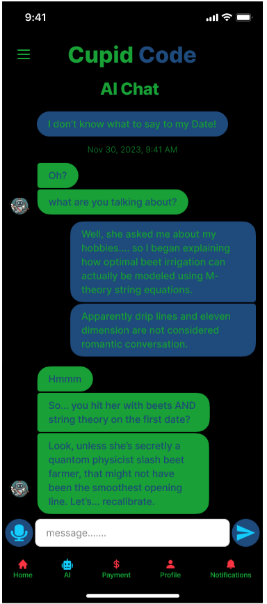

**Page Name:** Dater AI Chat Page

**Purpose:**  
Provide Dater users with an interactive space to receive real-time AI assistance for dating-related questions, conversation advice, and activity planning. The **AI Chat Page** serves as Cupid Code’s intelligent companion feature, offering both **text-based** and **voice-enabled** interaction modes. This page maintains a friendly, conversational layout while preserving the app’s terminal-inspired aesthetic and brand color palette.

**Elements on this page:**  
- **Top Bar**
  - Centered **Cupid Code** logo with the title **AI Chat** directly below.  
  - **Hamburger menu** on the left with quick access to settings, Accessibility Mode, and Logout options.
- **Chat Interface**
  - Alternating message bubbles:
    - **User Messages:** Displayed in **blue** with right alignment.
    - **AI Responses:** Displayed in **green** with left alignment and AI avatar.  
  - Timestamps displayed below or between message clusters for context.  
  - Smooth auto-scroll behavior to keep the latest messages in view.
- **Input Area**
  - Text input field with placeholder text *“message…….”*  
  - Send button (blue arrow icon) to submit typed messages.  
  - Optional **microphone icon** to activate voice input for AI listening mode.
- **Conversation Features**
  - Chat history persists for the current session.  
  - AI responses appear dynamically after short simulated typing delay.  
  - Message formatting supports line breaks and varied tone for natural dialogue.  
  - If a network or AI error occurs, a temporary toast displays an error message (e.g., *“Could not connect to AI. Try again.”*).

- **Navigation**
  - **Bottom Navigation Bar (Dater View):**
    - **Home:** Returns to Dater Home Page.  
    - **AI:** Active (disabled while on this page).  
    - **Payment:** Opens Payment Page.  
    - **Profile:** Opens Dater Profile Page.  
    - **Notifications:** Opens Notifications Page.

**Expected User Actions:**  
- Type a question or statement into the message bar → tap the **Send** icon.  
- Read AI’s response, which may include humor, conversation advice, or dating suggestions.  
- Use the **Hamburger Menu** to adjust Accessibility Mode or logout if desired.  
- Return to the Home Page or other sections using the **Bottom Navigation Bar**.  
- Press the **Microphone Icon** to enable voice chat and receive AI feedback via text.

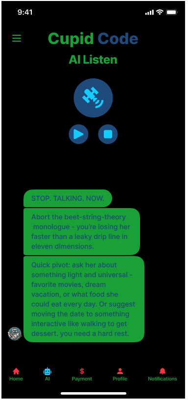

**Page Name:** Dater AI Voice Page (AI Listen Mode)

**Purpose:**  
Allow Dater users to interact with the AI through **voice-based input and response**, offering real-time conversational assistance without typing. The **AI Listen Page** is designed for users who prefer hands-free interaction or need faster in-the-moment feedback—such as during a date scenario. This page complements the AI Chat page and maintains the same terminal-inspired interface style and accessibility standards.

**Elements on this page:**  
- **Top Bar**
  - Centered **Cupid Code** logo with “AI Listen” title below it.  
  - **Hamburger menu** for quick access to all pages, accessibility mode, and logging out
- **Voice Interface**
  - Large animated microphone icon at the center to indicate listening state.  
  - **Play button** to begin voice recording.  
  - **Stop button** to end recording and trigger the AI’s response.  
  - Visual feedback (e.g., glow or pulse) when the microphone is active.
- **AI Response Area**
  - AI responses displayed in **green message bubbles**, similar to the chat view.  
  - Each message contains conversational guidance or quick tips based on the user's spoken input.  
  - Messages auto-stack vertically with smooth scroll behavior.  
  - Example responses include humor and adaptive advice (e.g., *“Abort the beet-string-theory monologue…”*).
- **Accessibility & Feedback**
  - AI messages use clear, concise language for readability.  
  - Optional voice output (future enhancement) to read AI responses aloud.  
  - Toast notifications appear for connection errors or permission denials (e.g., *“Microphone access required”*).
- **Navigation**
  - **Bottom Navigation Bar (Dater View):**
    - **Home:** Returns to Dater Home Page.  
    - **AI:** Active (disabled while on this page).  
    - **Payment:** Opens Payment Page.  
    - **Profile:** Opens Dater Profile Page.  
    - **Notifications:** Opens Notifications Page.

**Expected User Actions:**  
- Tap the **Play** button to begin recording their voice query.  
- Speak naturally while the microphone is active.  
- Tap the **Stop** button to send the recorded query to the AI.  
- View the AI’s **text-based response** immediately below, offering live advice or suggestions.  
- Use the **Hamburger Menu** to toggle Accessibility Mode or log out.  
- Navigate to other pages using the **Bottom Navigation Bar** once finished with the AI session.

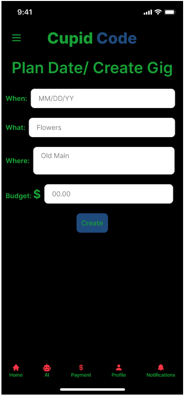

**Page Name:** Dater Plan Date / Create Gig Page

**Purpose:**  
Allow Dater users to create new **date events** or **gigs** quickly by specifying the basic details of the planned outing. This page provides a clean, minimal layout that prioritizes usability and speed, ensuring that users can create an event in seconds while adhering to the app’s **two-click navigation rule**. The page was streamlined based on customer feedback to include only the four key inputs: **When, What, Where, and Budget**.

**Elements on this page:**  
- **Top Bar**
  - Centered **Cupid Code** logo with page title **“Plan Date / Create Gig”** below it.  
  - **Hamburger menu** on the left providing quick access to all pages,, Accessibility Mode, and Logout.  
- **Input Fields**
  - **When:** Date input field (MM/DD/YY format) for selecting the event date.  
  - **What:** Text input describing the activity (e.g., *Flowers*, *Dinner*, *Concert*).  
  - **Where:** Text input for the event location (e.g., *Old Main*, *Megaplex*, *Park*).  
  - **Budget:** Currency input field with dollar sign indicator for specifying the cost or spending limit.  
- **Buttons**
  - **Create:** Primary action button that submits the form and generates a new gig record.  
- **Validation / Messaging**
  - Inline validation ensures all fields are filled before submission.  
  - Error messages displayed under invalid fields (e.g., *“Please enter a valid date”*, *“Budget must be greater than $0.00”*).  
  - Success toast appears after creation (e.g., *“Gig created successfully!”*).
- **Navigation**
  - **Bottom Navigation Bar (Dater View):**
    - **Home:** Returns to Dater Home Page.  
    - **AI:** Opens AI Chat/Voice Assistant page.  
    - **Payment:** Opens Payment Page.  
    - **Profile:** Opens Dater Profile Page.  
    - **Notifications:** Opens Notifications Page.

**Expected User Actions:**  
- Fill out each field (**When, What, Where, Budget**).  
- Tap **Create** to submit the gig.  
- On success: the new gig is added to the Dater’s list under the **Unclaimed Gigs** section and becomes visible to Cupids.  
- On failure (missing or invalid fields): inline errors prompt the user to correct information.  
- After successful creation, the user may return to **Home** or view notifications confirming gig creation.

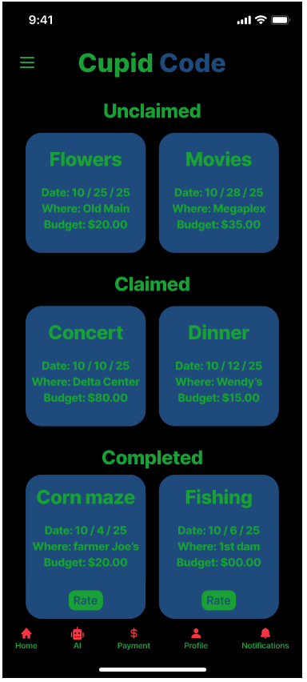

**Page Name:** Dater Rate Cupid / Gig Status Page

**Purpose:**  
Enable Dater users to **track the status of their gigs** (dates) and provide feedback once a Cupid completes a task. This page organizes all gigs into three clear categories — **Unclaimed**, **Claimed**, and **Completed** — making it simple for users to understand the progress of each event at a glance. Once a gig is marked as completed, users can submit a **rating** for the Cupid involved, contributing to service quality and user accountability.

**Elements on this page:**  
- **Top Bar**
  - Centered **Cupid Code** logo 
  - **Hamburger menu** on the left providing quick access to all pagest, Accessibility Mode, and Logout.

- **Main Sections**
  - **Unclaimed Gigs:**  
    - Displays gigs that have been created but not yet accepted by any Cupid.  
    - Each gig card includes details:  
      - **What:** Activity (e.g., *Flowers*, *Movies*)  
      - **When:** Date of event  
      - **Where:** Location  
      - **Budget:** Specified amount  
    - Cards are informational only (no action buttons).  

  - **Claimed Gigs:**  
    - Displays gigs currently accepted by a Cupid.  
    - Cards show the same details as above and are marked with a *Claimed* status.  
    - Used primarily for tracking — no user input required.  

  - **Completed Gigs:**  
    - Displays gigs that have been completed by Cupids.  
    - Each card includes a **Rate** button, allowing the user to rate their Cupid’s performance.  
    - Clicking **Rate** opens a **popup modal** (see below) for submitting a review.

- **Rating Popup Modal (when Rate is tapped)**
  - Text area for optional comments (user feedback).  
  - Five-heart rating scale (1–5 hearts).  
  - **Submit** button to finalize rating.  
  - **Cancel** button to close the modal without submitting.  
  - Confirmation toast appears on success: *“Thank you for rating your Cupid!”*

- **Navigation**
  - **Bottom Navigation Bar (Dater View):**
    - **Home:** Returns to Dater Home Page.  
    - **AI:** Opens AI Chat or AI Listen Page.  
    - **Payment:** Opens Payment Page.  
    - **Profile:** Opens Dater Profile Page.  
    - **Notifications:** Opens Notifications Page.

**Expected User Actions:**  
- Review **Unclaimed**, **Claimed**, and **Completed** gigs in their respective sections.  
- Tap the **Rate** button under any completed gig to open the rating modal.  
- Select 1–5 hearts and optionally add a short comment, then tap **Submit** to send the rating.  
- After rating submission, the modal closes, and the gig card updates to reflect that the Cupid has been rated.  
- Navigate freely using the **Bottom Navigation Bar** or **Hamburger Menu** to access other features.  

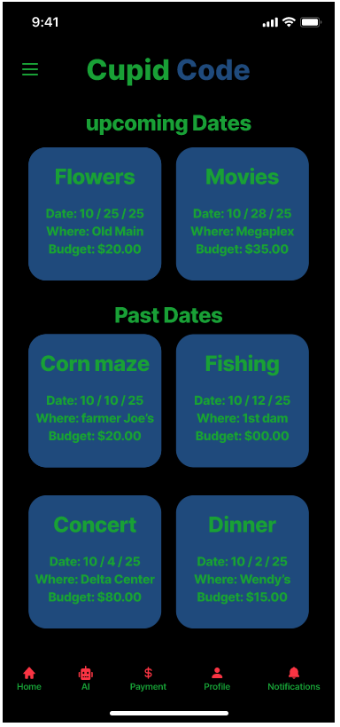

**Page Name:** Dater Calendar Page

**Purpose:**  
Provide Dater users with an organized overview of both **upcoming** and **past** dates in a clean, card-based layout. The Calendar Page helps users visually manage their schedule without requiring a traditional calendar grid, aligning with Cupid Code’s minimal and mobile-friendly design philosophy. It allows users to quickly review when and where events are happening, as well as revisit completed dates for rating or reference.

**Elements on this page:**  
- **Top Bar**
  - Centered **Cupid Code** logo  
  - **Hamburger menu** on the left for quick access to Profile, Payment, Accessibility Mode, and Logout.
- **Main Sections**
  - **Upcoming Dates Section**
    - Displays all future scheduled dates sorted chronologically.  
    - Each card includes:
      - **What:** Activity name (e.g., *Flowers*, *Movies*)  
      - **When:** Event date (MM/DD/YY format)  
      - **Where:** Event location  
      - **Budget:** Planned cost of the event  
    - Cards are interactive; tapping one opens more detailed date information or the related gig status page.
  - **Past Dates Section**
    - Displays completed dates (events before today’s date).  
    - Each card mirrors the same structure as Upcoming Dates.  
    - Cards may include a subtle dim effect to indicate completion.  
    - Tapping a past date card redirects the user to the **Rate Cupid / Completed Gig** page, where they can provide feedback if not yet rated.

- **Visual Design**
  - Distinct section headers: **“Upcoming Dates”** and **“Past Dates”** displayed in bright green for visual separation.  
  - Rounded blue cards with green text maintain consistency with the terminal-inspired rebranding style.  
  - Uniform spacing between cards for easy scrolling and readability.

- **Navigation**
  - **Bottom Navigation Bar (Dater View):**
    - **Home:** Returns to Dater Home Page.  
    - **AI:** Opens AI Chat or AI Listen Page.  
    - **Payment:** Opens Payment Page.  
    - **Profile:** Opens Dater Profile Page.  
    - **Notifications:** Opens Notifications Page.

**Expected User Actions:**  
- Scroll through **Upcoming Dates** to review upcoming events.  
- Tap any **Upcoming Date Card** to view or edit event details (future enhancement).  
- Scroll down to **Past Dates** to review previous events.  
- Tap a **Past Date Card** to open the **Rate Cupid / Gig Status Page** and provide a rating if applicable.  
- Use the **Bottom Navigation Bar** or **Hamburger Menu** to navigate to other features or toggle Accessibility Mode.  

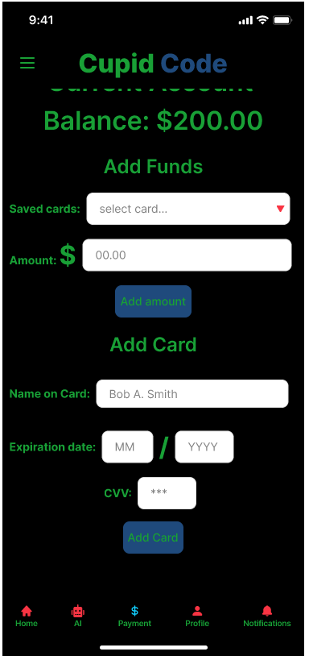

**Page Name:** Dater Payment Page

**Purpose:**  
Allow Dater users to **manage their account balance** and **stored payment methods** for funding date-related activities. This page combines balance visibility, fund addition, and card management into one simple interface. It follows the rebranding’s minimal and terminal-inspired look while emphasizing clarity and secure data handling.

**Elements on this page:**  
- **Top Bar**
  - Centered **Cupid Code** logo
  - **Hamburger menu** on the left for quick access to all pages, Accessibility Mode, and Logout.  

- **Main Sections**
  - **Current Account Balance:**  
    - Large, bold green text displaying the user’s available balance (e.g., *$200.00*).  
    - Updates dynamically after successful fund additions.  
  - **Add Funds Section:**  
    - **Saved Cards Dropdown:** Lets the user select a previously saved payment method.  
    - **Amount Input Field:** Accepts currency values (formatted to two decimals).  
    - **Add Amount Button:** Submits the transaction to add funds to the user’s account.  
  - **Add Card Section:**  
    - **Name on Card:** Text input for the cardholder’s full name.  
    - **Expiration Date:** Two separate fields for month (MM) and year (YYYY).  
    - **CVV:** Short numeric input (3–4 digits) for card security code, masked for privacy.  
    - **Add Card Button:** Saves new card information to the user’s account using secure encryption and tokenization.  

- **Validation / Messaging**
  - Inline error handling for missing or invalid data (e.g., *“Please enter a valid card number”*, *“Amount cannot be $0.00”*).  
  - Toast messages for success or failure (e.g., *“Funds added successfully”*, *“Payment failed, please try again”*).  
  - Input formatting enforces numeric-only entry for amount, expiration date, and CVV fields.  

- **Navigation**
  - **Bottom Navigation Bar (Dater View):**
    - **Home:** Returns to Dater Home Page.  
    - **AI:** Opens AI Chat or AI Listen Page.  
    - **Payment:** Active (disabled while on this page).  
    - **Profile:** Opens Dater Profile Page.  
    - **Notifications:** Opens Notifications Page.

**Expected User Actions:**  
- Select a **saved card** and enter an **amount** to add to their account → tap **Add Amount**.  
- View updated **Account Balance** after confirmation.  
- Enter **new card information** and tap **Add Card** to securely save payment details for future use.  
- Navigate to other app sections using the **Bottom Navigation Bar** or access **Accessibility Mode** via the Hamburger Menu.  

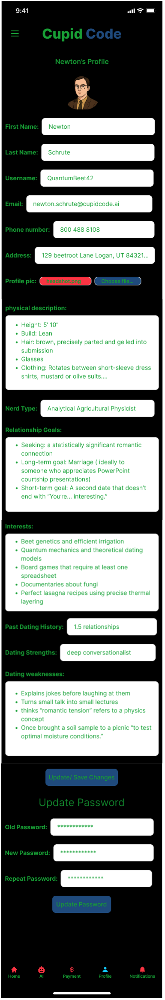

**Page Name:** Dater Profile Page

**Purpose:**  
Allow Dater users to **view, edit, and update their personal and dating-related information** in one place. The profile page is designed for clarity and flexibility, ensuring users can manage their details without leaving the app. Although the page appears long in prototype form, the final version will feature **scrollable content**.

**Elements on this page:**  
- **Top Bar**
  - Centered **Cupid Code** logo  
  - **Hamburger menu** on the left providing quick access to Payment, Accessibility Mode, and Logout.  

- **Main Sections**
  - **Profile Header**
    - Displays profile picture (uploadable or editable via file selector).  
    - Shows user’s name and role (e.g., *Dater Profile*).  

  - **Personal Information Section**
    - **First Name** (text input)  
    - **Last Name** (text input)  
    - **Username** (text input; read-only if tied to login credentials)  
    - **Email** (email field; read-only or editable depending on verification)  
    - **Phone Number** (numeric input)  
    - **Address** (text input for local matching or deliveries)  
    - **Profile Picture Upload** (image picker button + file label display)  

  - **About & Preferences Section**
    - **Physical Description:** Multi-line text area describing physical traits (e.g., height, build, hair, eyes, attire).  
    - **Nerd Type:** text field describing personality category (e.g., *Analytical Agricultural Physicist*).  
    - **Relationship Goals:**  
      - Long-term and short-term goals, editable text area (e.g., “Seeking: a statistically significant romantic connection”).  
    - **Interests:** Multi-line text area for hobbies and interests.  
    - **Past Dating History:** short text input summarizing relationship experience.  
    - **Dating Strengths:** Text field highlighting personal strengths in relationships.  
    - **Dating Weaknesses:** Text field or list noting self-identified challenges or humorous traits.

  - **Save & Update Section**
    - **Update/Save Changes Button:** Submits modifications to user data.  
    - Confirmation toast appears (“Profile updated successfully”).  

  - **Update Password Section**
    - **Old Password:** Masked input field for current password.  
    - **New Password:** Masked input with strength indicator.  
    - **Repeat Password:** Confirms match before submission.  
    - **Update Password Button:** Submits new password for authentication update.  
    - Success/failure toast displayed depending on validation.

- **Validation / Messaging**
  - Inline validation for empty required fields or invalid formats (e.g., email, phone).  
  - Error messages appear beneath affected fields.  
  - Success message confirms when updates are saved.  
  - Password update section includes check for matching and minimum strength.  

- **Navigation**
  - **Bottom Navigation Bar (Dater View):**
    - **Home:** Returns to Dater Home Page.  
    - **AI:** Opens AI Chat or AI Listen Page.  
    - **Payment:** Opens Payment Page.  
    - **Profile:** Active (disabled while on this page).  
    - **Notifications:** Opens Notifications Page.  

**Expected User Actions:**  
- Scroll through sections to review or edit personal information.  
- Tap **Update/Save Changes** to commit modifications.  
- Use **Profile Picture Upload** to change the avatar image.  
- Access the **Update Password Section** to reset credentials securely.  
- Navigate to other app areas via the **Bottom Navigation Bar** or **Hamburger Menu**.  

#### 7.3.3 Cupid Screens

---

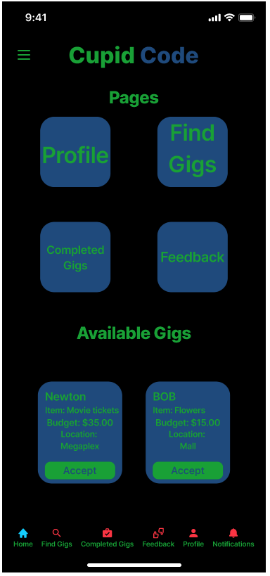

**Page Name:** Cupid Home Page

**Purpose:**  
Serve as the **central hub for Cupid users**, allowing quick access to all major operational functions such as viewing gigs, completing orders, submitting feedback, and managing profiles. The Cupid Home Page is designed for speed and simplicity—keeping the experience lightweight and actionable for users who frequently check in between gigs.

**Elements on this page:**  
- **Top Bar**
  - Centered **Cupid Code** logo  
  - **Hamburger menu** on the left providing quick access for all pages, Accessibility Mode, and Logout.  

- **Main Sections**
  - **Pages Section:**  
    - Four large action cards providing direct navigation to the Cupid’s main tools:
      - **Profile:** Opens Cupid Profile page for editing personal details and balance information.  
      - **Find Gigs:** Opens list of available gigs and active assignments.  
      - **Completed Gigs:** Opens history of finished gigs with rating options for daters.  
      - **Feedback:** Opens review section showing received ratings and comments.  
  - **Available Gigs Section:**  
    - Displays a preview of 1–3 available gigs to encourage immediate action.  
    - Each gig card includes:  
      - **Dater Name:** The client’s first name (e.g., *Newton*, *Bob*).  
      - **Item:** The requested task or object (e.g., *Flowers*, *Movie Tickets*).  
      - **Budget:** Amount allocated for the gig.  
      - **Location:** Where the task will occur.  
      - **Accept Button:** Allows the Cupid to accept the gig directly from the home screen.  

- **Validation / Messaging**
  - If a gig is successfully accepted, a toast confirmation appears (e.g., *“Gig accepted successfully!”*).  
  - If a gig becomes unavailable (e.g., already claimed by another Cupid), an alert appears (e.g., *“This gig has already been accepted by another Cupid.”*).  
  - Input handling is minimal since this page is primarily navigational and informational.  

- **Navigation**
  - **Bottom Navigation Bar (Cupid View):**
    - **Home:** Active (disabled while on this page).  
    - **Find Gigs:** Opens Cupid Find Gigs page.  
    - **Completed Gigs:** Opens Completed Gigs page.  
    - **Feedback:** Opens Feedback page with ratings received from daters.  
    - **Profile:** Opens Cupid Profile page.  
    - **Notifications:** Opens Notifications page (shared with all roles).  

**Expected User Actions:**  
- Tap a **page card** (Profile, Find Gigs, Completed Gigs, or Feedback) to navigate to that section.  
- Review **Available Gigs** at the bottom and tap **Accept** to claim one instantly.  
- Use the **Hamburger Menu** or **Bottom Navigation Bar** for quick role-specific navigation.  
- Monitor notifications for updates or new gig assignments while remaining within two taps of any key feature.

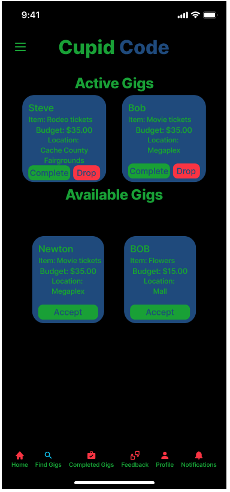

**Page Name:** Cupid Find Gigs Page

**Purpose:**  
Provide Cupids with a clear overview of both **active** and **available** gigs so they can efficiently manage their workload and accept new assignments. This page functions as the Cupid’s task dashboard, allowing them to **complete**, **drop**, or **accept** gigs directly without navigating through multiple menus. It is designed to keep workflow fast and intuitive while maintaining consistency with Cupid Code’s terminal-inspired visual style.

**Elements on this page:**  
- **Top Bar**
  - Centered **Cupid Code** logo  
  - **Hamburger menu** on the left for quick access to all pages, Accessibility Mode, and Logout.  

- **Main Sections**
  - **Active Gigs Section:**  
    - Displays gigs currently accepted by the Cupid.  
    - Each card includes:  
      - **Dater Name** (e.g., *Steve*, *Bob*)  
      - **Item:** The task or purchase (e.g., *Rodeo Tickets*, *Movie Tickets*)  
      - **Budget:** The allotted gig budget.  
      - **Location:** Where the task takes place.  
      - **Complete Button (Green):** Marks the gig as successfully finished and moves it to the *Completed Gigs* page.  
      - **Drop Button (Red):** Allows the Cupid to unassign themselves from the gig if unable to complete it.  
  - **Available Gigs Section:**  
    - Displays open gigs that any Cupid can accept.  
    - Each card includes the same details: **Dater Name**, **Item**, **Budget**, and **Location.**  
    - **Accept Button (Green):** Claims the gig immediately, moving it to the *Active Gigs* section.

- **Validation / Messaging**
  - Confirmation message appears after each action:  
    - *“Gig marked as complete.”*  
    - *“Gig dropped successfully.”*  
    - *“Gig accepted successfully.”*  
  - Error messages appear if the gig is no longer available: *“Gig already claimed by another Cupid.”*  
  - Visual indicators update dynamically after each action to prevent duplicate submissions.  

- **Navigation**
  - **Bottom Navigation Bar (Cupid View):**
    - **Home:** Returns to Cupid Home Page.  
    - **Find Gigs:** Active (disabled while on this page).  
    - **Completed Gigs:** Opens history of finished gigs.  
    - **Feedback:** Opens Feedback page.  
    - **Profile:** Opens Cupid Profile Page.  
    - **Notifications:** Opens Notifications Page (shared view).  

**Expected User Actions:**  
- Scroll through the **Active Gigs** list to monitor ongoing assignments.  
- Tap **Complete** to finalize a gig after successful delivery.  
- Tap **Drop** to release a gig if unable to fulfill it.  
- Scroll to **Available Gigs** and tap **Accept** to claim new tasks.  
- Use the **Hamburger Menu** or **Bottom Navigation Bar** to move between other pages efficiently.  
- Upon completing or dropping a gig, the page refreshes to reflect updated status instantly.

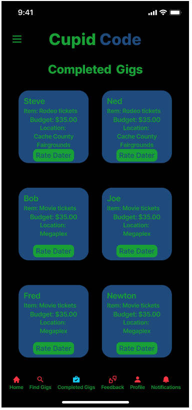

**Page Name:** Cupid Completed Gigs Page

**Purpose:**  
Allow Cupids to review and manage **finished gigs** while providing an easy way to give feedback on their dating interactions. The page maintains the same terminal-style visual consistency as other Cupid views and is optimized for quick scrolling and simple rating submission. It ensures Cupids can close the feedback loop by rating Daters promptly after completing gigs.

**Elements on this page:**  
- **Top Bar**
  - Centered **Cupid Code** logo  
  - **Hamburger menu** on the left providing quick access to all pages, Accessibility Mode, and Logout.  

- **Main Section**
  - **Completed Gigs:**  
    - Displays all gigs that the Cupid has successfully finished.  
    - Each card includes:  
      - **Dater Name:** Who the gig was completed for (e.g., *Steve*, *Ned*, *Bob*).  
      - **Item:** The task fulfilled (e.g., *Movie Tickets*, *Rodeo Tickets*).  
      - **Budget:** The amount spent or allocated.  
      - **Location:** Where the date or delivery took place.  
      - **Rate Dater Button (Green):** Opens a rating popup for leaving feedback about the Dater.  

- **Rating Popup Modal (after tapping “Rate Dater”)**
  - **Text Field:** Optional comments about the interaction (e.g., *“Easy to coordinate with”*).  
  - **Star Rating System:** 1–5 hearts or stars for visual consistency with Dater ratings.  
  - **Submit Button:** Sends the rating and saves feedback.  
  - **Cancel Button:** Closes the popup without submitting changes.  
  - Toast confirmation appears on success: *“Thank you for rating your Dater!”*  

- **Validation / Messaging**
  - Error messages displayed if submission fails (e.g., *“Rating could not be saved”*).  
  - Once a rating is submitted, the corresponding card updates to indicate that feedback has been recorded.  
  - Cards are arranged in two-column format for readability and efficient space use.  

- **Navigation**
  - **Bottom Navigation Bar (Cupid View):**
    - **Home:** Returns to Cupid Home Page.  
    - **Find Gigs:** Opens Find Gigs Page.  
    - **Completed Gigs:** Active (disabled while on this page).  
    - **Feedback:** Opens Feedback Page.  
    - **Profile:** Opens Cupid Profile Page.  
    - **Notifications:** Opens Notifications Page.  

**Expected User Actions:**  
- Scroll through the list of **Completed Gigs** to review all previously finished assignments.  
- Tap **Rate Dater** under each gig to open the rating modal and provide feedback.  
- Enter a short comment (optional) and select a 1–5 heart rating → tap **Submit**.  
- Observe confirmation message and visual change on the rated card.  
- Navigate to other app sections using the **Bottom Navigation Bar** or **Hamburger Menu** for additional features.

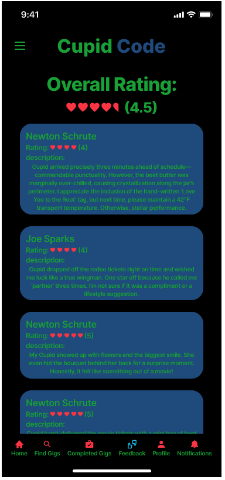

**Page Name:** Cupid Feedback Page

**Purpose:**  
Provide Cupids with an overview of all feedback and ratings they’ve received from Daters. The page highlights the **overall performance score** (average rating) at the top, followed by detailed reviews from individual Daters. This allows Cupids to monitor their reputation and identify areas for improvement while maintaining transparency and motivation.

**Elements on this page:**  
- **Top Bar**
  - Centered **Cupid Code** logo  
  - **Hamburger menu** on the left for quick access to all pages, Accessibility Mode, and Logout.  

- **Main Sections**
  - **Overall Rating Section:**  
    - Prominently displays the Cupid’s **average rating** (e.g., *4.5 hearts*).  
    - Includes a visual representation of hearts to reflect the rating.  
    - Updates automatically as new feedback is received.  
  - **Feedback Cards Section:**  
    - Lists all reviews from Daters in reverse chronological order (most recent first).  
    - Each feedback card includes:  
      - **Dater Name** (e.g., *Newton Schrute*, *Joe Sparks*).  
      - **Rating:** Numerical value displayed alongside heart icons (1–5).  
      - **Description:** Short written feedback from the Dater describing the interaction or service quality.  
    - Cards are visually styled in **blue backgrounds with green text**, consistent with Cupid Code’s rebranding.  
    - Cards use rounded corners and evenly spaced stacking for smooth scrolling.  

- **Validation / Messaging**
  - Displays placeholder text if no feedback has been received yet (e.g., *“No feedback available yet.”*).  
  - Ratings and comments are static, pulled from the server as read-only data.  
  - Feedback automatically refreshes when the page is reopened or when a new rating is received.  

- **Navigation**
  - **Bottom Navigation Bar (Cupid View):**
    - **Home:** Returns to Cupid Home Page.  
    - **Find Gigs:** Opens Cupid Find Gigs Page.  
    - **Completed Gigs:** Opens Completed Gigs Page.  
    - **Feedback:** Active (disabled while on this page).  
    - **Profile:** Opens Cupid Profile Page.  
    - **Notifications:** Opens Notifications Page.  

**Expected User Actions:**  
- View their **overall rating** and read detailed feedback from Daters.  
- Scroll through feedback cards to review multiple ratings.  
- Use the **Hamburger Menu** or **Bottom Navigation Bar** to navigate to other Cupid pages.  
- Observe live rating updates after new feedback submissions from Daters, ensuring real-time performance tracking.  

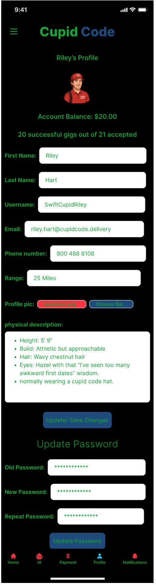

**Page Name:** Cupid Profile Page

**Purpose:**  
Provide Cupids with an editable view of their personal information, work statistics, and account management options. This page allows Cupids to review their performance, update personal details, manage their range of service, and securely change passwords. The design focuses on clarity, organization, and the ability to scroll through well-defined sections without overwhelming the user.

**Elements on this page:**  
- **Top Bar**
  - Centered **Cupid Code** logo  
  - **Hamburger menu** on the left providing quick access to all pages, Accessibility Mode, and Logout.  

- **Main Sections**
  - **Profile Header**
    - Displays Cupid’s **profile image** (editable via upload field).  
    - Shows **name** (e.g., *Riley Hart*), **account balance**, and **gig success ratio** (e.g., *20 successful gigs out of 21 accepted*).  
  - **Personal Information Section**
    - **First Name** (text input)  
    - **Last Name** (text input)  
    - **Username** (text input; usually read-only if tied to login credentials)  
    - **Email** (email field; validated format)  
    - **Phone Number** (numeric input; format validation)  
    - **Range** (numeric input or slider, defining delivery/service distance in miles)  
    - **Profile Picture Upload** (file selector with filename label displayed next to button)  
  - **Physical Description Section**
    - Multi-line read-only text area summarizing the Cupid’s appearance (e.g., *Height, Build, Hair, Eyes, Clothing*).  
    - Editable in profile settings if the Cupid wants to update self-description.  
  - **Save Changes Section**
    - **Update/Save Changes Button:** Saves edits to user information.  
    - Displays confirmation toast (“Profile updated successfully”) after saving.  
  - **Password Update Section**
    - **Old Password:** Masked input for current password verification.  
    - **New Password:** Masked input with strength validation.  
    - **Repeat Password:** Confirms new password match before submission.  
    - **Update Password Button:** Submits changes to update account credentials securely.  
    - Displays toast for success or error messages.  

- **Validation / Messaging**
  - Inline validation ensures all fields are complete before saving.  
  - Error messages displayed beneath incorrect fields (e.g., *“Invalid email format”* or *“Passwords do not match”*).  
  - Success message confirms when updates are applied.  
  - Inputs are scrollable for smaller screens, ensuring usability without clutter.

- **Navigation**
  - **Bottom Navigation Bar (Cupid View):**
    - **Home:** Returns to Cupid Home Page.  
    - **Find Gigs:** Opens Cupid Find Gigs Page.  
    - **Completed Gigs:** Opens Completed Gigs Page.  
    - **Feedback:** Opens Cupid Feedback Page.  
    - **Profile:** Active (disabled while on this page).  
    - **Notifications:** Opens Notifications Page (shared across all roles).  

**Expected User Actions:**  
- Review and edit personal details, contact info, and service range.  
- Upload a new profile picture using the **Choose File** button.  
- Tap **Update/Save Changes** to apply edits.  
- Scroll down to the **Update Password Section** to change credentials securely.  
- Use **Bottom Navigation Bar** or **Hamburger Menu** for quick access to other Cupid functions.  
- Observe confirmation toasts for profile and password updates.  
- Return to active gig tracking or feedback pages with a single tap, maintaining two-click navigation across the interface.

#### 7.3.4 Manager Screens

---

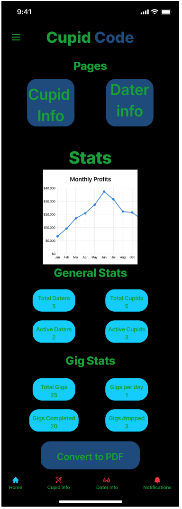

**Page Name:** Manager Home Page

**Purpose:**  
Serve as the **central dashboard** for Manager users, displaying both **business analytics** and **operational statistics**. This page enables quick access to the Cupid and Dater information pages, as well as a summarized view of profits, user activity, and gig metrics. It is designed to give managers a complete snapshot of Cupid Code’s performance at a glance while maintaining the app’s clean, terminal-inspired visual consistency.

**Elements on this page:**  
- **Top Bar**
  - Centered **Cupid Code** logo  
  - **Hamburger menu** on the left for quick access to all pages, Accessibility Mode, and Logout.  

- **Main Sections**
  - **Pages Section:**  
    - Two large navigation buttons:  
      - **Cupid Info:** Opens the page displaying all active Cupids, their ratings, and performance data.  
      - **Dater Info:** Opens the page showing all active Daters, their ratings, and activity summaries.  
    - Buttons are large, rounded blue cards with green text to clearly indicate interactive navigation.  

  - **Stats Section:**  
    - Contains the **Monthly Profits Graph**, showing revenue trends over time.  
    - Line chart includes month labels along the X-axis and profit values on the Y-axis.  
    - Displays an overview of the app’s financial performance, helping managers identify seasonal highs and lows.  

  - **General Stats Section:**  
    - Displays total counts for users in blue rounded statistic cards:
      - **Total Daters:** Total number of registered Dater accounts.  
      - **Total Cupids:** Total number of registered Cupid accounts.  
      - **Active Daters:** Number of Daters currently active.  
      - **Active Cupids:** Number of Cupids currently active or fulfilling gigs.  

  - **Gig Stats Section:**  
    - Provides operational data about gigs across the platform:  
      - **Total Gigs:** Total number of gigs created to date.  
      - **Gigs per Day:** Average number of gigs created daily.  
      - **Gigs Completed:** Number of successfully completed gigs.  
      - **Gigs Dropped:** Number of gigs that were canceled or not completed.  

  - **Convert to PDF Button:**  
    - Large button located at the bottom of the screen.  
    - When tapped, it generates a downloadable PDF report that includes the profit chart and all summary statistics.  
    - Used for recordkeeping or reporting purposes.

- **Validation / Messaging**
  - Stats and graphs are **read-only** and automatically updated in real time from the database.  
  - If no data is available, placeholders appear (e.g., *“No stats available at this time.”*).  
  - PDF generation triggers a brief confirmation message (e.g., *“Report exported successfully.”*).  

- **Navigation**
  - **Bottom Navigation Bar (Manager View):**
    - **Home:** Active (disabled while on this page).  
    - **Cupid Info:** Opens the Cupid Info Page.  
    - **Dater Info:** Opens the Dater Info Page.  
    - **Notifications:** Opens Notifications Page (shared with other roles).  

**Expected User Actions:**  
- Tap **Cupid Info** or **Dater Info** to manage user lists and view performance metrics.  
- Review **Monthly Profits Graph** to track earnings trends.  
- Reference **General Stats** and **Gig Stats** for up-to-date activity summaries.  
- Tap **Convert to PDF** to generate a downloadable summary report for business use.  
- Navigate to other management views using the **Bottom Navigation Bar** or **Hamburger Menu** for efficiency. 

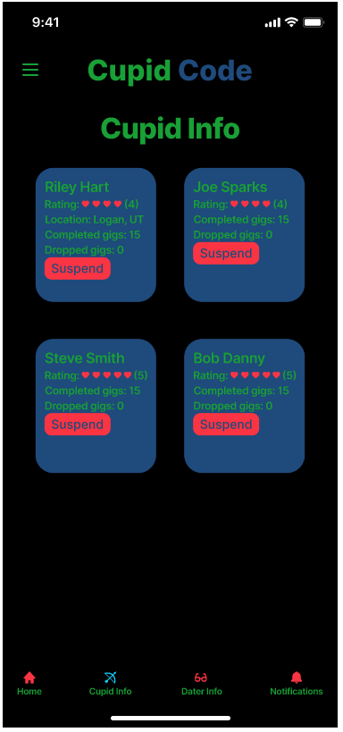

**Page Name:** Manager Cupid Info Page

**Purpose:**  
Allow Managers to view and manage all **Cupid accounts**, including performance stats, ratings, and disciplinary controls. This page provides a concise, card-based layout that helps administrators monitor each Cupid’s activity and take quick action when necessary. It aligns with the high-level design goal of making management tools **fast, clear, and accessible within two clicks** from the home screen.

**Elements on this page:**  
- **Top Bar**
  - Centered **Cupid Code** logo  
  - **Hamburger menu** on the left for quick navigation to all pages, Accessibility Mode, and Logout.  

- **Main Section**
  - **Cupid Info Cards:**  
    - Each Cupid is represented by a card displaying their key information:
      - **Name:** Full name of the Cupid (e.g., *Riley Hart*, *Joe Sparks*).  
      - **Rating:** Visual heart icons with a numerical value.  
      - **Location:** Cupid’s base or primary service area (e.g., *Logan, UT*).  
      - **Completed Gigs:** Number of gigs successfully completed.  
      - **Dropped Gigs:** Number of gigs the Cupid did not complete or canceled.  
      - **Suspend Button (Red):** Allows the Manager to temporarily deactivate the Cupid’s account or remove them from active listings.  
    - Cards use a consistent **blue background with green text** to match the Cupid Code color scheme and emphasize clarity.  
    - Layout displays cards in a two-column grid format for optimal visibility on mobile devices.  

- **Validation / Messaging**
  - Tapping **Suspend** triggers a confirmation popup:  
    - *“Are you sure you want to suspend this Cupid?”*  
    - Options: **Confirm** / **Cancel**.  
  - Upon confirmation, a toast message appears (e.g., *“Cupid suspended successfully.”*).  
  - If the action fails, an error message appears (e.g., *“Action could not be completed. Try again later.”*).  
  - All data displayed is read-only except for administrative actions like suspension.  

- **Navigation**
  - **Bottom Navigation Bar (Manager View):**
    - **Home:** Opens Manager Home Page.  
    - **Cupid Info:** Active (disabled while on this page).  
    - **Dater Info:** Opens Dater Info Page.  
    - **Notifications:** Opens Notifications Page (shared view).  

**Expected User Actions:**  
- Review each Cupid’s profile summary for quick insights into performance and reliability.  
- Tap **Suspend** on a Cupid’s card to temporarily disable their account if required.  
- Confirm or cancel suspension in the popup modal.  
- Navigate between **Cupid Info**, **Dater Info**, and **Home** pages using the **Bottom Navigation Bar** or **Hamburger Menu**.  
- Monitor active Cupids regularly to maintain service quality and uphold community standards. 

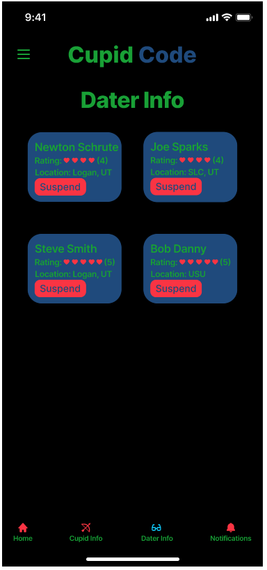

**Page Name:** Manager Dater Info Page

**Purpose:**  
Allow Managers to view, monitor, and manage all **Dater accounts** within the Cupid Code platform. This page mirrors the layout and functionality of the **Cupid Info Page** for consistency but focuses on Dater-specific information such as ratings, locations, and moderation controls. It provides a quick, visual overview of user activity and reputation, enabling Managers to take appropriate administrative actions when needed.

**Elements on this page:**  
- **Top Bar**
  - Centered **Cupid Code** logo  
  - **Hamburger menu** on the left for quick access to all pages, Accessibility Mode, and Logout.  

- **Main Section**
  - **Dater Info Cards:**  
    - Each Dater is represented by an individual card containing the following details:
      - **Name:** Full name of the Dater (e.g., *Newton Schrute*, *Joe Sparks*).  
      - **Rating:** Visual heart icons with a numeric value.  
      - **Location:** General area where the Dater is based (e.g., *Logan, UT*, *SLC, UT*, *USU*).  
      - **Suspend Button (Red):** Allows the Manager to temporarily deactivate a Dater’s account or restrict their activity in case of reported issues.  
    - Cards are styled in **blue backgrounds with green text** to match the terminal-inspired color scheme and maintain brand consistency.  
    - Cards are presented in a **two-column grid layout** for easy readability and quick scanning of multiple users.  

- **Validation / Messaging**
  - When the **Suspend** button is tapped, a confirmation dialog appears:  
    - *“Are you sure you want to suspend this Dater?”*  
    - Options: **Confirm** / **Cancel**.  
  - Successful action triggers a toast message (e.g., *“Dater suspended successfully.”*).  
  - Errors display if the action fails (e.g., *“Unable to suspend user. Please try again later.”*).  
  - Dater data is read-only except for administrative suspension controls.  

- **Navigation**
  - **Bottom Navigation Bar (Manager View):**
    - **Home:** Opens Manager Home Page.  
    - **Cupid Info:** Opens Manager Cupid Info Page.  
    - **Dater Info:** Active (disabled while on this page).  
    - **Notifications:** Opens Notifications Page (shared across all roles).  

**Expected User Actions:**  
- Review each Dater’s rating and location to assess engagement or behavior trends.  
- Tap **Suspend** to disable a Dater’s account if necessary.  
- Confirm or cancel the suspension action in the dialog box.  
- Use the **Hamburger Menu** or **Bottom Navigation Bar** to switch between **Cupid Info**, **Home**, or **Notifications** pages.  
- Regularly monitor this section to maintain a safe and respectful community environment across the platform. 


## 8. Technology Stack

Languages, frameworks, libraries (Vue, Django, DRF, Celery, Redis, Stripe SDK).

Justification of choices (community support, scalability, team skillset).

Alternatives considered (React vs Vue, Flask vs Django, etc.).

## 9. Deployment Plan

Environments (Dev, Staging, Prod).

Deployment pipeline (CI/CD, Azure App Services, containers).

Secrets management (Azure Key Vault).

Monitoring/logging strategy.

## 10. Testing & Monitoring

Unit test strategy (per subsystem).

Integration and E2E testing (Selenium, API tests).

Automated test coverage goals.

Monitoring (Azure Sentinel, alerting, log aggregation).

## 11. Appendices

UML diagrams (class, sequence, ER).

Wireframes and user flow diagrams.
