# Cupid Code User Manual

## Table of Contents 

- [Overview](#overview)
- [Getting Started](#getting-started)
- **User Types:**
  - [Dater Guide](#dater-guide)
  - [Cupid Guide](#cupid-guide) 
  - [Manager Guide](#manager-guide)
    - [Manager Overview](#manager-overview)
    - [Accessing the Manager Dashboard](#accessing-the-manager-dashboard)
    - [Dashboard Hamburger Side Bar](#dashboard-hamburger-side-bar)
    - [Dashboard Analytics](#dashboard-analytics)
    - [Statistics Section & Exporting Platform Data](#statistics-section--exporting-platform-data)
    - [Managing Daters](#managing-daters)
    - [Suspending Dater Accounts](#suspending-dater-accounts)
    - [Managing Cupids](#managing-cupids)
- [Glossary](#glossary)
- [Troubleshooting](#troubleshooting)
- [Support](#support)

---

## Overview

Cupid Code is a dating assistance platform that connects Daters with AI-powered advice and real-world help from Cupids. Whether you're looking for dating tips, emergency date assistance, or want to earn money helping others, Cupid Code has you covered.

### What is Cupid Code?
- **For Daters**: Get AI dating advice and emergency assistance during dates
- **For Cupids**: Earn money by helping Daters with deliveries and date-saving tasks
- **For Managers**: Oversee platform operations and user management

---

## Glossary

**AI Chat** - Conversational interface for getting dating advice from AI

**AI Listen Mode** - Feature that monitors conversations and can trigger emergency assistance

**Cupid** - User who provides delivery and assistance services to Daters

**Dater** - User seeking dating assistance and advice

**Dropoff Location** - Where Cupid delivers items (usually the date location)

**Gig** - A task or delivery request created by a Dater for a Cupid to complete

**Manager** - Administrator who oversees platform operations

**PayPal Email** - Email address linked to PayPal account for receiving payments

**Pickup Location** - Where Cupid collects requested items (usually a store)

**Quest** - The specific details of what's needed for a gig (items, locations, budget)

**Rating** - 1-5 star feedback system for Daters and Cupids
---

## Getting Started

### Creating an Account

1. **Access the Website**: Navigate to https://cupidcode.zapto.org/#/ in your web browser

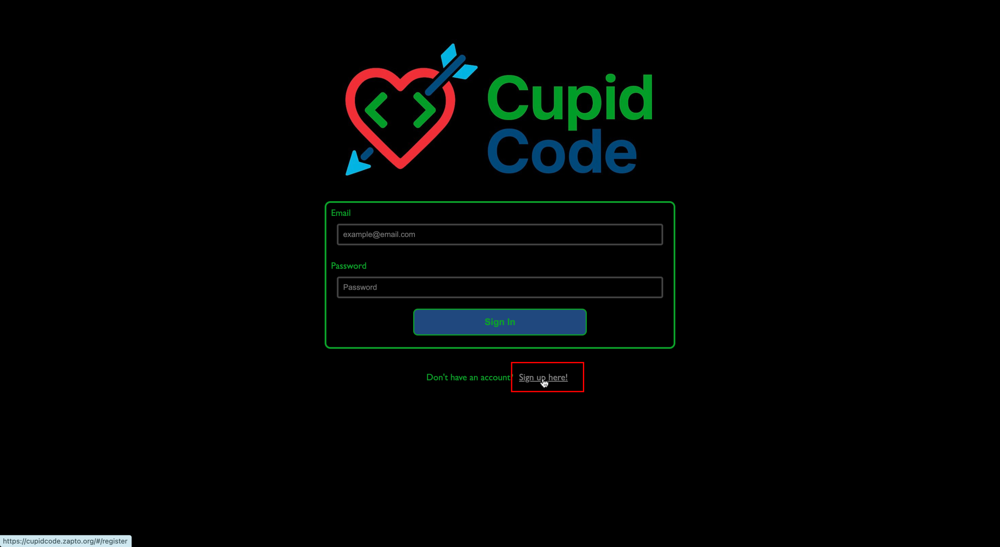

2. **Navigate to Registration**: On the login page, click the "Don't have an account? Sign up here!" link (highlighted in red) to access the registration form

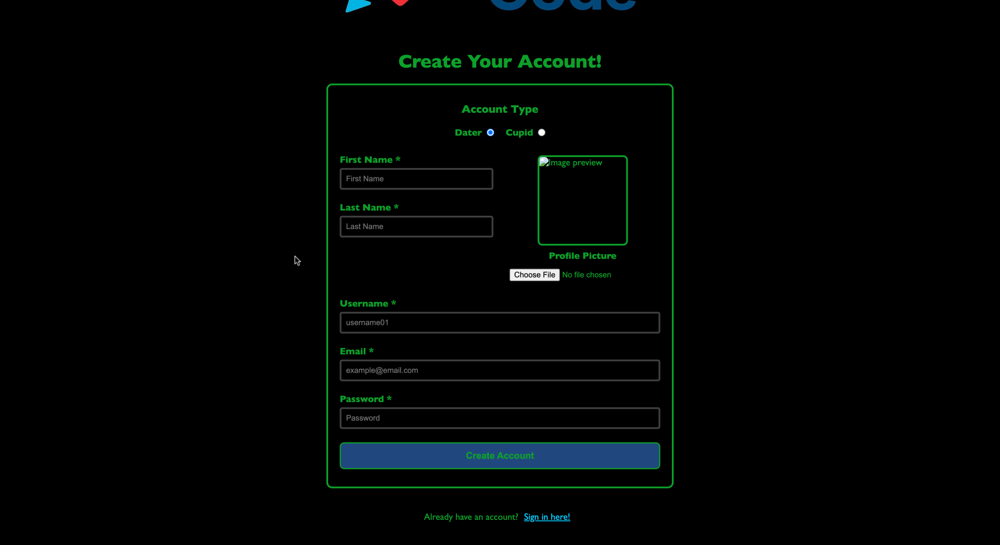

3. **Start Registration**: You'll see the empty registration form with fields for your information and role selection

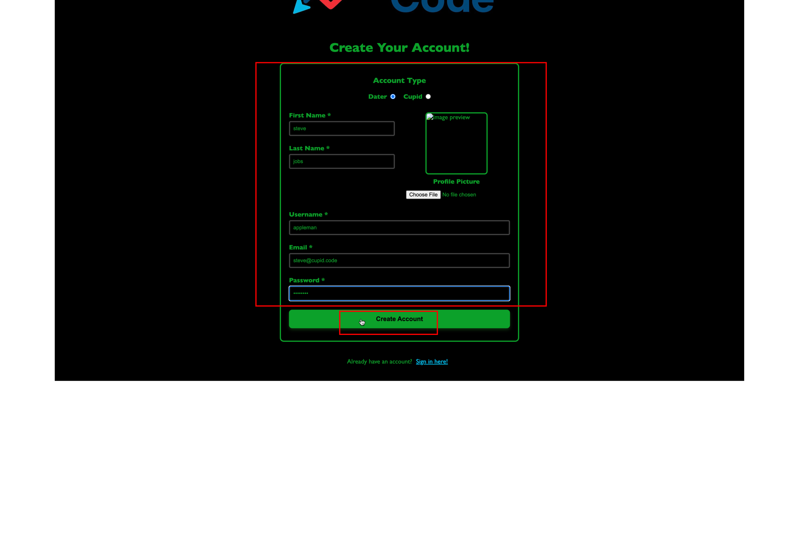

4. **Complete Dater Registration**: Fill in all required fields:
   - First Name and Last Name
   - Email address (will be your username)
   - Password and confirm password
   - Phone number
   - Select "Dater" as your role
   - Complete the Dater-specific fields (interests, dating goals, etc.)
   - Click "Create Account" when finished

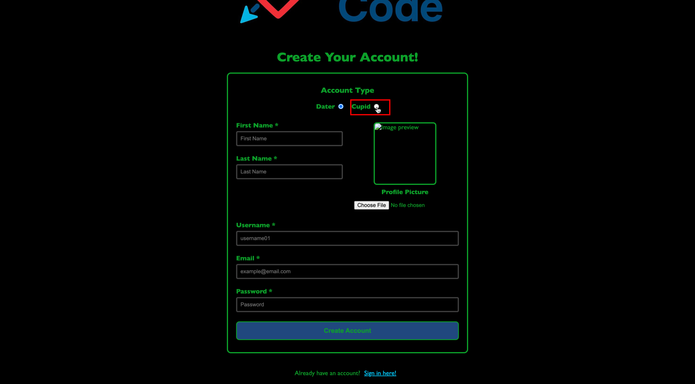

5. **Alternative: Select Cupid Role**: If you want to become a Cupid instead, select "Cupid" from the role dropdown

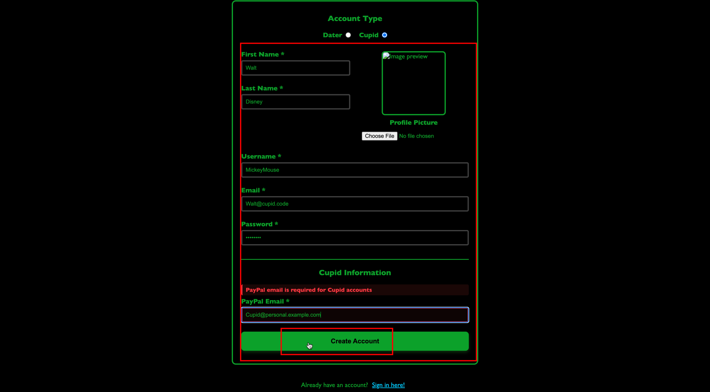

6. **Complete Cupid Registration**: Fill in all required fields for Cupid account:
   - First Name and Last Name  
   - Email address (will be your username)
   - Password and confirm password
   - Phone number
   - PayPal email for receiving payments
   - Select "Cupid" as your role
   - Click "Create Account" when finished

### Logging In

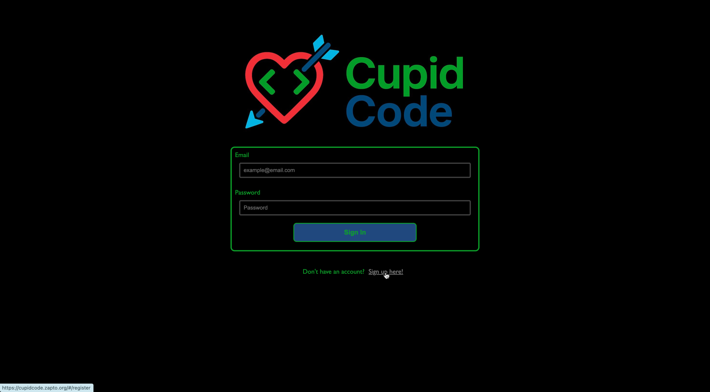
2. **Enter Credentials**: On the main login page, enter your email and password
3. **Sign In**: Click the "Sign In" button
4. **Automatic Redirect**: You'll be redirected to your role-specific dashboard based on your account type

---

## Dater Guide

### Accessing the Dater Dashboard

**How to Navigate the Dater Home:**
1. Upon logging in as a Dater, you'll see your main dashboard with navigation tiles
2. The dashboard displays three primary action tiles:
   - **AI Chat**: Access conversational AI for dating advice and emergency gig creation
   - **My Gigs**: View and manage all your assistance requests across three status categories
   - **Create Gig**: Post new requests for Cupid assistance with delivery or emergency help
3. Click any tile to access that feature - all navigation uses your user ID automatically
4. The interface adapts responsively between mobile and desktop layouts

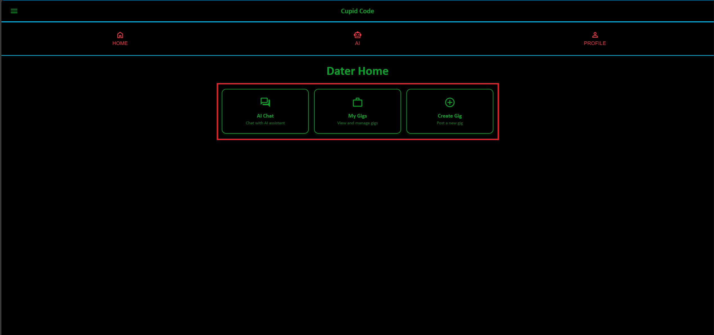

---

### Navigation Options

**Mobile Bottom Navigation Bar:**
- **Home**: Returns to the main Dater dashboard
- **AI**: Direct access to AI Chat functionality  
- **Profile**: Manage your account settings and personal information

**Desktop/Tablet Top Navigation:**
- Same three options positioned below the banner for larger screens

**Hamburger Menu (Available on all screens):**
Located in the top-left banner, provides comprehensive navigation:
- **Home**: Return to dashboard
- **AI Chat**: Access conversational AI assistant
- **Profile**: Manage account settings  
- **Gigs**: View and manage assistance requests
- **Create Gig**: Post new assistance requests
- **Calendar**: View scheduled dates and events
- **Feedback**: Provide platform feedback
- **Accessibility**: Toggle light/dark mode
- **Logout**: Sign out of your account

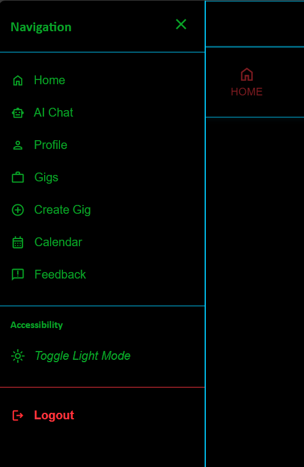
---

### Using AI Chat

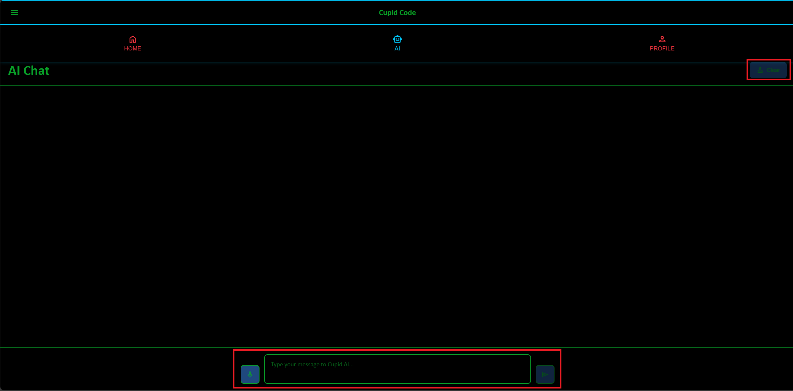
**Getting AI Dating Advice:**
1. Click "AI Chat" from dashboard or navigation
2. View welcoming interface with chat icon and instructions
3. Type questions in the message input field at the bottom
4. Press Enter or click send button to receive AI responses
5. Conversation history displays with user messages (right-aligned) and AI responses (left-aligned with robot icon)
6. Use "Clear" button to hide messages (preserves history)

**Advanced Voice Features:**
1. **Voice Input**: Click microphone button to start speech recording
   - Records up to 30 seconds automatically
   - Real-time transcript appears in message field
   - Click microphone again to stop early
2. **Smart Keyword Detection**: AI monitors speech for emergency keywords and can suggest creating gigs automatically

**AI Gig Creation Integration:**
- AI can detect when you need emergency assistance
- Automatically suggests creating gigs for any product
- for how to fill out payments, see [Creating a Gig](#creating-a-gig)

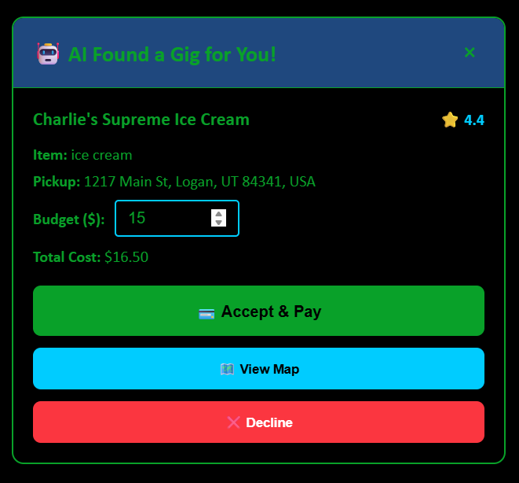
---

### Managing Your Gigs

**Understanding Gig Status Categories:**

**1. Unclaimed Gigs:**
- Recently posted assistance requests waiting for Cupid assignment
- View detailed gig information including items requested, budget, and locations
- **Cancel**: Remove gig if no longer needed (available until claimed)
- Empty state message: "You do not have any pending gigs"
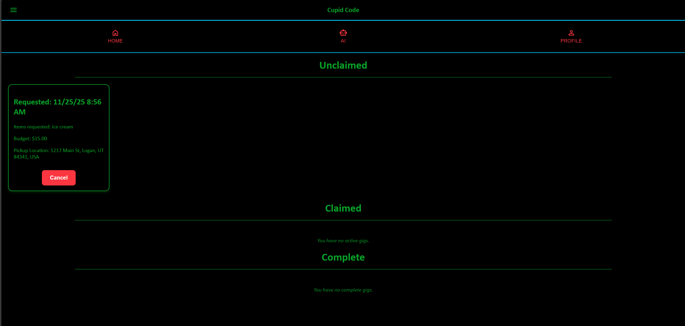

**2. Claimed Gigs:**
- Active assistance requests assigned to specific Cupids
- Monitor progress of ongoing assistance
- **Cancel**: Still available if circumstances change
- **Complete**: Mark as finished when service is received (triggers payment processing)
- Empty state message: "You have no active gigs"
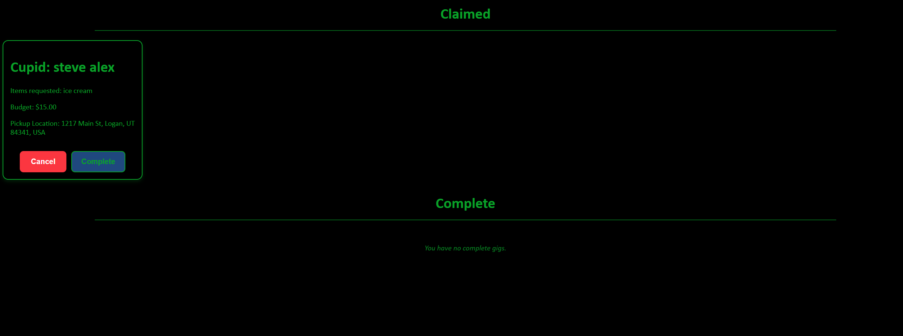

**3. Complete Gigs:**
- Finished assistance requests ready for feedback
- **Rate Cupid**: Comprehensive rating system with 1-5 heart interface
- View past gig history and Cupid performance
- Empty state message: "You have no complete gigs"

**Rating System:**
1. Click "Rate Cupid" on any completed gig
2. **Heart Rating**: Click hearts to select 1-5 rating (click same heart to reset)
3. **Written Feedback**: Optional text area for detailed service review
4. **Submit Process**: Click "Send" to submit rating and feedback
5. **Cancel Option**: Exit rating without submitting
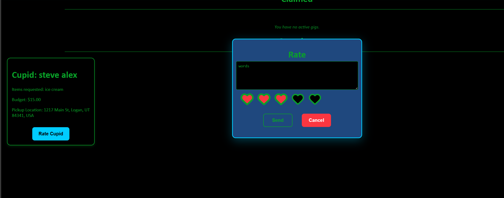

---

### Creating a Gig

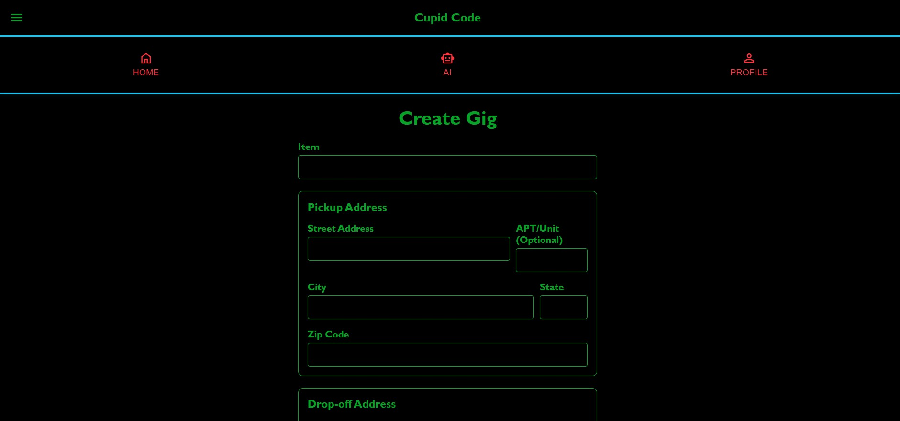
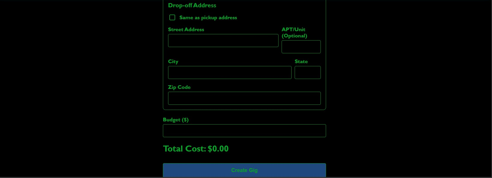

**How to Create a Gig:**
1. Click "Create Gig" from the navigation menu
2. Fill out the gig request form with the following information:
   - **Item**: Brief description of what you need (e.g., "Flowers, Movie Tickets, etc")
   - **Pickup Location**: Where the Cupid should collect items (enter address. EX: 100 N 100 E, 84321)
   - **Dropoff Location**: Where to deliver (your date location - enter address or use map). In the event that your drop off address is the same as your pickup address, click the checkbox called: "Same as pickup address"
   - **Budget**: Set maximum amount you're willing to pay in Cupid Cash
3. Review all information carefully
4. Click "Create Gig" to advance to the payment step. 
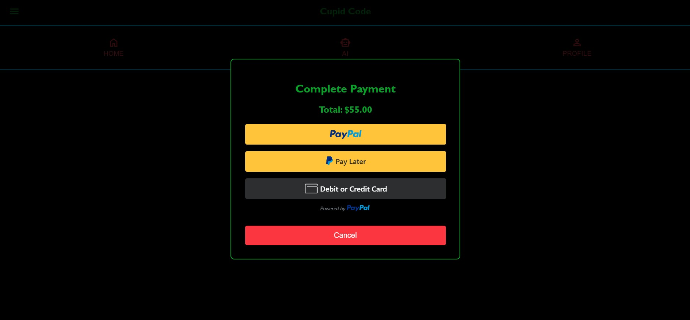

#### **PayPal Checkout**
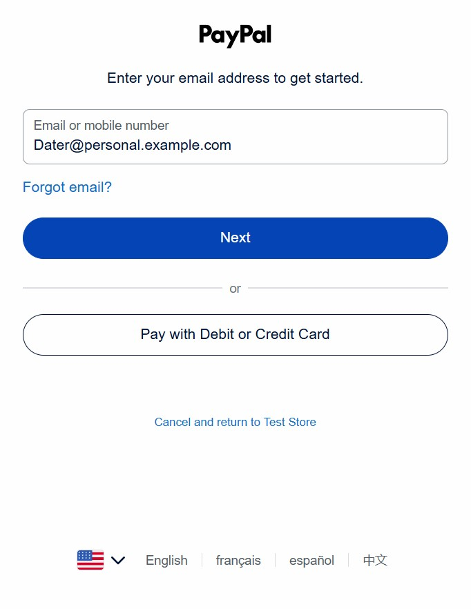

5. Press the PayPal button to open the pop out window leading to the PayPal checkout page. Log into paypal using the following information:
  - Email: Dater@personal.example.com
  - Password: I-Am-A-Dater
**Note:**
  - Paypal will default to using a phone number as dual authentication, to get to password authentication, click "try annother way", then "Use Password Instead."
  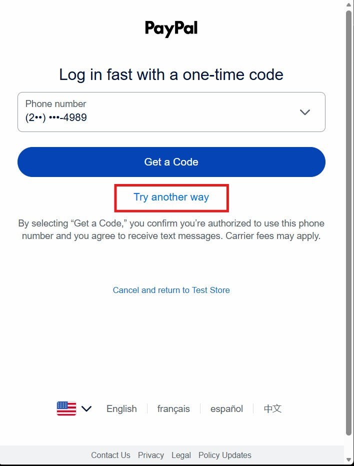
  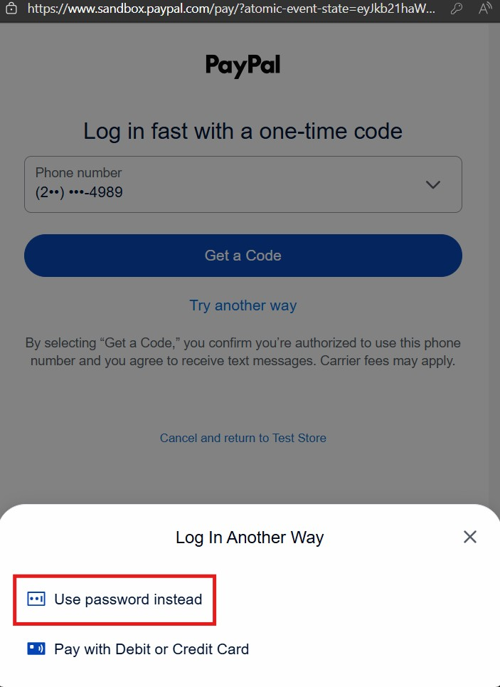

6. After loggin in, use the Credit Union account to pay for the gig, then click "Pay"
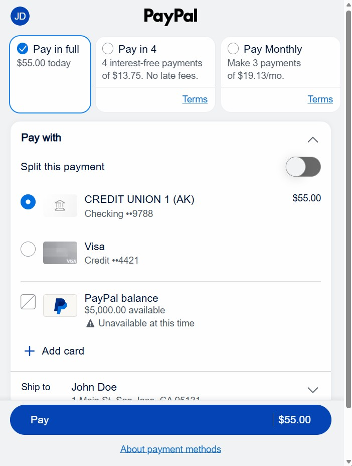

7. Once the gig is created, the page will redirect to the gigs page. 
**Gig Creation Tips:**
- Be specific in your quest details to ensure Cupids understand your needs
- Allow reasonable time between creation and dropoff time
- Set a fair budget that accounts for distance and item costs
- Double-check your dropoff location is accurate
- Include any special instructions in the quest details

**What Happens Next:**
1. Your gig becomes available for Cupids to accept
2. You'll receive a notification when a Cupid accepts your gig
3. The Cupid will complete the delivery at your specified time and location
4. You'll be prompted to rate the Cupid after completion

---

### Managing Your Calendar

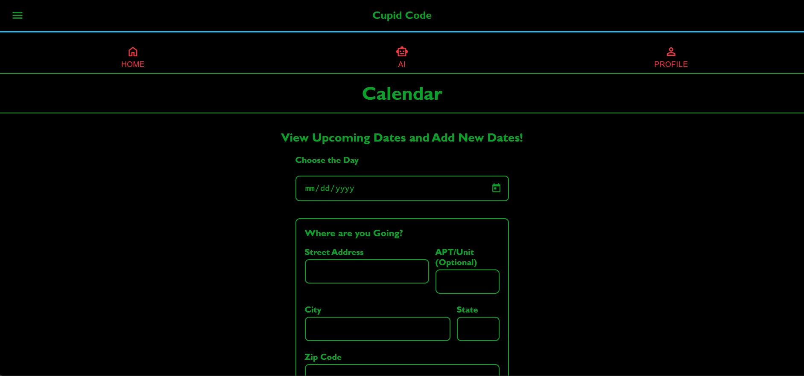

**How to Use Your Calendar:**
1. Click "Calendar" from the navigation menu
2. View all your planned and completed dates in a grid layout
3. Add new dates to track your dating schedule

**Adding a New Date to Your Calendar:**
1. Fill out the date creation form:
   - **Choose the Day**: Select the date from the calendar picker
   - **Where are you Going?** Enter the complete address:
     - Street Address (required)
     - APT/Unit (optional)
     - City (required)
     - State (required)
     - Zip Code (required)
   - **What will you be doing?** Describe your planned date activity
   - **Max budget for Gigs**: Set the maximum amount ($XX.XX) you're willing to spend on gigs for this date
2. Click the "Add Date" button to save the date to your calendar

**Understanding Date Statuses:**
- **Planned**: Date is scheduled and upcoming
- **Completed**: Date has been finished
- Use the "Change Status" button on each date card to toggle between planned and completed

**Calendar Features:**
- View all dates in an organized grid layout
- Each date card displays:
  - Date
  - Location/Address
  - Description of activities
  - Current status (Planned/Completed)
- Change status of dates with one click
- Track your dating activity and budget planning

**Calendar Tips:**
- Add dates in advance to plan your gig budget accordingly
- Update status after completing dates to keep your calendar organized
- Use the description field to remember details about planned activities
- Set realistic budgets based on what gigs you might need during the date

---

### Dater Profile

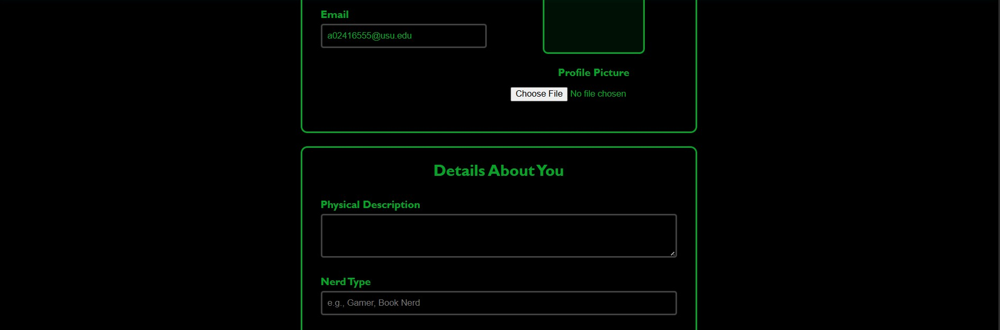

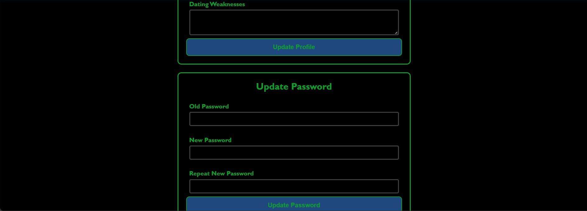

**How to Manage Your Profile:**
1. Click "Profile" from the navigation menu
2. View and edit your profile information:
   - **Profile Picture**: Click to upload a new photo
   - **Name**: Your display name
   - **Email**: Contact email (used for login)
   - **Location**: Your general area (helps match with nearby Cupids)
   - **Phone number**: Your contact information
   - **Bio**: Optional descriptions about yourself
     - Physical description
     - Nerd Type
     - Interests
     - Relationship Goals
     - Past Dating History
     - Dating Strengths
     - Dating Weaknesses

**Updating Your Profile:**
1. The Profile Page is automatically in "edit mode"
2. Make desired changes to any field
3. Click "Save Changes" to update your information
4. Changes take effect immediately

**Important Profile Tips:**
- Keep your location updated for accurate Cupid matching
- Add a profile picture to personalize your account
- Verify your payment information is current
- Review notification settings to stay informed about gig updates

---

### Viewing Your Feedback

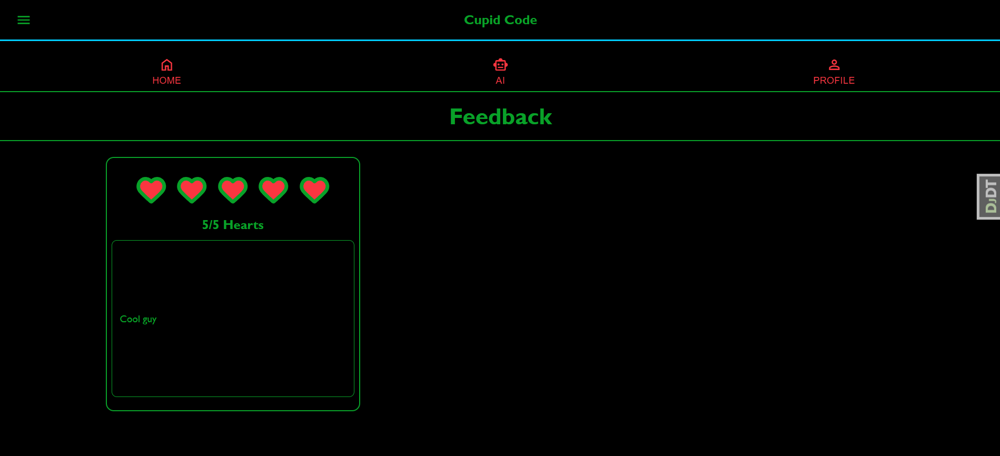

**How to View Your Feedback:**

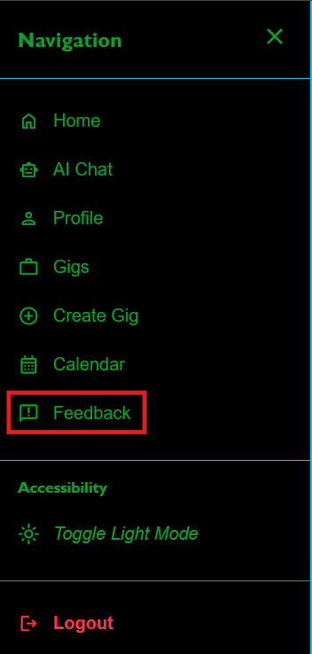

1. Click "Feedback" from the navigation menu or hamburger menu
2. View all feedback you've received from Cupids who completed your gigs
3. Each feedback card displays:
   - **Heart Rating**: Visual 1-5 heart rating from the Cupid
   - **Rating Score**: Numerical rating (e.g., "3/5 Hearts")
   - **Written Feedback**: The Cupid's message about their experience with you

**Understanding Your Feedback:**
- Feedback helps you understand how Cupids perceive working with you
- Higher ratings make you a more appealing client for Cupids
- Use feedback to improve your gig requests and interactions

**Feedback Display:**

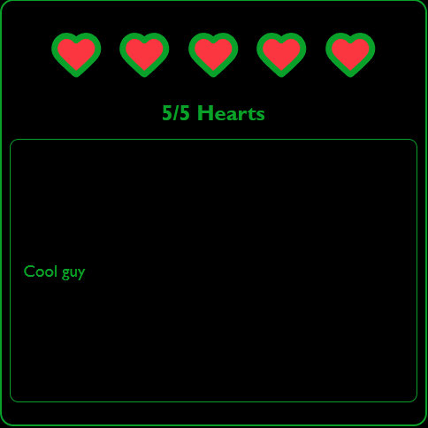

- These Feedback card will be displayed in a responsive grid layout
- On mobile: Single column of cards
- On tablet: 2-3 cards per row
- On desktop: Up to 4 cards per row
- Cards show hearts that cannot be clicked (display only)
- Each card maintains a square aspect ratio for visual consistency

**Tips for Better Feedback:**
- Be clear and specific in your gig requests
- Be available at the dropoff location on time
- Communicate promptly if there are changes
- Rate your Cupids fairly to encourage reciprocal good ratings
- Provide helpful information in your gig details

---

## Cupid Guide

### Cupid Overview

As a Cupid, you earn money by completing gigs for Daters. Your role involves accepting delivery requests, purchasing items, and delivering them to Daters during their dates. The Cupid interface provides tools for finding available gigs, managing active deliveries, and tracking your earnings.

#### Cupid Table of Contents
- [Accessing the Cupid Dashboard](#accessing-the-cupid-dashboard) - Navigate your main interface
- [Finding and Claiming Gigs](#finding-and-claiming-gigs) - Browse and accept available gigs
- [Managing Active Gigs](#managing-active-gigs) - Track your current deliveries
- [Viewing Completed Gigs](#viewing-completed-gigs) - Review past gigs and rate Daters
- [Cupid Feedback](#cupid-feedback) - View ratings and feedback from Daters
- [Cupid Profile](#cupid-profile) - Manage your account and payment settings

#### Key Cupid Responsibilities:
- **Find Gigs**: Browse available delivery requests within your range
- **Complete Deliveries**: Purchase and deliver items on time
- **Earn Money**: Get paid in Cupid Cash for completed gigs
- **Provide Service**: Maintain high ratings through quality service
- **Manage Availability**: Control when you're accepting new gigs

---

### Viewing Completed Gigs

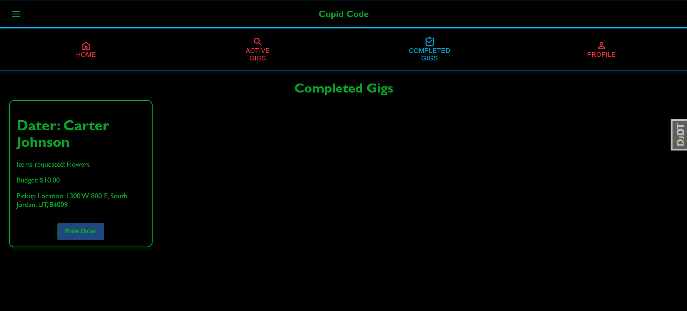

**How to View Your Completed Gigs:**

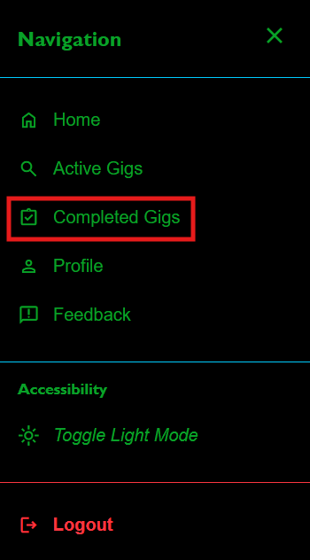

1. Click "Completed Gigs" from the navigation menu
2. View all gigs you've successfully completed
3. Each completed gig displays:
   - **Dater Information**: Name of the Dater you helped
   - **Items Requested**: What you delivered
   - **Budget**: Amount earned from the gig
   - **Pickup Location**: Where you collected the items
   - **Rate Dater Button**: Submit feedback for the Dater

**Rating Daters:**

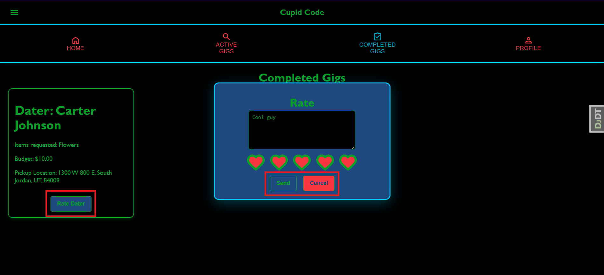

1. Click "Rate Dater" on any completed gig card
2. A popup will appear with rating options:
   - **Heart Rating**: Click hearts to select 1-5 rating
     - Click on a heart to set rating (e.g., click 3rd heart for 3/5)
     - Hearts automatically fill/unfill based on your selection
   - **Written Feedback**: Optional text area to describe your experience
3. Click "Send" to submit your rating
4. Click "Cancel" to close without submitting

**Completed Gigs Display:**

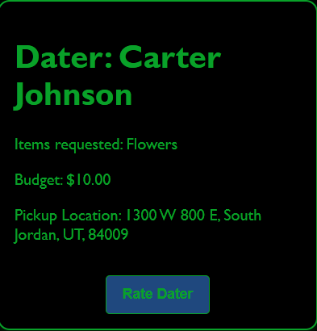

- These gig tiles are displayed in a responsive tile layout
- On mobile: 2 tiles per row (minimum 280px width)
- On tablet: 3 tiles per row
- On desktop: 4-5 tiles per row (220-300px each)
- Large screens: Up to 5 tiles per row
- Empty state message: "No completed gigs yet."

**Rating Tips:**
- Rate honestly to help maintain platform quality
- Consider punctuality, clear communication, and gig accuracy
- Provide constructive written feedback when appropriate
- Your ratings help other Cupids understand Dater reliability

---

### Cupid Feedback

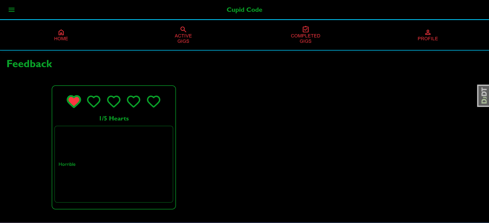

**How to View Your Feedback:**

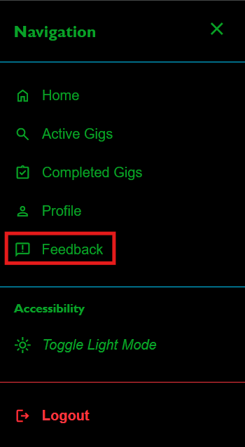

1. Click "Feedback" from the navigation menu or hamburger menu
2. View all feedback you've received from Daters whose gigs you completed
3. Each feedback card displays:
   - **Heart Rating**: Visual 1-5 heart rating from the Dater
   - **Rating Score**: Numerical rating (e.g., "4/5 Hearts")
   - **Written Feedback**: The Dater's message about your service

**Understanding Your Feedback:**
- Feedback reflects your performance and service quality
- Higher ratings increase your appeal to Daters
- Use feedback to improve your delivery service

**Feedback Display:**

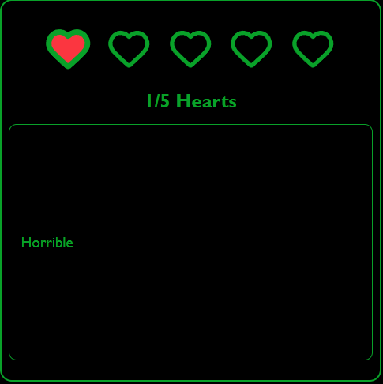

- These Feedback cards are displayed in a responsive grid layout
- On mobile: Single column of cards (250px minimum)
- On tablet: 2-3 cards per row
- On desktop: Up to 4 cards per row (300px each)
- Cards maintain square aspect ratio for visual consistency
- Hearts are display-only (cannot be clicked)

**Maintaining Good Ratings:**
- Deliver items on time
- Communicate any delays or issues promptly
- Purchase correct items as requested
- Be professional and courteous
- Follow special instructions carefully
- Deliver to correct location
- Handle items with care

**Impact of Ratings:**
- Your average rating is visible to Daters
- Higher ratings may lead to more gig opportunities
- Consistently low ratings may affect your account standing
- Good feedback builds trust with the Dater community

---

## Manager Guide

### Manager Overview

As a Manager, you have administrative control over the Cupid Code platform. Your role involves monitoring user activity, managing accounts, analyzing platform performance, and ensuring quality service delivery. The Manager interface provides comprehensive tools for platform oversight and user management.

#### Manager Table of Contents
- [Accessing the Manager Dashboard](#accessing-the-manager-dashboard) - Learn how to navigate the main interface
- [Dashboard Hamburger Side Bar](#dashboard-hamburger-side-bar) - Explore the navigation menu options
- [Dashboard Analytics](#dashboard-analytics) - Understanding platform metrics and performance data
- [Statistics Section & Exporting Platform Data](#statistics-section--exporting-platform-data) - Export reports and detailed statistics
- [Managing Daters](#managing-daters) - View and manage Dater accounts
- [Suspending Dater Accounts](#suspending-dater-accounts) - Learn how to suspend/unsuspend Daters
- [Managing Cupids](#managing-cupids) - View and manage Cupid accounts

#### Key Manager Responsibilities:
- **User Management**: Monitor and manage Dater and Cupid accounts
- **Platform Analytics**: Track performance metrics and user activity
- **Quality Control**: Review feedback and handle policy violations
- **Data Export**: Generate reports for stakeholder review
- **Account Actions**: Suspend/unsuspend users as needed

---

### Accessing the Manager Dashboard

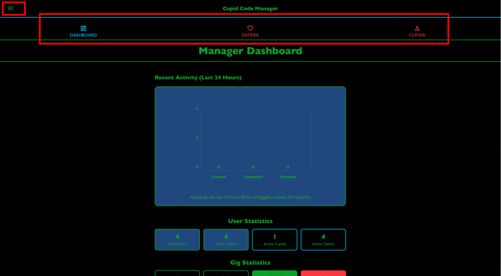

**How to Navigate the Manager Dashboard:**
1. Upon logging in as a manager, you'll see the main dashboard with the navigation bar, and hamburger highlighted
2. The navigation menu on the top shows three main options:
   - **Home**: Returns to the main dashboard with platform overview
   - **Cupids**: Manage all Cupid accounts and view their performance
   - **Daters**: Manage all Dater accounts and monitor their activity
3. Click on any navigation item to access that section
4. The hamburger button has the same navigation with additional features

---

### Dashboard Hamburger Side Bar

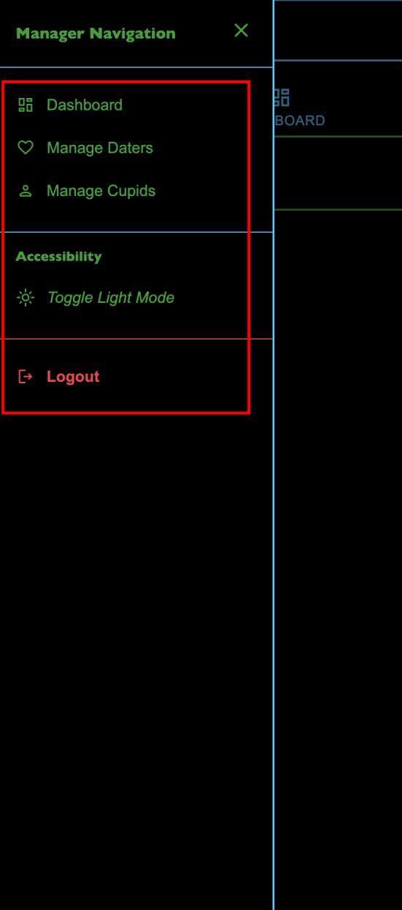

**Using Dashboard hamburger navigation:**
1. The navigation menu on the left shows three main options:
   - **Home**: Returns to the main dashboard with platform overview
   - **Cupids**: Manage all Cupid accounts and view their performance
   - **Daters**: Manage all Dater accounts and monitor their a- for how to fill out payments, see [Creating a Gig](#creating-a-gig)
ction
3. Below the navigation section is a toggle to turn light mode on or off
  - by default light mode is off
4. Below the light mode toggle is the logout button 

---

### Dashboard Analytics

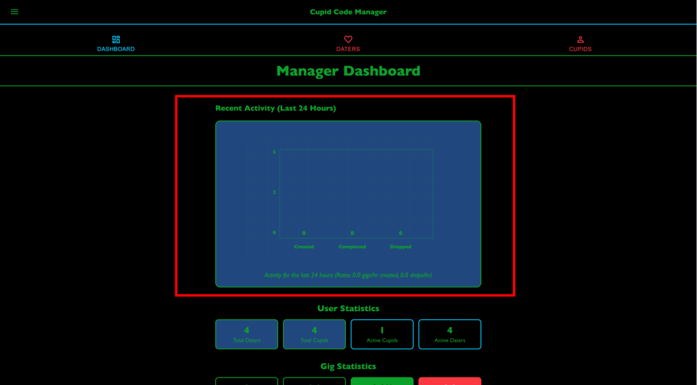

**Reading Dashboard Analytics:**
1. The main dashboard displays key platform statistics in visual graphs
2. View metrics such as:
   - User registration trends over time
   - Gig completion rates
   - Active user counts
   - Platform performance indicators
3. Use these graphs to monitor platform health and growth
4. Hover over data points to see specific values and dates
5. Use this data to make informed decisions about platform management

---

### Statistics Section & Exporting Platform Data

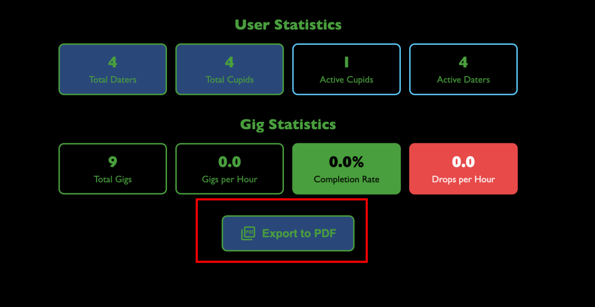

**statistics section & Exporting Platform Data:**
1. the statistic section is located directly below the graph, and contains more detailed information
1. Click the "Export" button (highlighted) to download platform reports
2. Use exported data for external analysis or reporting to stakeholders

---

### Managing Daters

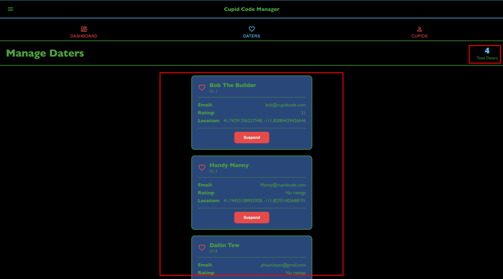

**How to Manage Dater Accounts:**
1. Navigate to the "Daters" section from the main menu
2. View the complete list of all registered daters on the platform
3. For each dater, you can see:
   - User profile information (name, email)
   - how many ratings they have 
   - location 
4. the suspend button allow you to suspend, unsuspend

---

### Suspending Dater Accounts

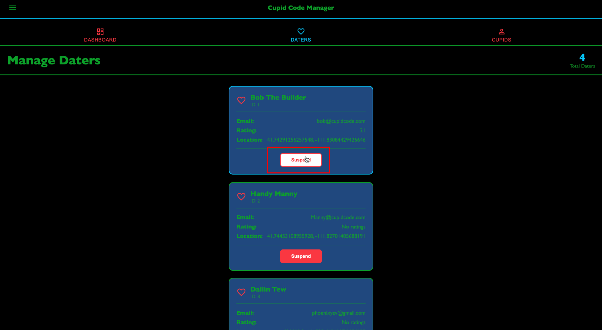

**How to Suspend a Dater Account:**
1. From the Daters list, click the "Suspend" button next to a dater's name
2. Review the dater's information to ensure you're suspending the correct account
3. Suspended accounts cannot:
   - Log into the platform
   - Create new gigs
   - Access AI chat features
   - Interact with Cupids
4. To reverse this action, use the "Unsuspend" button which will appear after suspension

---

### Managing Cupids

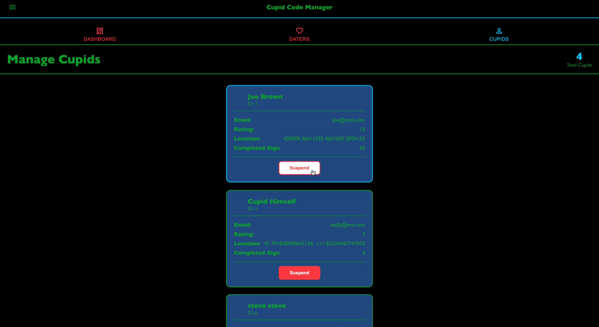

**How to Manage Cupid Accounts:**
1. Navigate to the "Cupids" section from the main menu
2. View the complete list of all registered cupids on the platform
3. For each cupids, you can see:
   - User profile information (name, email)
   - how many ratings they have 
   - location 
4. the suspend button allow you to suspend, unsuspend
   - the suspention process is the same for daters, please refer to the [Suspending Dater Accounts](#suspending-dater-accounts) section above to learn about suspending.

---

## Troubleshooting

### Common Issues

**Can't log in?**
- Check email and password spelling
- Try refreshing the page
- Contact support if issues persist

**AI Chat not responding?**
- Wait a moment for the AI to "wake up"
- Try refreshing the page
- Check your internet connection

**Gig not showing up?**
- Ensure you're within the service area
- Check your availability settings (Cupids)

**Payment issues?**
- Verify PayPal email is correct (Cupids)
- Check payment method on file (Daters)
- Contact support for payment disputes

### Getting Help
- Check this user manual first
- Use the in-app support features
- Contact customer service via email
- Report bugs through the feedback system

---

## Support

### Contact Information
- **Email Support**: support@cupidcode.com
- **Business Hours**: Monday-Friday, 9 AM - 6 PM
- **Response Time**: Within 24 hours

### Additional Resources
- **FAQ**: Available in the app help section
- **Video Tutorials**: Coming soon
- **Community Forum**: Coming soon

### Feedback
We value your feedback! Help us improve Cupid Code by:
- Rating your experiences with Cupids/Daters
- Reporting bugs or issues
- Suggesting new features
- Participating in user surveys

---

*Last Updated: January 2025*
*Version: 1.0*
