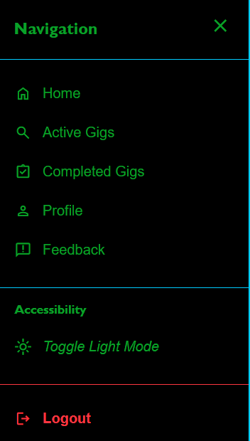
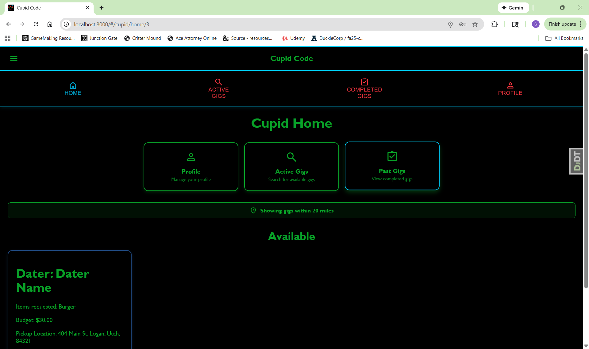
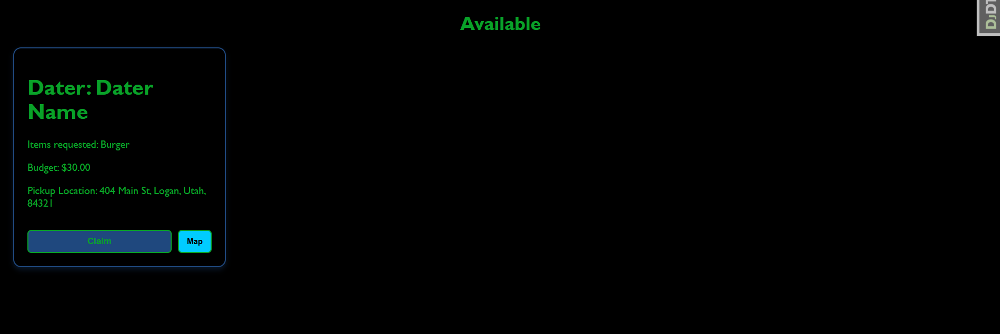
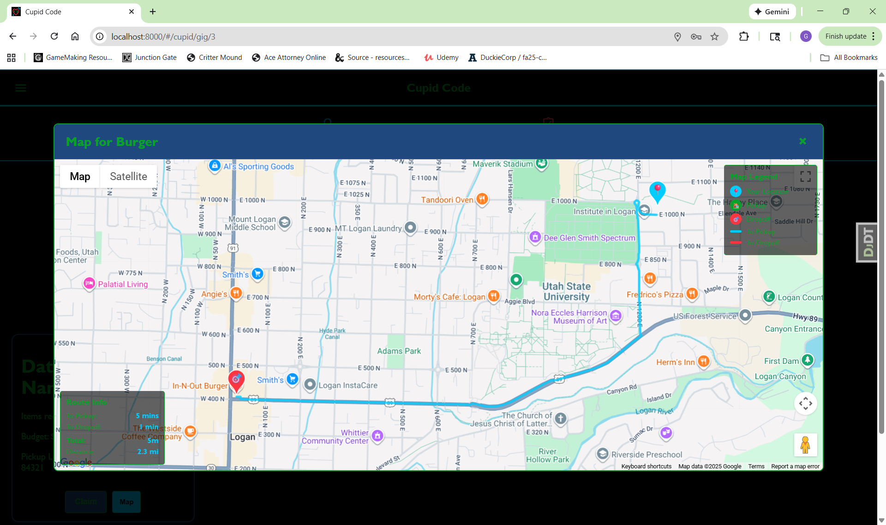
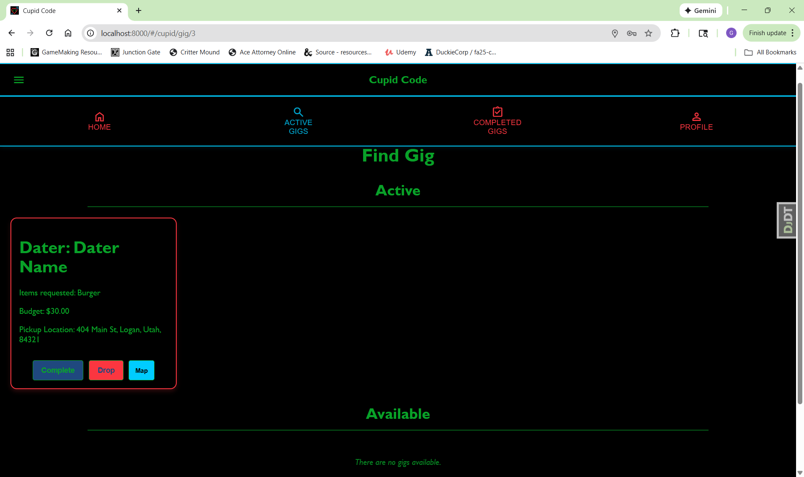
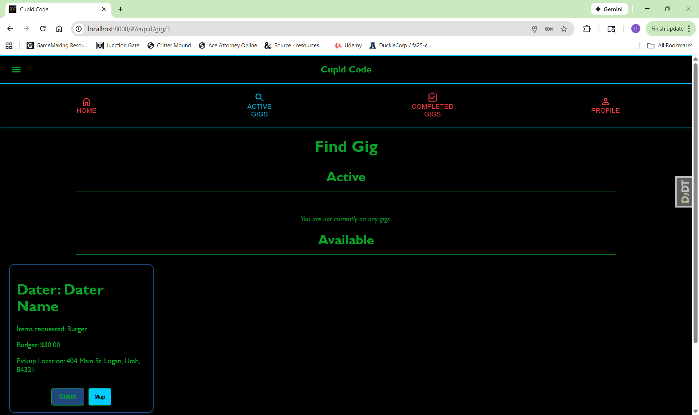
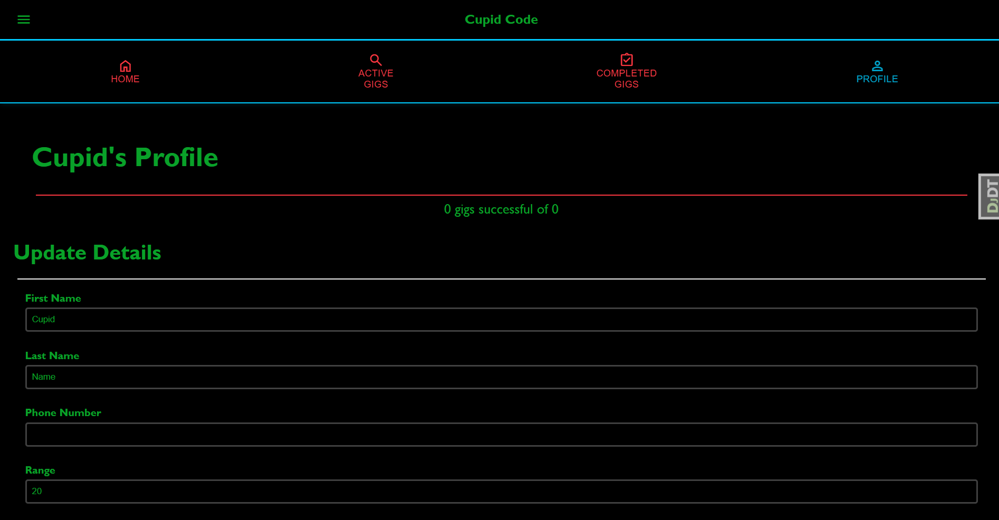
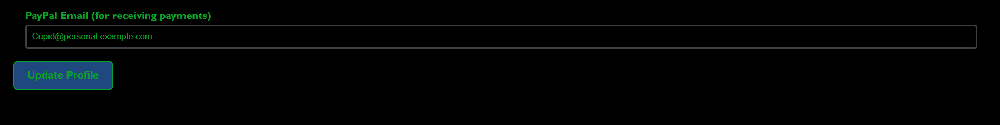

# Cupid Code User Manual

## Table of Contents 

- [Overview](#overview)
- [Getting Started](#getting-started)
- **User Types:**
  - [Dater Guide](#dater-guide)
    - [Dater Overview](#dater-overview)
    - [Accessing the Dater Dashboard](#accessing-the-dater-dashboard)
    - [Navigation Options](#navigation-options)
    - [Using AI Chat](#using-ai-chat)
    - [How AI Gig Creation Works](#how-ai-gig-creation-works)
    - [Managing Your Gigs](#managing-your-gigs)
    - [Creating a Gig](#creating-a-gig)
    - [PayPal Checkout Process](#paypal-checkout-process)
    - [Managing Your Calendar](#managing-your-calendar)
    - [Dater Profile](#dater-profile)
    - [Viewing Your Feedback](#viewing-your-feedback)
  - [Cupid Guide](#cupid-guide)
    - [Cupid Overview](#cupid-overview)
    - [Accessing the Cupid Dashboard](#accessing-the-cupid-dashboard)
    - [Cupid Home](#cupid-home)
    - [Finding and Managing Gigs](#finding-and-managing-gigs)
    - [Viewing Completed Gigs](#viewing-completed-gigs)
    - [Cupid Feedback](#cupid-feedback)
    - [Cupid Profile](#cupid-profile)
  - [Manager Guide](#manager-guide)
    - [Manager Overview](#manager-overview)
    - [Accessing the Manager Dashboard](#accessing-the-manager-dashboard)
    - [Dashboard Hamburger Side Bar](#dashboard-hamburger-side-bar)
    - [Dashboard Analytics](#dashboard-analytics)
    - [Statistics Section & Exporting Platform Data](#statistics-section--exporting-platform-data)
    - [Managing Daters](#managing-daters)
    - [Suspending Dater Accounts](#suspending-dater-accounts)
    - [Managing Cupids](#managing-cupids)
- [Glossary](#glossary)
- [Troubleshooting](#troubleshooting)
- [Support](#support)

---

## Overview

Cupid Code is a dating assistance platform that connects Daters with AI-powered advice and real-world help from Cupids. Whether you're looking for dating tips, emergency date assistance, or want to earn money helping others, Cupid Code has you covered.

### What is Cupid Code?
- **For Daters**: Get AI dating advice and emergency assistance during dates
- **For Cupids**: Earn money by helping Daters with deliveries and date-saving tasks
- **For Managers**: Oversee platform operations and user management

---

## Glossary

**AI Chat** - Conversational interface for getting dating advice from AI

**AI Listen Mode** - Feature that monitors conversations and can trigger emergency assistance

**Cupid** - User who provides delivery and assistance services to Daters

**Dater** - User seeking dating assistance and advice

**Dropoff Location** - Where Cupid delivers items (usually the date location)

**Gig** - A task or delivery request created by a Dater for a Cupid to complete

**Manager** - Administrator who oversees platform operations

**PayPal Email** - Email address linked to PayPal account for receiving payments

**Pickup Location** - Where Cupid collects requested items (usually a store)

**Quest** - The specific details of what's needed for a gig (items, locations, budget)

**Rating** - 1-5 star feedback system for Daters and Cupids
---

## Getting Started

### Creating an Account

1. **Access the Website**: Navigate to https://cupidcode.zapto.org/#/ in your web browser

2. **Navigate to Registration**: On the login page, click the "Don't have an account? Sign up here!" link (highlighted in red) to access the registration form

3. **Start Registration**: You'll see the empty registration form with fields for your information and role selection

4. **Complete Dater Registration**: Fill in all required fields:
   - First Name and Last Name
   - Email address (will be your username)
   - Password and confirm password
   - Phone number
   - Select "Dater" as your role
   - Complete the Dater-specific fields (interests, dating goals, etc.)
   - Click "Create Account" when finished

5. **Alternative: Select Cupid Role**: If you want to become a Cupid instead, select "Cupid" from the role dropdown

6. **Complete Cupid Registration**: Fill in all required fields for Cupid account:
   - First Name and Last Name  
   - Email address (will be your username)
   - Password and confirm password
   - Phone number
   - PayPal email for receiving payments
   - Select "Cupid" as your role
   - Click "Create Account" when finished

### Logging In

2. **Enter Credentials**: On the main login page, enter your email and password
3. **Sign In**: Click the "Sign In" button
4. **Automatic Redirect**: You'll be redirected to your role-specific dashboard based on your account type

---

## Dater Guide

### Dater Overview

As a Dater, you have access to AI-powered dating advice and emergency assistance from real people called Cupids. Whether you need last-minute flowers for a date, restaurant recommendations, or just someone to talk through your dating anxiety, Cupid Code connects you with the help you need.

#### Dater Table of Contents
- [Accessing the Dater Dashboard](#accessing-the-dater-dashboard) - Navigate your main interface and understand the dashboard tiles
- [Navigation Options](#navigation-options) - Learn about mobile/desktop navigation and the hamburger menu
- [Using AI Chat](#using-ai-chat) - Get dating advice and create emergency gigs with voice input
- [How AI Gig Creation Works](#how-ai-gig-creation-works) - Voice-activated emergency gig creation process
- [Managing Your Gigs](#managing-your-gigs) - Track unclaimed, claimed, and completed assistance requests
- [Creating a Gig](#creating-a-gig) - Post new requests with PayPal payment integration
- [PayPal Checkout Process](#paypal-checkout-process) - Complete payment for gigs using PayPal
- [Managing Your Calendar](#managing-your-calendar) - Plan dates and track your dating schedule
- [Dater Profile](#dater-profile) - Manage personal information and dating preferences
- [Viewing Your Feedback](#viewing-your-feedback) - See ratings and feedback from Cupids

#### Key Dater Features:
- **AI Dating Assistant**: Get personalized advice and conversation help
- **Emergency Assistance**: Request real-time help during dates
- **Gig Management**: Track all your assistance requests from creation to completion
- **Calendar Integration**: Plan dates and coordinate with gig scheduling
- **Payment System**: Secure PayPal integration for gig payments
- **Feedback System**: Rate Cupids and view your own ratings

---

### Accessing the Dater Dashboard

**How to Navigate the Dater Home:**
1. Upon logging in as a Dater, you'll see your main dashboard with navigation tiles
2. The dashboard displays three primary action tiles:
   - **AI Chat**: Access conversational AI for dating advice and emergency gig creation
   - **My Gigs**: View and manage all your assistance requests across three status categories
   - **Create Gig**: Post new requests for Cupid assistance with delivery or emergency help
3. Click any tile to access that feature - all navigation uses your user ID automatically
4. The interface adapts responsively between mobile and desktop layouts

---

### Navigation Options

**Mobile Bottom Navigation Bar:**
- **Home**: Returns to the main Dater dashboard
- **AI**: Direct access to AI Chat functionality  
- **Profile**: Manage your account settings and personal information

**Desktop/Tablet Top Navigation:**
- Same three options positioned below the banner for larger screens

**Hamburger Menu (Available on all screens):**
Located in the top-left banner, provides comprehensive navigation:
- **Home**: Return to dashboard
- **AI Chat**: Access conversational AI assistant
- **Profile**: Manage account settings  
- **Gigs**: View and manage assistance requests
- **Create Gig**: Post new assistance requests
- **Calendar**: View scheduled dates and events
- **Feedback**: Provide feedback from cupids
- **Accessibility**: Toggle light/dark mode
- **Logout**: Sign out of your account

---

### Using AI Chat

**Getting AI Dating Advice:**
1. Click "AI Chat" from dashboard or navigation
2. View welcoming interface with chat icon and instructions
3. Type questions in the message input field at the bottom
4. Press Enter or click send button to receive AI responses
5. Conversation history displays with user messages (right-aligned) and AI responses (left-aligned with robot icon)
6. Use "Clear" button to hide messages (preserves history)

**Advanced Voice Features:**
1. **Voice Input**: Click microphone button to start speech recording
   - Records up to 30 seconds automatically
   - Real-time transcript appears in message field
   - Click microphone again to stop early
2. **Smart Keyword Detection**: AI monitors speech for emergency keywords and can suggest creating gigs automatically

**AI Gig Creation Integration:**
- AI can detect when you need emergency assistance
- Automatically suggests creating gigs for any product
- **Voice-Only Feature**: AI gig creation only works with voice input, not typed messages
- For payment processing, see [PayPal Checkout Process](#paypal-checkout-process)

---

### How AI Gig Creation Works

The AI assistant can automatically detect when you mention products in your conversations and help you create gigs instantly through voice commands only:

1. **Voice Detection Process:**
   - Use the microphone button to speak naturally about your dating situation
   - **Important**: Simply speak what you need - do NOT press the send button
   - The AI analyzes your speech in real-time for product keywords (flowers, coffee, chocolates, etc.)
   - If a product is detected, you'll see an automatic popup suggesting gig creation
   - **Note**: Pressing the send button will NOT create a gig - AI gig creation only works through voice detection

2. **AI Gig Creation Steps:**
   - When the AI detects a product, it will show: "I detected you might need [PRODUCT]. Would you like me to help you create a gig?"
   - The AI uses Google Places API to find nearby stores that sell the detected item
   - Your current location is used to find the closest available pickup location
   - The system automatically fills in:
     - **Item**: The detected product (e.g., "Flowers")
     - **Pickup Location**: Nearest store address (e.g., "Walmart Supercenter, 123 Main St")
     - **Dropoff Location**: Your current coordinates or manually enter your date location
   - **Budget**: You must manually enter your desired budget amount (this is not auto-filled)

3. **Review and Confirm:**
   - Review the automatically generated gig details
   - **Required**: Enter your budget amount for the gig
   - Modify any other fields if needed (specific item details, dropoff location)
   - Proceed to [PayPal Checkout Process](#paypal-checkout-process) to complete payment
   - Once payment is complete, your gig becomes available for Cupids to claim

**AI Detection Examples:**
- "I need flowers for my date" → Detects "flowers" → Finds florists nearby
- "Should I bring coffee?" → Detects "coffee" → Finds coffee shops nearby  
- "Maybe I should get chocolates" → Detects "chocolates" → Finds stores selling candy

**Tips for AI Gig Creation:**
- **Voice Only**: This feature only works with voice input through the microphone
- **Don't Press Send**: Speak naturally without pressing the send button
- Speak clearly when mentioning products you need
- Allow location access for accurate pickup location suggestions
- Review the AI-suggested pickup location before confirming
- The AI works best with common products (food, flowers, gifts, etc.)
- Always set your budget before completing the gig creation

---

### Managing Your Gigs

**Understanding Gig Status Categories:**

The "My Gigs" page shows all your assistance requests organized by their current status. Each category represents a different stage in the gig lifecycle.

**1. Unclaimed Gigs:**
- Recently posted assistance requests waiting for Cupid assignment
- **What you see**: Gig details including items requested, budget, pickup/dropoff locations
- **Available Actions**: 
  - **Cancel**: Remove gig if no longer needed (only available until claimed by a Cupid)
- **What happens next**: Once a Cupid claims your gig, it moves to "Claimed Gigs"
- **Timeline**: Most gigs are claimed within 15-30 minutes during peak hours
- Empty state message: "You do not have any pending gigs"

**2. Claimed Gigs:**
- Active assistance requests assigned to specific Cupids
- **What you see**: Same gig details plus the Cupid's name who accepted it
- **Available Actions**: 
  - **Cancel**: Still available if circumstances change (Cupid will be notified)
  - **Complete**: Mark as finished when service is received (triggers payment processing to Cupid)
- **What happens**: The assigned Cupid is now working on your request
- **Expected timeline**: Most gigs are completed within 30-60 minutes of being claimed
- **Communication**: Cupids may contact you if they need clarification on pickup/dropoff details
- Empty state message: "You have no active gigs"

**3. Complete Gigs:**
- Finished assistance requests ready for feedback
- **What you see**: Completed gig details and delivery confirmation
- **Available Actions**: 
  - **Rate Cupid**: Provide feedback about the service quality
- **Why rating matters**: Your ratings help other Daters choose reliable Cupids
- Empty state message: "You have no complete gigs"

**Important Gig Management Notes:**
- You'll receive notifications when gigs are claimed, completed, or dropped
- **Refresh the page** to see the most up-to-date gig statuses and any new feedback you've received
- **When to refresh**: After creating gigs, when checking for status updates, or if you've been on the page for a while and want to see new feedback
- Cancelled gigs are permanently removed and cannot be recovered
- Completed gigs remain in your history for future reference

**Rating System Process:**
1. Click "Rate Cupid" on any completed gig
2. **Heart Rating**: Click hearts to select 1-5 rating 
   - 1 heart = Poor service
   - 3 hearts = Satisfactory service  
   - 5 hearts = Excellent service
   - Click the same heart again to reset your rating
3. **Written Feedback**: Optional text area for detailed service review
   - Mention timeliness, item quality, communication, etc.
4. **Submit Process**: Click "Send" to submit rating and feedback
5. **Cancel Option**: Exit rating popup without submitting

---

### Creating a Gig

**Understanding the Create Gig Page:**

The "Create Gig" page allows you to post new assistance requests for Cupids to claim. This is where you create detailed delivery requests that will be visible to all available Cupids in your area.

**How to Create a Gig:**
1. Click "Create Gig" from the navigation menu
2. Fill out the gig request form with the following information:
   - **Item**: Brief description of what you need (e.g., "Flowers, Movie Tickets, etc")
   - **Pickup Location**: Where the Cupid should collect items (enter address. EX: 100 N 100 E, 84321)
   - **Dropoff Location**: Where to deliver (your date location - enter address or use map). In the event that your drop off address is the same as your pickup address, click the checkbox called: "Same as pickup address"
   - **Budget**: Set maximum amount you're willing to pay  
3. Review all information carefully
4. Click "Create Gig" to advance to the payment step
5. Complete payment using the [PayPal Checkout Process](#paypal-checkout-process)

**Gig Creation Tips:**
- Be specific in your quest details to ensure Cupids understand your needs
- Allow reasonable time between creation and dropoff time
- Set a fair budget that accounts for distance and item costs
- Double-check your dropoff location is accurate
- Include any special instructions in the quest details

**What Happens Next:**
1. Your gig becomes available for Cupids to accept
2. You'll receive a notification when a Cupid accepts your gig
3. The Cupid will complete the delivery at your specified time and location
4. You'll be prompted to rate the Cupid after completion

---

### PayPal Checkout Process

This section explains how to complete payment for gigs using PayPal. This process is used when creating gigs manually or through AI assistance.

**Starting the PayPal Checkout:**
1. After completing your gig creation form, you'll see the payment page
2. Review your gig details and total amount
3. Press the PayPal button to open the popup window leading to PayPal checkout

**PayPal Authentication Steps:**

1. Log into PayPal using the test account information:
   - Email: Dater@personal.example.com
   - Password: I-Am-A-Dater

**Important Note:**
PayPal will default to using phone number authentication. To use password authentication instead:
1. Click "Try another way"
2. Then click "Use Password Instead"

   - Password: I-Am-A-Dater

**Completing the Payment:**
1. After logging in, you'll see your available payment methods
2. Use the Credit Union account to pay for the gig
3. Review the payment details
4. Click "Pay" to complete the transaction

**After Payment Completion:**
1. The PayPal window will close automatically
2. You'll be redirected back to the Cupid Code gigs page
3. Your newly created gig will appear in your "Unclaimed Gigs" section
4. You'll receive a confirmation that your gig has been posted

**Payment Tips:**
- Ensure you have a stable internet connection during payment
- Do not close the PayPal popup window manually
- If payment fails, you can retry by creating the gig again
- Your gig will only be posted after successful payment completion

---

### Managing Your Calendar

**How to Use Your Calendar:**
1. Click "Calendar" from the navigation menu
2. View all your planned and completed dates in a grid layout
3. Add new dates to track your dating schedule

**Adding a New Date to Your Calendar:**
1. Fill out the date creation form:
   - **Choose the Day**: Select the date from the calendar picker
   - **Where are you Going?** Enter the complete address:
     - Street Address (required)
     - APT/Unit (optional)
     - City (required)
     - State (required)
     - Zip Code (required)
   - **What will you be doing?** Describe your planned date activity
   - **Max budget for Gigs**: Set the maximum amount ($XX.XX) you're willing to spend on gigs for this date
2. Click the "Add Date" button to save the date to your calendar

**Understanding Date Statuses:**
- **Planned**: Date is scheduled and upcoming
- **Completed**: Date has been finished
- Use the "Change Status" button on each date card to toggle between planned and completed

**Calendar Features:**
- View all dates in an organized grid layout
- Each date card displays:
  - Date
  - Location/Address
  - Description of activities
  - Current status (Planned/Completed)
- Change status of dates with one click
- Track your dating activity and budget planning

**Calendar Tips:**
- Add dates in advance to plan your gig budget accordingly
- Update status after completing dates to keep your calendar organized
- Use the description field to remember details about planned activities
- Set realistic budgets based on what gigs you might need during the date

---

### Dater Profile

**How to Manage Your Profile:**
1. Click "Profile" from the navigation menu
2. View and edit your profile information:
   - **Profile Picture**: Click to upload a new photo
   - **Name**: Your display name
   - **Email**: Contact email (used for login)
   - **Location**: Your general area (helps match with nearby Cupids)
   - **Phone number**: Your contact information
   - **Bio**: Optional descriptions about yourself
     - Physical description
     - Nerd Type
     - Interests
     - Relationship Goals
     - Past Dating History
     - Dating Strengths
     - Dating Weaknesses

**Updating Your Profile:**
1. The Profile Page is automatically in "edit mode"
2. Make desired changes to any field
3. Click "Save Changes" to update your information
4. Changes take effect immediately

**Important Profile Tips:**
- Keep your location updated for accurate Cupid matching
- Add a profile picture to personalize your account
- Verify your payment information is current
- Review notification settings to stay informed about gig updates

---

### Viewing Your Feedback

**Understanding Your Feedback Page:**

This page shows all the ratings and reviews you've received from Cupids who completed your gigs. Your feedback helps you understand how Cupids perceive working with you and can help you improve your future gig requests.

**How to View Your Feedback:**

1. Click "Feedback" from the navigation menu or hamburger menu
2. View all feedback you've received from Cupids who completed your gigs
3. Each feedback card displays:
   - **Heart Rating**: Visual 1-5 heart rating from the Cupid
   - **Rating Score**: Numerical rating (e.g., "3/5 Hearts")
   - **Written Feedback**: The Cupid's message about their experience with you

**What Ratings Mean:**
- **5 Hearts**: Excellent client - clear instructions, punctual, courteous
- **4 Hearts**: Good client - mostly smooth experience with minor issues
- **3 Hearts**: Average client - adequate but room for improvement
- **2 Hearts**: Difficult client - unclear instructions, late, or rude
- **1 Heart**: Poor client - major issues with communication or behavior

**Common Feedback Themes:**
- **Communication**: "Very clear instructions" vs "Confusing pickup details"
- **Punctuality**: "Was waiting at dropoff" vs "Not available when I arrived"
- **Courtesy**: "Very polite and thankful" vs "Seemed impatient"
- **Accuracy**: "Perfect gig details" vs "Location was wrong"

**Why Good Feedback Matters:**
- **Cupid Attraction**: Higher ratings make you a more appealing client
- **Faster Service**: Cupids prefer working with well-rated Daters
- **Platform Standing**: Consistently good ratings improve your account status
- **Community Trust**: Good feedback builds trust within the Cupid community

**Improving Your Ratings as a Dater:**

**Communication Excellence:**
- **Clear Instructions**: Provide specific, detailed pickup and dropoff information
- **Availability**: Be reachable by phone if Cupids need clarification
- **Updates**: Inform Cupids if there are changes to timing or location
- **Specifications**: Be clear about any special requirements for items

**Professional Interaction:**
- **Punctuality**: Be at the dropoff location when the Cupid arrives
- **Courtesy**: Be polite and appreciative of the Cupid's service
- **Fair Expectations**: Set reasonable budgets and timeframes
- **Gratitude**: Thank Cupids for their service

**Gig Quality Tips:**
- **Accurate Locations**: Double-check all addresses before posting
- **Fair Budgets**: Set budgets that account for distance and effort
- **Realistic Timing**: Allow adequate time for pickup and delivery
- **Clear Details**: Specify exactly what items you need

**Feedback Display:**

- Responsive grid layout adapts to different screen sizes
- Hearts are display-only (cannot be clicked on feedback page)
- Each card maintains a square aspect ratio for visual consistency

**Using Feedback for Improvement:**
- **Learn from Comments**: Pay attention to constructive feedback
- **Address Patterns**: If multiple Cupids mention the same issue, work to improve
- **Ask Questions**: If feedback is unclear, consider how to communicate better
- **Appreciate Service**: Remember that Cupids are helping make your dates successful

---

## Cupid Guide

### Cupid Overview

As a Cupid, you earn money by completing gigs for Daters. Your role involves accepting delivery requests, purchasing items, and delivering them to Daters during their dates. The Cupid interface provides tools for finding available gigs, managing active deliveries, and tracking your earnings.

#### Cupid Table of Contents
- [Accessing the Cupid Dashboard](#accessing-the-cupid-dashboard) - Navigate your main interface and understand the dashboard
- [Cupid Home](#cupid-home) - Understand the main dashboard, location filtering, and quick access tiles
- [Finding and Managing Gigs](#finding-and-managing-gigs) - Search for available gigs and manage active assignments
- [Viewing Completed Gigs](#viewing-completed-gigs) - Review past gigs and rate Daters
- [Cupid Feedback](#cupid-feedback) - View ratings and feedback from Daters
- [Cupid Profile](#cupid-profile) - Manage your account, payment settings, and service range

#### Key Cupid Features:
- **Gig Marketplace**: Browse and claim delivery requests from Daters
- **Location-Based Filtering**: See gigs within your service range
- **Real-Time Payments**: Get paid immediately through PayPal when claiming gigs
- **Map Integration**: View pickup and dropoff locations before accepting gigs
- **Earnings Tracking**: Monitor your completed gigs and payment history
- **Rating System**: Build your reputation through Dater feedback

#### Key Cupid Responsibilities:
- **Find Gigs**: Browse available delivery requests within your range
- **Complete Deliveries**: Purchase and deliver items on time
- **Earn Money**: Get paid for completed gigs
- **Provide Service**: Maintain high ratings through quality service
- **Manage Availability**: Control when you're accepting new gigs

---

### Accessing the Cupid Dashboard

**How to Navigate the Cupid Dashboard:**
1. Upon logging in as a Cupid, you'll see your main dashboard with the Cupid Home page
2. The dashboard displays key navigation tiles for quick access to main features
3. The top navigation bar access to:
   - **Home**: Returns to the main Cupid dashboard
   - **Active Gig**: Browse and manage available and active gigs
   - **Completed Gigs**: Browse all completed gig and rate the daters 
   - **Profile**: Manage your account settings and payment information
4. hamburger menu provides access to all the pages the navigation bar does as well as:
   - **Feedback**: Provide feedback from daters
   - **Accessibility**: Toggle light/dark mode
   - **Logout**: Sign out of your account
4. All navigation uses your user ID automatically

---

### Cupid Home

**Understanding the Cupid Home Dashboard:**

The Cupid Home page provides an overview of your Cupid account and quick access to all main features.

**How to Navigate the Cupid Home:**
1. Upon logging in as a Cupid, you'll see your main dashboard with navigation tiles
2. The dashboard displays three primary action tiles:
   - **Profile**: Access and update your personal information and payment settings
   - **Active Gigs**: View and manage available gigs that you can claim
   - **Past Gigs**: View your completed gigs and provide feedback ratings
3. Click any tile to access that feature - all navigation uses your user ID automatically
4. The interface adapts responsively between mobile and desktop layouts

**Location-Based Gig Filtering:**

The Cupid Home page automatically uses your current location to show relevant gigs within your service range.

- **Location Status Indicators**:
  - **Success (Green)**: "Showing gigs within [X] miles" - Your location has been detected and gigs are filtered by your range
  - **Warning (Red)**: "Location unavailable - showing all gigs" - Your location could not be accessed; all gigs are displayed
  - **Loading**: "Getting your location..." - The system is currently determining your location

**How to Use Location Features:**

1. **Allow location access** when prompted by your browser (required for location-based features)
2. If successful, gigs will be filtered based on your set range
3. You can update your gig range in your profile settings
4. **Note**: Location access is mandatory for location-based gig filtering to work

#### Available Gigs Section

This section displays all gigs available for you to claim within your location range.

**Understanding Gig Cards:**

Each gig tile displays:
- Items requested (what the Dater needs)
- Budget amount (how much they're willing to pay)
- Pickup and dropoff locations
- Any special instructions or notes

**How to Claim a Gig:**

1. **Review Available Gigs**: Browse the gigs displayed on the page
2. **Check Details**: Review pickup/dropoff locations and ensure they're reasonable for you
3. **Verify Payment Setup**: Ensure your PayPal email is configured in your profile (required for payment)
4. **Claim the Gig**: Click the **"Claim"** button on the gig you want to accept
5. **Immediate Payment**: You'll receive 10% of the budget immediately via PayPal when claiming
6. **Confirmation**: The page will refresh and the gig moves to your active gigs
7. **Important**: **Refresh the page** to see updated available gigs and your new active assignments

**How to View Gig Details on a Map:**

1. Click the **"Map"** button on any gig card
2. A map modal will open showing:
   - **Pickup Location**: Where you'll collect the items (usually a store)
   - **Dropoff Location**: Where you'll deliver the items (usually a Dater's location)
3. Review the route and distance
4. Click the close button to return to the gig list

**Tips for Finding the Right Gigs:**
- Start by reviewing gigs within a reasonable distance
- Check the budget to ensure it's fair compensation
- Read any special instructions carefully
- Consider the pickup and dropoff locations for travel time

---

### Finding and Managing Gigs

**Understanding Gig Categories:**

The Active Gigs page is divided into two sections: Active and Available.

#### Active Gigs Section

**What are Active Gigs?**

Active gigs are assignments you've claimed and are currently working on. These show your ongoing obligations to Daters.

**Viewing Your Active Gigs:**

1. Click "Active Gigs" from the navigation or the dashboard tile
2. Active gigs appear in a separate section at the top of the page
3. Each gig card displays:
   - Items requested
   - Budget
   - Pickup and dropoff locations
   - Current status

**Managing Active Gigs:**

For each active gig, you have three action buttons:

1. **Complete Button (Green)**
   - **When to use**: After you've successfully delivered the items to the Dater
   - **Process**: 
     - Click when delivery is finished
     - A confirmation popup shows the completion
     - Gig moves to your completed gigs list
     - Your completion stats are updated
   - **Important**: Only click Complete when the Dater has actually received their items

2. **Drop Button (Red)**
   - **When to use**: If you can no longer complete the delivery due to circumstances
   - **Process**:
     - Click to release yourself from the gig
     - Gig becomes available for other Cupids to claim
     - Your "gigs failed" count increases
     - Dater is notified of the drop
   - **Use responsibly**: Frequent drops affect your reputation

3. **Map Button (Blue)**
   - **Purpose**: Plan your delivery route efficiently
   - **Features**:
     - Shows pickup location (where to collect items)
     - Shows dropoff location (where to deliver to Dater)
     - Displays driving directions and estimated distance
   - **How to use**: Click to open map modal, review route, close when done

**Active Gigs Workflow:**
1. **After Claiming**: Gig appears in your Active section
2. **Plan Route**: Use Map button to plan efficient pickup and delivery
3. **Go to Pickup**: Visit the pickup location to collect items
4. **Complete Delivery**: Bring items to the Dater at the dropoff location
5. **Mark Complete**: Click Complete button only after successful delivery
6. **Optional**: Drop if you encounter issues that prevent completion

**Expected Timelines:**
- **Quick Items** (coffee, flowers): 30-45 minutes
- **Shopping Items** (groceries, gifts): 45-90 minutes
- **Special Requests**: Coordinate with Dater for timing

**Empty State:**
- "You are not currently on any gigs." - You have no active assignments

#### Available Gigs Section

**What are Available Gigs?**

Available gigs are new requests from Daters waiting for Cupids to claim them. These are opportunities to earn money.

**Viewing Available Gigs:**

1. **Location Check**: Gigs are filtered based on your range setting in profile
2. **Budget Review**: Ensure the budget is fair for the distance and effort required
3. **Timing**: Consider pickup and dropoff locations for travel time
4. **Item Type**: Some items (flowers) may be time-sensitive

**Claiming Available Gigs:**

1. Browse through the available gigs
2. Review the gig details and budget
3. Click the **"Claim"** button to accept the gig
4. **Immediate Payment**: You receive 10% of budget via PayPal instantly
5. Success message confirms the claim
6. **Important**: **Refresh the page** to see updated available gigs

**Reviewing Gig Details:**

1. Click the **"Map"** button on any gig card
2. A map modal will open showing:
   - **Pickup Location**: Where you'll collect the items (usually a store)
   - **Dropoff Location**: Where you'll deliver the items (usually a Dater's location)
3. Review the route and distance
4. Click outside the map or close button to return to the gig list

**Empty State:**
- "There are no gigs available." - No new gigs are currently waiting to be claimed

**Filtering and Sorting Tips:**

- Recently posted gigs may appear first
- Gigs are organized by distance from your current location
- Higher budget gigs tend to attract more Cupids, so claim quickly if interested
- Consider peak hours when many gigs become available

---

### Viewing Completed Gigs

**Purpose of Completed Gigs Page:**

This page allows you to review your delivery history and provide feedback on your experience working with different Daters. Your feedback helps other Cupids understand what to expect when accepting gigs from specific Daters.

**How to View Your Completed Gigs:**

1. Click "Completed Gigs" from the navigation menu or "Past Gigs" tile from home

2. View all gigs you've successfully completed
3. Each completed gig displays:
   - **Dater Information**: Name of the Dater you helped
   - **Items Requested**: What you delivered
   - **Budget**: Amount earned from the gig (10% of budget received upon claiming)
   - **Pickup Location**: Where you collected the items
   - **Rate Dater Button**: Submit feedback for the Dater

**Why Rate Daters:**
- **Help Other Cupids**: Your ratings help fellow Cupids know what to expect
- **Platform Quality**: Good ratings encourage Daters to be clear and respectful
- **Communication Quality**: Rate how well Daters communicated their needs

**Rating Daters Process:**

1. **Open Rating**: Click "Rate Dater" on any completed gig card
2. **Rating Popup Appears** with two sections:
   - **Heart Rating System**: Click hearts to select 1-5 rating
     - **1-2 Hearts**: Poor experience (unclear instructions, rude, no-show)
     - **3 Hearts**: Average experience (some issues but manageable)
     - **4-5 Hearts**: Good to excellent experience (clear, helpful, punctual)
   - **Written Feedback**: Optional text area to describe your experience

3. **Rating Guidelines:**
   - **Communication**: Did they provide clear pickup/dropoff instructions?
   - **Availability**: Were they available at the dropoff location on time?
   - **Courtesy**: Were they polite and respectful?
   - **Accuracy**: Were their gig details accurate?

4. **Submit Options:**
   - **Send**: Submit your rating and feedback
   - **Cancel**: Close without submitting

**Rating Tips for Cupids:**
- **Be Fair**: Rate based on the Dater's behavior, not external factors
- **Be Specific**: In written feedback, mention what went well or could improve
- **Be Professional**: Keep feedback constructive and respectful
- **Be Honest**: Your ratings help maintain platform quality

**Completed Gigs Display:**

- Responsive tile layout adapts to your screen size
- Empty state message: "No completed gigs yet."
- Each tile shows essential delivery information for easy reference

**Using Your History:**
- **Track Earnings**: Review how much you've earned from different gig types
- **Learn Patterns**: See which pickup locations are most convenient for you
- **Build Reputation**: Consistent completions build your credibility with Daters

---

### Cupid Feedback

**Understanding Your Feedback Page:**

This page shows all the ratings and reviews you've received from Daters whose gigs you completed. Your feedback reflects your performance as a Cupid and helps you understand how Daters perceive your service quality.

**How to View Your Feedback:**

1. Click "Feedback" from the navigation menu or hamburger menu

2. View all feedback you've received from Daters
3. Each feedback card displays:
   - **Heart Rating**: Visual 1-5 heart rating from the Dater
   - **Rating Score**: Numerical rating (e.g., "4/5 Hearts")
   - **Written Feedback**: The Dater's message about your service

**Understanding Your Feedback:**
- Feedback reflects your performance and service quality
- Higher ratings increase your appeal to Daters
- Use feedback to improve your delivery service

**Feedback Display:**

- These Feedback cards are displayed in a responsive grid layout
- On mobile: Single column of cards (250px minimum)
- On tablet: 2-3 cards per row
- On desktop: Up to 4 cards per row (300px each)
- Cards maintain square aspect ratio for visual consistency
- Hearts are display-only (cannot be clicked)

**Maintaining Good Ratings:**
- Deliver items on time
- Communicate any delays or issues promptly
- Purchase correct items as requested
- Be professional and courteous
- Follow special instructions carefully
- Deliver to correct location
- Handle items with care

**Impact of Ratings:**
- Your average rating is visible to Daters
- Higher ratings may lead to more gig opportunities
- Consistently low ratings may affect your account standing
- Good feedback builds trust with the Dater community### Cupid Overview

---

### Cupid Profile

**How to Manage Your Profile:**

Your profile is essential for your success as a Cupid. It contains your personal information and critical payment details.

**How to Access Your Profile:**

1. Click "Profile" from the navigation menu or the dashboard tile
2. Your profile page will load with all your information displayed

#### Profile Information Display

Your profile shows the following information:

**Account Statistics:**
- **Gigs Successful**: Number of completed gigs (display format: "X gigs successful of Y")
- **Total Gigs**: Total number of completed plus failed gigs

**Personal Information:**
- **Email**: Your account email address (used for login)
- **Username**: Your unique username on the platform
- **First Name**: Your first name
- **Last Name**: Your last name
- **Phone Number**: Your contact phone number

**Cupid-Specific Information:**
- **Gig Range**: Your service radius in miles (how far from your location you're willing to travel)
- **Gigs Completed**: Number of successfully completed gigs
- **Gigs Failed**: Number of gigs you've dropped or failed to complete

#### Updating Your Profile

**How to Edit Your Information:**

1. All editable fields display as input boxes
2. Click on any field to modify the information

**Fields You Can Update:**

1. **First Name**
   - Click the field and enter your first name
   
2. **Last Name**
   - Click the field and enter your last name

3. **Phone Number**
   - Click the field and enter your contact phone number
   - Format: 10-digit phone number

4. **Range**
   - Click the field and enter your desired service radius in miles
   - This determines which gigs are shown to you
   - Default is 10 miles, can be adjusted based on your availability

5. **PayPal Email** (Critical for Payment)
   - Click the field and enter the email address associated with your PayPal account
   - **This is required to receive payments for completed gigs**
   - Earnings will be transferred to this PayPal account
   - Verify this email is correct and active
   - You can change this anytime if you use a different PayPal account

#### Saving Your Changes

1. After making edits to your profile fields
2. Click the **"Update Profile"** button at the bottom of the form
3. All changes are saved immediately

#### Important Profile Tips

- **Keep PayPal Email Current**: Ensure your PayPal email is always up-to-date to receive payments
- **Update Your Range**: Adjust your gig range based on your vehicle and availability
- **Build Your Reputation**: Maintain a high completion rate and positive ratings
- **Contact Information**: Keep your phone number updated so Daters can reach you if needed
- **Professional Presence**: Use a professional phone number and keep all information accurate

#### Understanding Your Statistics

- **Success Rate**: Compare your gigs completed vs. gigs failed
  - Consistently completing gigs builds your reputation

- **Gig Range Impact**: Your range setting affects:
  - Which gigs are available to you
  - How many gigs you see on the Find Gig page
  - Your earning potential (larger range = more opportunities)

#### Payment Processing

- Payments are processed through PayPal
- When you complete a gig, the payment is transferred to your PayPal account
- Ensure your PayPal email is verified to receive funds
- Check your PayPal account for direct payment verification

---

## Manager Guide

### Manager Overview

As a Manager, you have administrative control over the Cupid Code platform. Your role involves monitoring user activity, managing accounts, analyzing platform performance, and ensuring quality service delivery. The Manager interface provides comprehensive tools for platform oversight and user management.

#### Manager Table of Contents
- [Accessing the Manager Dashboard](#accessing-the-manager-dashboard) - Learn how to navigate the main interface
- [Dashboard Hamburger Side Bar](#dashboard-hamburger-side-bar) - Explore the navigation menu options
- [Dashboard Analytics](#dashboard-analytics) - Understanding platform metrics and performance data
- [Statistics Section & Exporting Platform Data](#statistics-section--exporting-platform-data) - Export reports and detailed statistics
- [Managing Daters](#managing-daters) - View and manage Dater accounts
- [Suspending Dater Accounts](#suspending-dater-accounts) - Learn how to suspend/unsuspend Daters
- [Managing Cupids](#managing-cupids) - View and manage Cupid accounts

#### Key Manager Responsibilities:
- **User Management**: Monitor and manage Dater and Cupid accounts
- **Platform Analytics**: Track performance metrics and user activity
- **Quality Control**: Review feedback and handle policy violations
- **Data Export**: Generate reports for stakeholder review
- **Account Actions**: Suspend/unsuspend users as needed

---

### Accessing the Manager Dashboard

**How to Navigate the Manager Dashboard:**
1. Upon logging in as a manager, you'll see the main dashboard with the navigation bar, and hamburger highlighted
2. The navigation menu on the top shows three main options:
   - **Home**: Returns to the main dashboard with platform overview
   - **Cupids**: Manage all Cupid accounts and view their performance
   - **Daters**: Manage all Dater accounts and monitor their activity
3. Click on any navigation item to access that section
4. The hamburger button has the same navigation with additional features

---

### Dashboard Hamburger Side Bar

**Using Dashboard hamburger navigation:**
1. The navigation menu on the left shows three main options:
   - **Home**: Returns to the main dashboard with platform overview
   - **Cupids**: Manage all Cupid accounts and view their performance
   - **Daters**: Manage all Dater accounts and monitor their activities
2. Below the navigation section is a toggle to turn light mode on or off
   - by default light mode is off
3. Below the light mode toggle is the logout button 

---

### Dashboard Analytics

**Reading Dashboard Analytics:**
1. The main dashboard displays key platform statistics in visual graphs
2. View metrics such as:
   - User registration trends over time
   - Gig completion rates
   - Active user counts
   - Platform performance indicators
3. Use these graphs to monitor platform health and growth
4. Hover over data points to see specific values and dates
5. Use this data to make informed decisions about platform management

---

### Statistics Section & Exporting Platform Data

**statistics section & Exporting Platform Data:**
1. the statistic section is located directly below the graph, and contains more detailed information
1. Click the "Export" button (highlighted) to download platform reports
2. Use exported data for external analysis or reporting to stakeholders

---

### Managing Daters

**How to Manage Dater Accounts:**
1. Navigate to the "Daters" section from the main menu
2. View the complete list of all registered daters on the platform
3. For each dater, you can see:
   - User profile information (name, email)
   - how many ratings they have 
   - location 
4. the suspend button allow you to suspend, unsuspend

---

### Suspending Dater Accounts

**How to Suspend a Dater Account:**
1. From the Daters list, click the "Suspend" button next to a dater's name
2. Review the dater's information to ensure you're suspending the correct account
3. Suspended accounts cannot:
   - Log into the platform
   - Create new gigs
   - Access AI chat features
   - Interact with Cupids
4. To reverse this action, use the "Unsuspend" button which will appear after suspension

---

### Managing Cupids

**How to Manage Cupid Accounts:**
1. Navigate to the "Cupids" section from the main menu
2. View the complete list of all registered cupids on the platform
3. For each cupids, you can see:
   - User profile information (name, email)
   - how many ratings they have 
   - location 
4. the suspend button allow you to suspend, unsuspend
   - the suspention process is the same for daters, please refer to the [Suspending Dater Accounts](#suspending-dater-accounts) section above to learn about suspending.

---

## Troubleshooting

### Common Issues

**Can't log in?**
- Check email and password spelling
- Try refreshing the page
- Contact support if issues persist

**AI Chat not responding?**
- Wait a moment for the AI to "wake up"
- Try refreshing the page
- Check your internet connection

**Gig not showing up?**
- Ensure you're within the service area
- Check your availability settings (Cupids)

**Payment issues?**
- Verify PayPal email is correct (Cupids)
- Check payment method on file (Daters)
- Contact support for payment disputes

### Getting Help
- Check this user manual first
- Use the in-app support features
- Contact customer service via email
- Report bugs through the feedback system
- **Form Validation Issues**: If form submission fails, verify all required sections are filled out and check the top of the page for validation error messages explaining what needs to be corrected

---

## Support

### Contact Information
- **Email Support**: support@cupidcode.com
- **Business Hours**: Monday-Friday, 9 AM - 6 PM
- **Response Time**: Within 24 hours

### Additional Resources
- **FAQ**: Available in the app help section
- **Video Tutorials**: Coming soon
- **Community Forum**: Coming soon

### Feedback
We value your feedback! Help us improve Cupid Code by:
- Rating your experiences with Cupids/Daters
- Reporting bugs or issues
- Suggesting new features
- Participating in user surveys

---

*Last Updated: January 2025*
*Version: 1.0*
