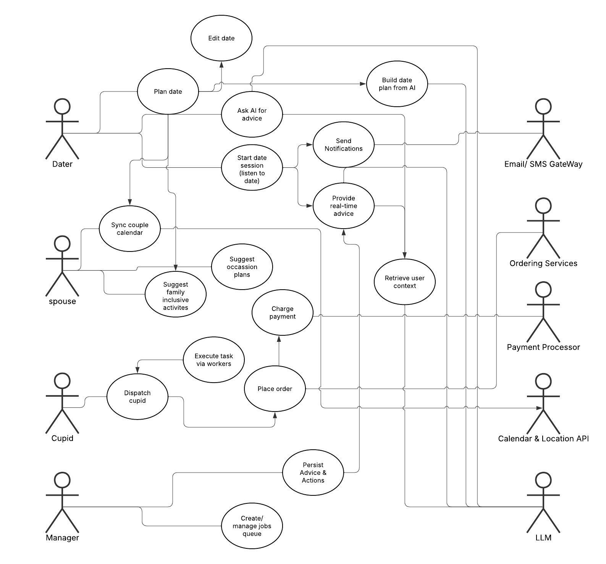
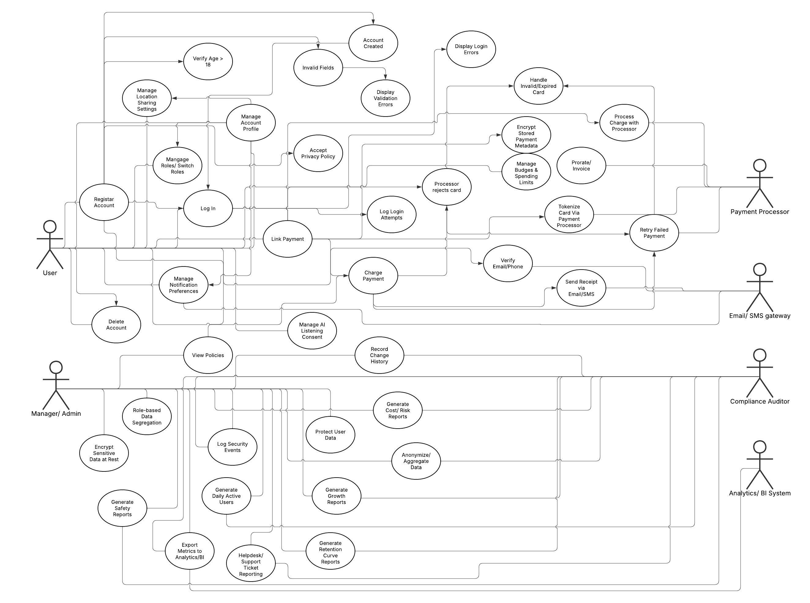

# Requirements Specification 

## Summary

### Problem Statement

Dating presents unique challenges for many individuals, especially those who identify as “nerds” or socially anxious. Preparing for and navigating a date often feels overwhelming, and many lack accessible support systems to guide them. Cupid Code was designed as a solution: an AI-assisted dating platform that provides personalized advice, real-time interventions, and on-demand Cupid gig workers to help “save” dates with items or services when things go wrong.

Our team inherited Cupid Code in a partially completed state. The previous team established the foundation of the application with core components like authentication, user roles, and a visual manager dashboard. However, much of the platform’s critical functionality — especially those tied to the money system and AI — remains incomplete or non-functional. Many must-have requirements identified in the original RSD were either partially implemented or left unfinished, which prevents the platform from operating as intended.

In summary, we were provided a project that demonstrates the conceptual framework of Cupid Code but falls short of delivering a usable MVP. Authentication works, roles are defined, and Cupids can sign up, but daters cannot fund their accounts, Cupids cannot withdraw earnings, and the AI fails to provide meaningful assistance. This leaves the system more of a prototype shell than a functional product.

### Solution Statement

The previous team established important foundations we can build on. Below is a concise accounting of the system as we received it, grouped by completion level.

#### Completed
- Authentication (username/password): working sign-in/sign-up.
- Cupid sign-up portal: gig workers can register.
- Microphone permission integration: device mic access is available in the app.
- Documentation/manuals present: user and manager manuals exist in the repository.
- Browser-based web app: site accessible on mobile and desktop browsers.

#### Partially Implemented
- Dater profiles: interests and goals present; communication preferences still to add.
- Manager dashboard: user interface exists; current stats appear placeholder and not wired to live data.
- Scheduling: daters can schedule dates; Cupid busy/peak-time logic not verified.
- Order and gig placement UI: gigs/orders can be created, but no real payment flow occurs yet.
- AI listening: microphone capture path exists; guidance and responses remain limited.

#### Incomplete
- Funds pipeline: daters cannot add funds; budgets can be set on gigs but do not deduct from a user balance.
- Cupid payments and payouts: Cupids may be shown a share (for example, 10 percent) but no actual transfer or deduction occurs; no withdraw/transfer flow exists.
- Subscriptions: monthly tiers ($10/$15) not implemented.
- Free tier: limited-budget intervention not implemented, as it depends on subscriptions and funds.
- AI interventions and automated purchases: no meaningful real-time coaching or purchase execution (flowers, food, tickets) yet.
- Notifications: real-time notifications (and email/SMS fallbacks) not present.
- Single Sign-On (SSO): Google, GitHub, and similar options not implemented.
- Ratings and feedback tied to gigs: not activated because money and gig completion are not flowing.
- Cupid availability toggle (on/off duty): not present.
- Revenue and analytics: revenue model cannot function without subscriptions and payouts; dashboard metrics are not tied to transactions.

## Requirements

### Functional Requirements

Key: **M** = Must, **S** = Should, **C** = Could, **W** = Won’t

- Notifications and suggestions outside of the app through email, text, etc. **(M)**
- Automatic real time feedback from agentic AI **(M)** 
- Webpage accessible on computer and phone **(M)**
- Database access for AI to remember things about the user **(M)**
- Connection to Stripe and PayPal payment processing APIs **(M)**
- Date planning interface **(S)**
- Date planning capability for AI **(S)**
- Date plan editing capability for user **(S)**
- Integrate shared calendar sync for couples. **(S)**
- Suggest anniversary/birthday plans from saved preferences. **(S)**
- Integrate a weather API so the agentic AI can plan appropriate activities and give relevant suggestions **(C)**
- AI capability to give feedback after a date **(C)**
- AI capability to set goals for the user based on their date history **(C)**
- AI capability to make predictions about the user to create a more complete profile and make more accurate suggestions **(C)**
- Integrate dating app APIs (e.g. Tinder) to find dates for the user **(C)**
- Integrate location services for real-time updates on the location of Cupids **(C)**
- Microtransactions **(W)**

### Nonfunctional Requirements

Key: **M** = Must, **S** = Should, **C** = Could, **W** = Won’t

1. **Performance**
  - Connect to the AI API for the listen and chat features. **(C)**
  - Record change history for shared features (who edited joint preferences or calendar sync) to provide an audit trail. **(C)**

2. **Security**
  - When auto filling the user information, the users' address is still encrypted rendering the information useless. We need to fix that. **(M)**
  - Ensure that card data is properly encrypted in the database. **(M)**
  - change the encryption of addresses on the calendar and gigs pages. **(M)**
  - Link cards to a payment processor to allow for seamless adding of cash to a users account. **(S)** 
  - Enforce role‑based data segregation for couples so spouse‑only artifacts (surprise gifts, private notes) remain hidden until revealed. **(C)**
  - Provide per‑partner privacy and consent controls for shared features (who can see/edit plans, gifts, and timeline). **(C)**
  
3. **Usability**
  - Add error messages when invalid input options are provided. **(M)**
  - Clarify instructions for running software to reduce confusion. **(M)**
  - Include software dependency information and installation instructions in the documentation. **(S)**
  - Improve contrast for readability. **(M)**
  - Ensure compatability with screen readers. **(M)**
  - Comply with general accessibility practives **(S)**

4. **Rebranding**
  - Re-generate the images for the app **(M)**
  - Dynamically allocate space depending on the screen size of the user. **(S)**
  - Change the color schemes **(C)**
  - Improve consistency in the app. for example the navigation menu is nested in a hamburger menu when a user is logged in, but not when you are not logged in. **(C)**
  - Change the layout of the pages, center the buttons, change the shapes to be more inline with the theme of the application. **(C)**

### Business Requirements

Key: **M** = Must, **S** = Should, **C** = Could, **W** = Won’t

1. **Value**
  - Provide messaging functionality (text, chat) for users to interact with each other. **(M)**
  - Allow users to discover and connect with new people. **(M)**
  - Send push notifications to increase engagement and retention. **(M)**
  - Provide personalized recommendations to create a tailored user experience. **(S)**
  - Offer an intuitive and easy-to-use interface to reduce user frustration. **(S)**
  - Maximize user satisfaction and retention through engaging features. **(S)**
  - Include measures to detect and eliminate spam accounts. **(S)**
  - Provide location-based matching to connect users with other nearby users. **(S)**
  - Support married users as an adjacent audience (without changing core goals). **(S)**
  - Support multiple languages to enable global accessibility. **(C)**
  - Provide text-to-speech functionality to support visually impaired users. **(C)**
  - Include subscriptions and in-app purchases as monetization options. **(W)**

2. **Compliance**
  - Restrict access to users aged 18 years and older. **(M)**
  - Protect user data against unauthorized access and leakage. **(M)**
  - Include a published privacy policy explaining data use. **(M)**
  - Provide users the ability to delete their accounts permanently. **(M)**
  - Verify email addresses and phone numbers during account creation. **(S)**
  - Log login attempts for security auditing. **(S)**
  - Provide opt-out options for marketing communications in compliance with anti-spam laws. **(S)**
  - Include terms of service that prohibit harmful content. **(S)**
  - Protect user location data to prevent misuse or stalking. **(S)**
  - Include accessibility options (e.g., braille) for visually impaired users. **(W)**
  
3. **Reporting**
  - Generate daily active user reports to measure engagement. **(S)**
  - Generate safety reports on flagged users to monitor risks. **(S)**
  - Track and report customer support tickets to identify common issues. **(S)**
  - Provide a help ticket management system for bug tracking and resolution. **(S)**
  - Generate growth reports on new signups per month. **(S)**
  - Provide retention curve reports to evaluate long-term engagement. **(C)**
  - Provide demographic reports on the user base. **(C)**
  - Log feature usage reports to prioritize specific feature improvements. **(C)**

4. **Stakeholders**
  - Maintain well-documented code to enable efficient bug fixes. **(M)**
  - Support a monetization method to maximize profitability. **(M)**
  - Support inclusive access to diverse user groups. **(S)**
  - Generate risk reports to address compliance and safety concerns. **(S)**
  - Provide cost analysis reports to optimize infrastructure spending. **(S)**
  - Calculate and report customer lifetime value metrics. **(S)**
  - Support subscription billing (tiers for singles/married users). **(S)**
  - Provide revenue dashboards to track financial performance in real time. **(C)**
  - Identify and report top-performing features that drive engagement. **(C)**

### User Requirements

Key: **M** = Must, **S** = Should, **C** = Could, **W** = Won’t

1. **General End-users**
  - Interact with a sleek, contemporary user interface. **(M)**
  - Adjust account settings using a variety of managerial tools. **(M)**
  - Link more than one payment method to finance services. **(M)**
  - Utilize an organized task management system. **(M)**
  - Switch easily between application roles. **(S)**
  - Opt to use a mobile application for portability and ease. **(C)**

2. **Dating End-users**
  - Receive push alerts to receive real-time assistance. **(M)**
  - Engage in meaningful dialogue with an AI chatbot. **(M)**
  - Allow AI chatbot to listen during dates. **(M)**
  - Swipe on potential matches by linking an external dating service. **(S)**
  - Work with a fully integrated match-finder that offers all standard dating app support (i.e. messaging). **(C)**

3. **Cupid End-users**
  - Have several gig management tools to organize gigs. **(M)**
  - Update a connected dater's software in real time. **(M)**
  - Access a variety of third-party services to assist dater. **(M)**
  - Ability to message the dater with updates, pointers, etc. **(S)**
  - Navigate using a Google Maps API or similar. **(C)**

4. **Married/Coupled End-users**
  - Provide a relationship timeline of past date nights and milestones. **(S)**
  - Provide shared calendar sync for couples. **(S)**
  - Suggest gifts based on spouse preferences and past data. **(S)**
  - Support joint profile preferences for couples. **(S)**
  - Suggest family‑inclusive activities when desired. **(C)**

## User Stories 

### User 

- As a user, I want the app to dynamically adjust its layout to my screen size so that I can comfortably use it on any device.
- As a user, I want the AI chat and listening features to connect quickly and reliably to the backend API so that my conversations feel seamless.
- As a user, I want my payment information to be securely encrypted during transactions so that I feel safe making purchases.
- As a user, I want error messages to appear when I enter invalid data in forms so that I know what went wrong and how to fix it.
- As a user, I want the app to validate monetary amounts and confirm large transactions before processing so that I don’t make costly mistakes.
- As a user, I want the interface to have high contrast and support screen readers so that it’s accessible to users with visual impairments.
- As a user, I want clear documentation that includes required software versions and setup instructions so that I can install and run the app without confusion.
- As a user, I want my address to remain encrypted only where necessary so that my privacy is protected without interfering with features like calendar and gigs.
- As a user, I want the app to reflect a fresh brand identity with updated colors, images, and layout so that it feels modern and engaging.
- As a user, I want customizable navigation elements instead of generic hamburger menus so that I can tailor the interface to my preferences.
- As a user, I want to interact with a stylish, modern-looking user interface so I can easily and confidently use Cupid Code.
- As a user, I want to have multiple account management tools so I can properly atune my account settings ad hoc.
- As a user, I want to have the option to connect multiple payment options so I can seamlessly finance Cupid Code's services.
- As a user, I want to have a structured task management system so I can straightforwardly tend to my responsibilities.
- As a user, I want to receive notifications and suggestions via email or text so that I don't have to be in the app to get helpful information.
- As a user, I want to get instant feedback from the AI so that I can improve my dating interactions in real time.
- As a user, I want to access the app on both my computer and my phone so that I can use it wherever I am.
- As a user, I want the AI to remember my preferences and past interactions so that it can provide more personalized and relevant suggestions over time.
- As a user, I want to be able to pay for services using Stripe or PayPal so that I have a convenient way to make purchases.
- As a user, I want to use an interface to plan my dates so that I can easily organize my activities.
- As a user, I want the AI to suggest and plan dates for me so that I don't have to do all the work myself.
- As a user, I want to be able to edit the date plans the AI creates so that I can make adjustments to suit my needs.
- As a user, I want the AI to know the weather forecast so that it can suggest date activities that are appropriate for the weather.
- As a user, I want the AI to help me reflect on my dates after they happen so that I can learn and improve for the future.
- As a user, I want the AI to make predictions about me so that it can build a more complete profile and provide more accurate suggestions.
- As a user, I want the app to connect with popular dating apps like Tinder so that I can find potential dates without leaving the app.

### Dater

- As a dater, I want to recieve push notifications so I can get real time support on my dates.
- As a dater, I want to have meaningful conversation with an AI chatbot so I can fall back on a dynamic and nuanced support system.
- As a dater, I want my AI chatbot to optionally listen on my date so I can immersively make smart dating decisions.

### Married User / Couple

- As a Married User, I want to sync both our calendars so that date plans don’t conflict.
- As a Married User, I want recurring date-night reminders so that we maintain a regular routine.
- As a Married User, I want special-occasion plans (anniversaries/birthdays) so that I don’t miss important dates.
- As a Married User, I want a shared relationship timeline of past date nights and milestones so that we can reflect and plan better.
- As a Married User, I want joint preferences (budget, cuisines, activities) so that suggestions fit both of us.
- As a Married User, I want family-friendly suggestions so that we can include kids when desired.
- As a Married User, I want gift suggestions for my spouse so that I can plan thoughtful surprises.
- As a Married User, I want per-partner privacy and consent controls so that I can choose what my spouse can see.
- As a Surprise Planner, I want private gift planning (hidden until reveal) so that my spouse doesn’t see surprises early.
- As a Couple, I want an audit trail of changes to our shared settings so that we can resolve who changed what quickly.

### Cupid

* As a cupid, I want to have multiple gig management solutions so I can systemically govern my gigs.
* As a cupid, I want to directly connect to a dater's Cupid Code experience and reactively update their software.
* As a cupid, I want to have multiple third-party services available to me so I can effectively serve my dater.

### Manager

- (none)

### Business/Company

- As a dating app, we want to offer a space for couples to interact, talk, and text.
- As a dating app, we want to offer a way to meet new people
- As a dating app, we want to provide access to multiple languages, so a larger populous can comfortably use the app.
- As a dating app, we want to provide a unique experience tailored to the user.
- As a dating app, we want subscriptions and in-app purchases to increase revenue 
- As a dating app, we want to provide an wasy to use and easy to understand interface as to not frustrate the users.
- As a dating app, we want to satisfy the user and keep retention.
- As a dating app, we want to provide a text to speech option to accomodate the visually impaired.
- As a dating app, we want to eliminate spam accounts and keep content authentic.
- As a dating app, we want to push notifications to the user and keep retention.
- As a dating app, we want to match users with people who live nearby.
- As a Company, I want to support married-couple experiences so that we grow our audience without changing the product’s core goals.
- As a Company, I want a couples-tier subscription option so that households can access shared features at fair pricing.
- As the company, we want daily active user reports so that we can measure engagement.
- As the company, we want safety reports on flagged users so that we can monitor risks.
- As the company, we want customer support tickets tracked so that we can identify common issues.
- As the company, we want demographic reports so that we can see who is using the app.
- As the company, we want feature usage reports so that we can prioritize improvements.
- As the company, we want growth reports (new signups per month) so that we can track expansion.
- As the company, we want retention curve reports so that we can understand long-term engagement.
- As the company, we want an effective help ticket system so users' experiences can be repaired and bugs can be fixed.
- As a company in the USA, we should limit who can use the app to persons 18 years and older
- As a company in the USA, we should protect user data from leakage.
- As a company in the USA, we should provide a privacy policy so users can understand how we use their data.
- As a company in the USA, we should provide a terms of service guideline so users know that harmful content is prohibited.
- As a company in the USA, we should offer a way to delete an account.
- As a company in the USA, we should verify user email/phone numbers to authenticate accounts.
- As a company in the USA, we should log login attempts so that suspicious activity can be audited.
- As a company in the USA, we should provide opt-out options for marketing emails so that we comply with anti-spam laws.
- As a company in the USA, we should offer a braille option for the blind.
- As a company in the USA, we should protect a user's location to prevent stalking.
- As a buisness, we want revenue dashboards so that we can track financial performance in real time.
- As a buisness, we want risk reports so that we can address compliance or safety concerns early.
- As a buisness, we want cost analysis so that we can optimize infrastructure spending.
- As a buisness, we want customer lifetime value reports so that we can maximize long-term profitability.
- As a buisness, we want to identify top-performing features so that we know what drives value.
- As a buisness, we want a way for users to spend money so that we earn a profit.
- As a buisness, we want well documented code so that bugs can be fixed quickly and restore user satisfaction.
- As a buisness, we want to provide access to as many groups of people as possible.

## Overall MoSCoW

### Must

- Notifications and suggestions outside of the app through email, text, etc.
  _From categories: Functional_
- Automatic real time feedback from agentic AI
  _From categories: Functional_
- Webpage accessible on computer and phone
  _From categories: Functional_
- Database access for AI to remember things about the user
  _From categories: Functional_
- Connection to Stripe and PayPal payment processing APIs
  _From categories: Functional_
- General users can interact with a sleek, contemporary user interface.
  _From categories: User_
- General users can adjust account settings using a variety of managerial tools.
  _From categories: User_
- General users can link more than one payment method to finance services.
  _From categories: User, Buisness_
- General users can utilize an organized task management system.
  _From categories: User_
- Daters can receive push alerts to receive real-time assistance.
  _From categories: User_
- Daters can engage in meaningful dialogue with an AI chatbot.
  _From categories: User_
- Daters can allow AI chatbot to listen during dates.
  _From categories: User_
- Cupids can have several gig management tools to organize gigs.
  _From categories: User_
- Cupids can update a connected dater's software in real time.
  _From categories: User_
- Cupids can access a variety of third-party services to assist dater.
  _From categories: User_
- Provide messaging functionality (text, chat) for users to interact with each other.
  _From categories: Buisness_
- Allow users to discover and connect with new people. 
  _From categories: Buisness_
- Send push notifications to increase engagement and retention. 
  _From categories: Buisness_
- Restrict access to users aged 18 years and older. 
  _From categories: Buisness_
- Protect user data against unauthorized access and leakage. 
  _From categories: Buisness_
- Include a published privacy policy explaining data use. 
  _From categories: Buisness_
- Provide users the ability to delete their accounts permanently. 
  _From categories: Buisness_
- Maintain well-documented code to enable efficient bug fixes. 
  _From categories: Buisness_

### Should

- Integrate shared calendar sync for couples.
  _From categories: Functional, User_
- Provide a relationship timeline of past date nights and milestones.
  _From categories: User_
- Suggest anniversary/birthday plans from saved preferences.
  _From categories: Functional_
- Suggest gifts based on spouse preferences and past data.
  _From categories: User_
- Support joint profile preferences for couples.
  _From categories: User_
- Support married users as an adjacent audience (without changing core goals).
  _From categories: Business_
- Support subscription billing (tiers for singles/married users).
  _From categories: Business_
- Date planning interface.
  _From categories: Functional_
- Date planning capability for AI.
  _From categories: Functional_
- Date plan editing capability for user.
  _From categories: Functional_
- General users can switch easily between application roles.
  _From categories: User_
- Swipe on potential matches by linking an external dating service.
  _From categories: User_
- Ability to message the dater with updates, pointers, etc.
  _From categories: User_
- Provide personalized recommendations to create a tailored user experience. 
  _From categories: Buisness_
- Offer an intuitive and easy-to-use interface to reduce user frustration. 
  _From categories: Buisness_
- Maximize user satisfaction and retention through engaging features. 
  _From categories: Buisness_
- Include measures to detect and eliminate spam accounts. 
  _From categories: Buisness_
- Provide location-based matching to connect users with other nearby users. 
  _From categories: Buisness_
- Verify email addresses and phone numbers during account creation. 
  _From categories: Buisness_
- Log login attempts for security auditing. 
  _From categories: Buisness_
- Provide opt-out options for marketing communications in compliance with anti-spam laws.
  _From categories: Buisness_
- Include terms of service that prohibit harmful content.
  _From categories: Buisness_
- Protect user location data to prevent misuse or stalking. 
  _From categories: Buisness_
- Generate daily active user reports to measure engagement. 
  _From categories: Buisness_
- Generate safety reports on flagged users to monitor risks. 
  _From categories: Buisness_
- Track and report customer support tickets to identify common issues. 
  _From categories: Buisness_
- Provide a help ticket management system for bug tracking and resolution. 
  _From categories: Buisness_
- Generate growth reports on new signups per month. 
  _From categories: Buisness_
- Support inclusive access to diverse user groups. 
  _From categories: Buisness_
- Generate risk reports to address compliance and safety concerns. 
  _From categories: Buisness_
- Provide cost analysis reports to optimize infrastructure spending. 
  _From categories: Buisness_
- Calculate and report customer lifetime value metrics. 
  _From categories: Buisness_

### Could

- Enforce role‑based data segregation for couples so spouse‑only artifacts (surprise gifts, private notes) remain hidden until revealed.
  _From categories: Nonfunctional_
- Provide per‑partner privacy and consent controls for shared features (who can see/edit plans, gifts, and timeline).
  _From categories: Nonfunctional_
- Record change history for shared features (who edited joint preferences or calendar sync) to provide an audit trail.
  _From categories: Nonfunctional_
- Suggest family‑inclusive activities when desired.
  _From categories: User_
- Integrate a weather API so the agentic AI can plan appropriate activities and give relevant suggestions
  _From categories: Functional_
- AI capability to give feedback after a date
  _From categories: Functional_
- AI capability to set goals for the user based on their date history
  _From categories: Functional_
- AI capability to make predictions about the user to create a more complete profile and make more accurate suggestions
  _From categories: Functional_
- Integrate dating app APIs (e.g. Tinder) to find dates for the user
  _From categories: Functional_
- Integrate location services for real-time updates on the location of Cupids
  _From categories: Functional_

### Won't

- Microtransactions
  _From categories: Functional_
- General users can opt to use a mobile application for portability and ease.
  _From categories: User_
- Daters can work with a fully integrated match-finder that offers all standard dating app support (i.e. messaging).
  _From categories: User_
- Cupids can navigate using a Google Maps API or similar.
  _From categories: User_
- Support multiple languages to enable global accessibility. 
  _From categories: Buisness_
- Provide text-to-speech functionality to support visually impaired users. 
  _From categories: Buisness_
- Provide retention curve reports to evaluate long-term engagement. 
  _From categories: Buisness_
- Provide demographic reports on the user base. 
  _From categories: Buisness_
- Log feature usage reports to prioritize specific feature improvements.
  _From categories: Buisness_
- Provide revenue dashboards to track financial performance in real time. 
  _From categories: Buisness_
- Identify and report top-performing features that drive engagement. 
  _From categories: Buisness_

### Won't
- Include subscriptions and in-app purchases as monetization options. 
  _From categories: Buisness_
- Include accessibility options (e.g., braille) for visually impaired users. 
  _From categories: Buisness_

## Use Case Diagrams

### Diagram 1 - Dater Interactions 

### Diagram 2 - Accounts, Security & Compliance 

